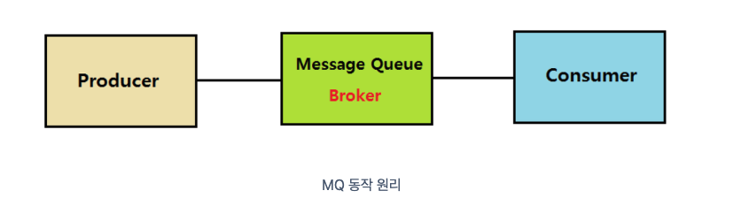

# 빅데이터 분산처리 시스템 하둡(Hadoop)
하둡이란 간단한 프로그래밍 인터페이스를 활용해 대용량 데이터를 빠르게 유연하게 분산처리할 수 있는 소프트웨어 라이브러리다. 과거, 데이터를 읽고 처리하는 속도가 데이터의 양을 따라잡지 못하는 문제를 해결하기 위해 분산처리 개념이 출발하게 되었다.

### 키워드 1. scalable
하둡의 스케일은 확장 가능하다는 특징이 있다. 그래서 자원을 추가하더라도 코드의 수정 등을 할 필요 없이 동일한 방법으로 프로세싱이 가능하다.

### 키워드 2. distributed computing
분산 컴퓨팅을 특징으로 한다. 이는 하나의 Job을 적절한 크기로 쪼갠 후, 분산된 자원을 통해 계산하고 결과를 합치는 작업을 수행한다.

## Hadoop 구조

하둡을 이해하기 위해서는 여러 대의 컴퓨터를 통해 손쉽게 대규모 데이터를 처리하는 Map-Reduce라는 데이터 처리 모델을 알아야 하며, 분산 파일 시스템 HDFS의 작동 원리를 이해해야 한다.

## 맵리듀스(MapReduce)
맵리듀스란 분산 컴퓨팅을 위한 프레임워크로, 하둡의 서브 프로젝트에 속한다. 주요 역할로는 job의 스케줄링, 모니터링, 에러 핸들링 등이 있다. 또한 입력 데이터를 독립적인 청크로 나누고 이를 병렬적으로 처리한다. 이 과정에서 하둡 분산 파일 시스템(Hadoop Distributed File System)으로부터 데이터를 불러오고 저장할 수 있다.
예를 들어보자. 100개의 문서가 입력으로 들어오고 모든 문서의 특정 단어 빈도수를 세어야 하는 작업이 요청될 때, 1개의 컴퓨터가 차례로 작업할 수도 있겠지만 100개의 컴퓨터에 하나씩 나눠서 처리하는 것이 더 빠를 것이다. 간단해 보이지만 이렇게 데이터를 나누는 것도, 각각의 컴퓨터에서 계산한 빈도수를 합쳐서 보여주는 것도 특정 컴퓨터나 단계의 에러가 발생하거나 자원의 부족으로 어려울 수 있다. 그래서 이러한 모든 상황을 고려해서 작동하는 하나의 분산 컴퓨팅 프레임워크가 필요한 것이다.

- Map: 빅데이터에서 쪼개진 데이터를 어떻게 처리할 것인지 작성하는 함수
- Shuffle and Sort: map에서 처리한 결과물을 나눠주는 것 -> 하둡 엔진이 한다.
- Reduce: 최종 집계해서 결과를 내는 함수
즉 개발자는 결국 Map 함수와 Reduce 함수를 정의하면 된다. 참고로 맵에서는 리듀스를 위한 키-값 쌍을 만들어내고, 이 키-값 쌍은 사용자에 의해 정의될 수 있다. 리듀스는 맵의 아웃풋 키-값 쌍을 인풋으로 받아서 최종 결과를 출력한다.

### 맵 리듀스 분산 병렬 처리 방식
1. 시스템(하둡)이 map() 함수들을 데이터에 배포
2. map() 함수는 데이터를 읽고 <key, value>를 출력
3. 시스템(하둡)이 <key, value> 데이터를 그룹핑(shuffle and sort)
4. 시스템(하둡)이 그룹핑된 데이터를 reduce() 함수들에 배포
5. reduce() 함수는 <key, value>를 읽고 결과를 출력

## HDFS(Hadoop Distributed File System)
하둡은 HDFS라는 분산 파일시스템을 제공한다. 데이터가 단일 물리 머신의 저장 용량을 초과하게 되면 전체 데이터 셋을 분리해서 여러 머신에 나눠 저장할 수 있다. 네트워크로 연결된 여러 머신의 스토리지를 관리하는 파일 시스템이 바로 HDFS다. 분산 파일 시스템은 네트워크 기반이므로 일반적인 디스크 파일 시스템보다 훨씬 복잡하다. 하지만 기존에는 대용량 파일 시스템을 구축하려면 고성능의 서버나 대용량 스토리지가 필요했지만 HDFS의 등장으로 수십~수백대의 웹서버 수준의 서버나 저사양 서버를 이용헤 스토리지를 구성할 수 있게 된다.   
이때 HDFS에 저장되는 데이터는 물리적으로 분산된 서버의 로컬 디스크에 저장되고, 파일의 읽기와 쓰기 등의 제어는 HDFS의 API를 통해 처리된다. 

### HDFS의 구조

HDFS는 블록 구조의 파일 시스템이다. 

### HDFS 설계 목표
1. 장애 복구
HDFS를 구성하는 분산 서버들에는 여러가지 다양한 장애가 발생될 수 있다. 대표적으로는 사용 중인 하드디스크에 문제가 있어 데이터 저장을 실패할 수도 있고 디스크 복구가 불가능해 데이터가 유실되는 심각한 문제도 발생할 수 있다. HDFS는 이러한 장애들을 빠른 시간에 감지하고 대처할 수 있도록 설계되어 있다. 예를 들어 HDFS에 데이터를 저장하게 되면 복제 데이터가 생상되어 다른 곳에 저장되는 방식으로 데이터 유실을 방지한다.

2. 스트리밍 방식의 데이터 접근
HDFS는 클라이언트의 요청을 빠른 시간에 처리하는 것보다 동일 시간 내 많은 데이터를 처리하는 것을 목표로 하고 있다. 그러므로 인터넷 뱅킹이나 쇼핑몰 등 특정 데이터 일부를 접근하는 작업이 잦는 경우는 기존 파일 시스템을 사용하는 것이 적합하며 전체적인 데이터를 보고 분석하고 처리하는 그러한 경우에 스트리밍 방식으로 데이터에 접근할 수 있도록 설계해서 끊김없이 연속된 데이터 흐름을 얻을 수 있다.

3. 대용량 데이터 저장
HDFS는 하나의 파일이 기가 바이트에서 테라 바이트, 그 이상의 크기도 저장할 수 있도록 설계되어 있다. 하나의 클러스터에서 수백 대의 노드를 지원할 수 있고 하나의 인스턴스에서 수백만개 이상의 파일 처리를 지원한다.

4. 데이터 무결성
데이터무결성이란 저장되는 데이터의 일관성을 의미한다. 한번 저장한 데이터는 수정할 수 없고 읽기만 가능하게 하여 데이터 무결성을 유지하게 된다. 데이터 수정은 불가능하지만 파일 이동, 삭제, 복사할 수 있는 인터페이스는 제공한다.

# Hadoop ecosystem

hadoop ecosystem은 hadoop framework를 이루고 있는 다양한 소프트웨어 및 project들의 모임이다. 그 구성요소들을 하나씩 살펴보자.

### 분산환경 관리자 ZooKeeper
하둡의 이름이 코끼리에서 시작해서 그런가 하둡 서브 프로젝트들이 대부분 동물과 관련된 이름을 가지고 있다. 그래서 이러한 요소들을 관리하는 역할로 분산환경 관리자 ZooKeeper가 등장했다. 역할은 다음과 같다.
- 여러 서버에 서비스를 알맞게 분산하여 동시에 처리한다.
- 각 서버에서 처리한 결과를 다른 서버에도 동기화해서 데이터 안정성을 보장한다.
- 운영(active) 서버에서 문제가 발생해서 서비스를 제공할 수 없는 경우, 다른 대기 중인 서버를 운영 서버로 바꿔서 서비스가 중지없이 제공되도록 한다.
- 분산 환경을 구성하는 서버들의 환경설정을 통합적으로 관리한다.

https://dodonam.tistory.com/390#google_vignette
https://velog.io/@holicme7/Apache-Kafka-%EC%B9%B4%ED%94%84%EC%B9%B4%EB%9E%80-%EB%AC%B4%EC%97%87%EC%9D%B8%EA%B0%80

## 데이터 수집과 저장 요소
### Flume
Apache Flume은 오픈 소스 프로젝트로 개발된 로그데이터 수집 기술이다. 여러 서버에서 생산된 대용량 로그 데이터를 효과적으로 수집하고 HDFS와 같은 원격 목적지에 데이터를 전송한다. 이 과정은 분산된 서버에 에이전트가 설치되고 각 에이전트가 데이터를 전달받는 방식으로 작동된다. 전체 데이터의 흐름을 마스터 서버가 관리하는데, 마스터 서버는 데이터의 수집 위치와 전송 방식을 결정하고 동적으로 변경할 수 있고 구조가 단순하고 유연해서 다양한 유형의 streaming data flow 아키텍처를 구성할 수 있다.

### Kafka
Apache Kafka는 링크드인에서 개발한 실시간 스트림 데이터를 수집하고 처리하기 위한 분산 메시징 시스템이다. 여기서 스트리밍 데이터란 수천 개의 데이터 원본에서 실시간으로 생성되는 데이터가 동시 전송되는 것을 말한다. 스트리밍 플랫폼은 이러한 연속적인 데이터 유입을 실시간으로 처리하고 데이터를 순차적이고 점진적으로 처리해야 한다. 카프카의 세가지 주요 기능은 다음과 같다.
- 스트림 데이터 게시 및 구독
- 생성된 순서대로 데이터 저장
- 스트림 데이터 실시간 처리

카프카는 위의 기능을 통해 실시간 스트리밍 데이터 파이프라인을 구축하거나 실시간 스트리밍 데이터 애플리케이션을 구축하는 데 사용된다. 그럼 어떻게 작동하는 걸까?
- Pub-Sub 모델의 메세지 큐: 메시지 큐는 메시지 지향 미들웨어로 프로그램이나 프로세스 간 데이터를 교환할 때 사용하는 기술이다. producer는 정보를 제공하는 포지션으로 publish를 하고 consumer은 정보를 제공받으려는 포지션으로 Subcribe를 한다. 여기서 중심에 큐를 사용하는데 각 프로세스의 endpoint 간 직접 통신을 하지 않고 큐를 통해 중개함으로써, 여러 장점을 갖는다. 먼저 큐를 임시 저장소로 사용하여 나중에 처리가 가능해지는 비동기의 장점이 있고, 낮은 결합도, 확장성, 탄력성(하나의 서비스가 다운되더라도 애플리케이션 중단이 아니라 메시지 큐에 남아있음), 보장성(메시지 큐에만 들어간다면 컨슈머에 전달될 수 있다)를 특징으로 가진다.

- Topic: 각각의 메세지를 목적에 맞게 구분하기 위해 사용한다. 메시지를 전송하거나 소비할 때 반드시 토픽을 입력하고, 한개의 토픽은 한개 이상의 파티션으로 구성된다.
- Partition: 분산 처리를 위해 사용하며 파티션 내부의 각 메시지는 각각의 고유번호 offset으로 구분된다. 파티션이 한개면 모든 메시지에 대해 순서가 보장되고, 여러개라면 카프카 클러스터가 라운드 로빈 방식을 분배하여 분산처리하므로 순서는 보장되지 않는다. 파티션을 나누는 이유는, 카프카의 토픽에 메세지가 쓰여지는 것도 어느정도 시간이 소비되기 때문에 분산 저장하면 write 동작을 병렬로 처리할 수 있다는 장점이 있다. 한번 늘린 파티션은 절대 줄일 수 없고 파티션이 많으면 처리량이 좋지만 장애복구시간이 늘어난다.
- Offset: 컨슈머에서 메시지를 어디까지 읽었는지 저장하는 값으로 메시지의 위치정보라고 할 수 있다.
- Producer: 메시지를 만들어서 카프카 클러스터에 전송한다. 전송 시 배치 처리가 가능하고 키값을 지정해서 특정 파티션으로 전송이 가능하다.
- Consumer: 카프카 클러스터에서 메시지를 읽어서 처리한다. 동일하게 배치처리하며 한개의 컨슈머는 여러 개의 토픽을 처리할 수 있다. 메시지를 소비하고 삭제하지 않으므로 한번 저장된 메시지는 여러번 소비가 가능하다.
- Broker: 실행된 카프카 서버를 말한다. 각 브로커(서버)는 카프카 클러스터 내부에 존재하며 서버 내부에 데이터를 저장하고 관리하는 역할을 수행한다.

## Spark

