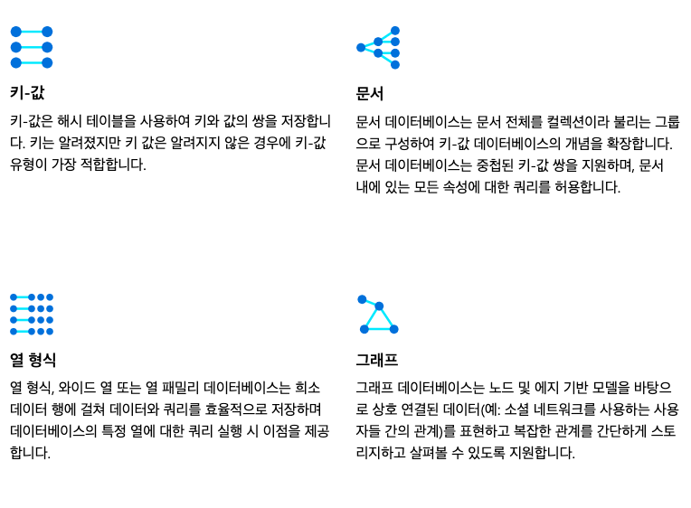

# NoSQL 데이터베이스
### NoSQL에 대해
일반적으로 행과 테이블을 사용하는 관계형(SQL) 데이터베이스를 많이 사용해왔다. 하지만 대량 비정형 데이터를 처리하기엔 적합하지 않은데, 이 NoSQL 데이터베이스는 다양한 방식으로 비정형 데이터를 저장할 수 있도록 고안되어 있다. 그래서 '비관계형', 'NoSQL', 'non-SQL'이라고도 한다.

### NoSQL 데이터베이스 이점
1. 민첩한 개발 - 빈번한 릴리즈 주기에 유연하게 대응하여 빠르고 민첩한 개발에 적합함
2. 유연성(유연한 데이터 처리) - 스키마와 쿼리를 빠르고 유연하게 변경 가능, 데이터 요구 사항에 유연하게 부응할 수 있음, 스키마 설계를 하지 않아도 빠르게 개선을 적용할 수 있음
3. 확장성(원하는 규모로 운영 가능) - 스케일 아웃이 가능, 업그레이드 없이 서버를 추가할 수 있음. 분산형 하드웨어 클러스터를 이용해서 이러한 확장이 가능한데, 완전관리형 서비스로 사용자에게 이런 복잡한 운영 작업은 보이지 않음.
4. 고성능, 고기능성 - 특정 데이터 모델 및 액세스 패턴에 최적화되어 있고, 각 데이터 모델에 맞춰 구축된 다양한 기능의 API 제공

### NoSQL 유형

참고 - https://learn.microsoft.com/ko-KR/azure/architecture/data-guide/big-data/non-relational-data

### 종류
- MongoDB
- DynamoDB
- ElastiCache
- Cassandra 

### 사용 사례
1) 실시간 데이터 관리
2) 클라우드 보안
3) 고가용성 애플리케이션
