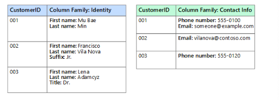
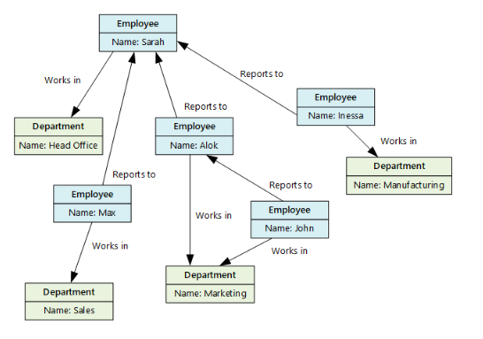

# NoSQL 데이터베이스
### NoSQL에 대해
일반적으로 행과 테이블을 사용하는 관계형(SQL) 데이터베이스를 많이 사용해왔다. 하지만 대량 비정형 데이터를 처리하기엔 적합하지 않은데, 이 NoSQL 데이터베이스는 다양한 방식으로 비정형 데이터를 저장할 수 있도록 고안되어 있다. 그래서 '비관계형', 'NoSQL', 'non-SQL'이라고도 한다.

### NoSQL 데이터베이스 이점
1. 민첩한 개발 - 빈번한 릴리즈 주기에 유연하게 대응하여 빠르고 민첩한 개발에 적합함
2. 유연성(유연한 데이터 처리) - 스키마와 쿼리를 빠르고 유연하게 변경 가능, 데이터 요구 사항에 유연하게 부응할 수 있음, 스키마 설계를 하지 않아도 빠르게 개선을 적용할 수 있음
3. 확장성(원하는 규모로 운영 가능) - 스케일 아웃이 가능, 업그레이드 없이 서버를 추가할 수 있음. 분산형 하드웨어 클러스터를 이용해서 이러한 확장이 가능한데, 완전관리형 서비스로 사용자에게 이런 복잡한 운영 작업은 보이지 않음.
4. 고성능, 고기능성 - 특정 데이터 모델 및 액세스 패턴에 최적화되어 있고, 각 데이터 모델에 맞춰 구축된 다양한 기능의 API 제공
-----------------------------

## NoSQL 유형

참고 - https://learn.microsoft.com/ko-KR/azure/architecture/data-guide/big-data/non-relational-data

### 문서 데이터 저장소
문서형 데이터 저장소는 문서라고 하는 항목의 문자열 필드 및 개체 데이터값 집합을 관리한다. 일반적으로는 JSON 문서 형식이지만 그 외에도 XML, YAML, BSON 등을 포함해 다양한 방식으로 인코딩될 수 있다.   
그렇다면 이 문서에 어떻게 애플리케이션이 접근할 수 있을까? 바로 문서 키를 이용해서 문서를 검색하는 것이다. 키는 문서의 고유 식별자로 일부 문서 데이터베이스는 자동으로 문서 키를 생성하는 시스템으로 이루어져 있다. 문서 키 외에도 하나 이상의 필드 값에 따라 문서를 쿼리할 수도 있다. 일부 문서 데이터베이스는 하나 이상의 인덱싱 필드를 기반으로 빠르게 조회할 수 있도록 인덱싱을 지원한다.    
또한 대부분의 문서 데이터베이스는 애플리케이션에서 전체 문서를 다시 작성하지 않고도 문서의 특정 필드 값을 수정할 수 있는 내부 업데이트를 지원한다. 

### 키-값 데이터 저장소
키/값 저장소는 기본적으로 큰 해시 테이블이다. 각 데이터 값을 고유한 키와 연결하고, 이 키를 적절한 해시 알고리즘을 통해 데이터를 저장한다. 여기서 해시 알고리즘은 데이터가 스토리지 전반에 균등하게 분산되도록 선택하게 한다.   
대부분의 키/값 저장소는 간단한 쿼리로 삽입 및 삭제 작업만 지원한다. 값을 수정하려면 애플리케이션이 전체 값에 대해 기존 데이터를 완전히 덮어써야 한다. 대부분의 구현에서 단일 값 읽기 또는 쓰기는 원자성 작업이 된다.

### 칼럼(열) 형식 데이터 저장소
데이터를 열과 행으로 구성한다. 가장 간단한 형태의 열 패밀리 데이터 저장소는 개념적으로는 관계형 데이터베이스와 매우 유사하게 보일 수 있다. 하지만 여기서의 열은 하나의 데이터 값이 아닌, 열 패밀리를 이루고 있다. 그러므로 열 패밀리는 다양한 스키마와 함께 다양한 크기의 데이터를 저장할 수 있으며, 행 키를 기본 인덱스로 키 기반 액세스만 허용된다. 

### 그래프 데이터 저장소
그래프 데이터 저장소는 노드와 엣지 두 정보를 관리한다. 노드는 여기서 엔티티를 나타내고 엣지는 엔티티 간의 관계를 지정한다. 이 노드와 엣지 정보를 통해 쿼리를 간단하게 수행할 수 있으며, 관계가 많은 대형 그래프의 경우에도 복잡한 분석을 빠르게 수행할 수 있습니다.

### 시계열 데이터 저장소
시계열 데이터는 시간별로 구성된 값 집합으로, 시계열 데이터 저장소는 여러 소스에서 대량의 데이터를 실시간으로 수집하는 데 최적화되어 있다. 매우 많은 쓰기를 지원해야 하고, 원격 분석 데이터를 저장하는 기능이 있습니다. 업데이트는 거의 발생하지 않으며, 삭제는 종종 대량 작업으로 수행된다. 시계열 데이터베이스에 기록된 레코드는 일반적으로 작지만, 레코드 수가 많아서 전체 데이터 크기가 빠르게 커지는 경우가 있어 크기가 유연하게 변화할 수 있도록 한다. 또한 순서가 맞지 않고 늦게 도착하는 데이터, 데이터 요소 자동 인덱싱, 시간 측면에서 기술된 쿼리의 최적화도 처리한다. 
----------------------------
## 종류
- MongoDB
- DynamoDB
- ElastiCache
- Cassandra 

### 사용 사례
1) 실시간 데이터 관리
2) 클라우드 보안
3) 고가용성 애플리케이션
