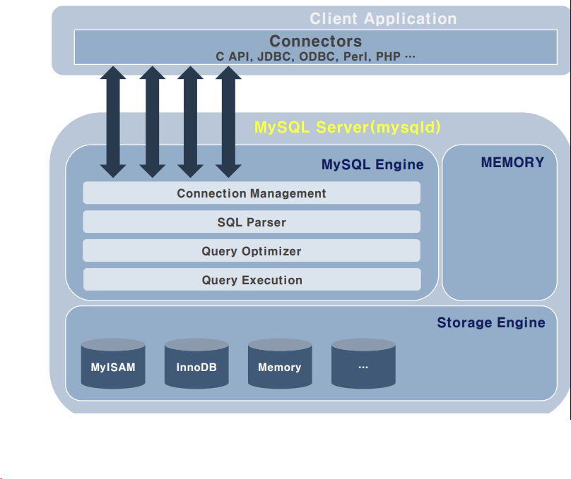
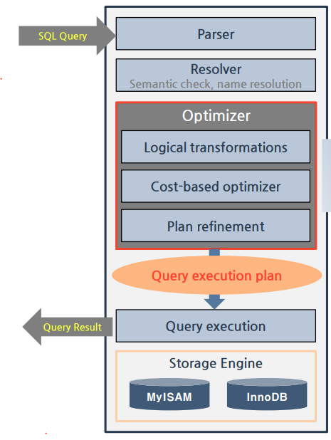

# SQL
### SQL
SQL은 structured query language(구조적 쿼리 언어)로 관계형 데이터베이스에 정보를 저장하고 처리하는 프로그래밍 언어를 말한다. 관계형 데이터베이스는 정보를 테이블(표 형식)으로 저장하며 행과 열은 다양한 데이터 속성과 값의 관계를 나타낸다.

### SQL 시스템 구성요소
- SQL 테이블: 행과 열로 구성된 데이터베이스 테이블
- SQL 문: 관계형 데이터베이스 관리 시스템에서 이해하는 유효한 명령어
- 저장 프로시저: 저장 프로시저는 관계형 데이터베이스에 저장된 하나 이상의 SQL 문 모음이다. 소프트웨어 개발자는 저장 프로시저를 사용해서 효율성과 성능을 개선한다. 

### SQL 프로세스
- 구문 분석기: SQL 문의 단어들을 토큰화하거나 바꾼 후, 여러 사항을 확인한다. SQL 문이 쿼리 문의 정확성을 보장하는지 SQL 규칙 준수 여부를 확인하고 세미콜론으로 끝나는지 확인한다. 더불어 쿼리를 실행하는 사용자가 해당 데이터를 조작하는 데 필요한 권한이 있는지도 검증한다. 이 단계에서 문제가 발견되면 쿼리를 실행하지 않고 구문 분석기가 오류를 반환한다.
- 관계형 엔진(쿼리 프로세서): 가장 효과적인 방법으로 데이터를 조작하기 위한 (검색,쓰기,업데이트 등의) 계획을 만든다. 그런 다음, 바이트 코드라는 sql 중간 수준 표현으로 계획을 다시 작성한다. 
- 스토리지 엔진(데이터베이스 엔진): 바이트 코드를 처리함으로써 의도한 sql 문을 실행한다. 

### SQL 명령어
- DDL (Data Definition Language, 정의어)   
데이터베이스의 구조를 정의,수정,삭제하는 언어 (예 - alter, create, drop)   
- DML (Data Manipulation Language, 조작어)
데이터베이스 내의 자료를 검색하고 삽입하고 갱신하는 언어 (예 - select, insert, update, delete)
- DCL (Data Control Language, 제어어)
데이터에 대해 무결성을 유지하고 병행 수행을 제어하며 보호와 관리를 위한 언어 (예 - commit, rollback, grant, revoke)

## 기본 문법 
### SELECT문
```sql
SELECT [ALL┃DISTINCT] 속성이름(들)
[FROM 테이블이름(들)]
[WHERE 검색조건(들)] 
/* =, <>, <, <=, >, >=, BETWEEN AND, IN, NOT IN, LIKE '', IS NULL, IS NOT NULL, AND, OR, NOT   
LIKE 조건은 문자열에만 사용 가능, %(0개 이상 문자열), _(1개문자), [^조건], [조건]
*/

[GROUP BY 속성이름]
[HAVING 검색조건(들)]
[ORDER BY 속성이름 [ASC┃DESC]]
```

### 집계 함수
특정 속성 값을 통계적으로 계산한 결과를 검색한다. 널인 속성 값은 제외, SELECT 절이나 HAVING 절에서만 사용 가능하다.
- SUM : 속성 값의 합계 계산
- AVG : 속성 값의 평균 계산
- COUNT : 속성 값의 개수 계산
- MAX : 속성 값의 최댓값
- MIN : 속성 값의 최솟값

[예시] 가격이 8,000원 이상인 도서를 구매한 고객에 대하여 고객별 주문 도서의 총 수량을 구하시오. 단, 두 권 이상 구매한 고객만 구한다.
```sql
SELECT custid, COUNT(*) AS 도서수량
FROM Orders
WHERE saleprice >= 8000
GROUP BY custid
HAVING count(*) >= 2;
```

### CREATE TABLE
테이블 구성, 속성과 속성에 관한 제약 정의, 기본키 및 외래키를 정의한다.


### ALTER TABLE
```sql
ALTER TABLE 테이블이름
    [ADD 속성이름 데이터타입]
    [DROP COLUMN 속성이름]
    [MODIFY 속성이름 데이터타입]
    [MODIFY 속성이름 [NULL┃NOT NULL]]
    [ADD PRIMARY KEY(속성이름)]
    [[ADD┃DROP] 제약이름]
```

### DROP TABLE
DROP TABLE 문은 테이블을 삭제하는 명령이다. DROP 문은 테이블의 구조와 데이터를 모두 삭제하며 데이터만 삭제하려면 DELETE 문을 사용해야 한다.

### INSERT
테이블에 새로운 튜플을 삽입하는 명령으로 INTO 테이블(속성) VALUES (속성값들)의 구문을 사용한다.
[예시]
```sql 
INSERT INTO Book(bookid, bookname, publisher, price)
VALUES (11, '스포츠 의학', '한솔의학서적', 90000);
```

### UPDATE
테이블에 저장된 투플에서 특정 속성의 값을 수정하는 명령으로 SET 키워드 다음에 속성 값을 어떻게 수정할지 지정한다. 일반적으로 WHERE 절에 제시된 조건을 만족하는 투플에 대해서만 속성 값을 수정하고 WHERE 절을 생략하면 테이블에 존재하는 모든 투플을 대상으로 수정한다.

### DELETE
테이블에 있는 기존 튜플을 삭제하는 명령 WHERE 절에 제시한 조건을 만족하는 튜플만 삭제하며 만약 WHERE 절을 생략하면 테이블에 존재하는 모든 튜플을 삭제해서 빈 테이블이 된다.

-----------------------------------------

# MySQL
MySQL은 Oracle에서 제공하는 오픈 소스 관계형 데이터베이스 관리 시스템으로, SQL 쿼리를 사용하는 관계형 데이터베이스 프로그램 중 가장 널리 사용되고 있다. 웹사이트와 애플리케이션의 데이터 저장소 역할을 한다. 트랜잭션, 보기, 저장 프로시저 및 트리거를 비롯한 다양한 기능과 다양한 스토리지 엔진을 지원하며 다양한 운영체제와 프로그래밍 언어에 통합될 수 있다는 장점이 있다.
### MySQL 구성도와 query 실행 과정


- SQL 파싱: SQL 파서라는 모듈이 SQL query 문장을 잘게 쪼개서 mysql 서버가 이해할 수 있는 수준으로 분리한다. 잘못된 문법을 가지고 있다면 여기서 걸러지며, 올바른 문장의 경우에 잘 처리되어 결과로 파싱 트리가 나온다.
- 최적화 및 실행계획 수립: mysql 서버의 옵티마이저가 SQL 파싱 트리를 확인하면서 어떤 테이블부터 읽고 어떤 인덱스를 이용해 읽을지 선택하여 실행계획을 수립한다.
- 스토리지 엔진으로부터 데이터 가져오기: 앞의 실행계획을 기반으로 스토리지 엔진으로부터 데이터를 로드해온다. 또한 mysql 엔진에서도 받은 레코드를 조인하거나 정렬하는 작업을 수행한다.

### 옵티마이저와 실행 계획
옵티마이저란 최적화 장치로, 쿼리의 실행계획을 수립하는 mysql 엔진의 모듈이다. 아래의 3단계가 있다.
* Logical transformations: 쿼리의 논리적 구조를 분석하고 효율적으로 처리하기 위해 쿼리를 변환한다. 여기서 쿼리의 조건을 단순화하고 필요한 연산의 순서를 최적화하게 된다.
    - where절 변환: 부정 조건을 변환, 상수/동일값 대입, 상수 조건 평가, trivial(항상 true) 조건 제거
    - outer join을 가능하면 inner join으로 변환
    - view/derived table 병합
    - subquery 변환
* cost-based optimizer: 가능한 모든 실행계획을 생성하고 쿼리의 논리적 구조와 테이블 및 인덱스의 통계정보를 기반으로 해서 각 계획의 비용을 추정한다.
    - 인덱스 및 access 방법과 조인 순서를 결정한다.
    - 조인버퍼 전략, 서브쿼리 전략을 결정한다.
    - 통계정보: cost base optimizer가 실행 계획을 세울 때 참조하는 스키마 관련 정보로, 테이블 예상 건수, 테이블/인덱스 공간의 크기, 칼럼의 distinct value 개수(카디널리티) 및 컬럼 분포도 등을 포함한다. 
* Plan refinement: 조인 순서, 실행계획 중 비용을 최소화하는 최적의 계획을 선택한다.
    - 조인순서에서 가능한 빠르게 조인조건을 할당한다.
    - ORDER By optimizer
    - access 방법 변경
    - index condition pushdown

### key
데이터베이스에서 key의 의미는 테이블에서 각 데이터를 분류하는 기준의 역할을 한다. 키의 종류를 하나씩 살펴보겠다.
1. key(Index)
 가장 일반적인 key는 index로 데이터베이스의 각 데이터 색인을 의미한다. 중복과 null 모두 허용하지만 null은 비약적인 성능 저하를 가져오므로 인덱싱하지 않도록 한다.
2. Primary key
 일반적인 key는 인덱스를 지칭하지만 DB 설계에서의 key는 보통 pk를 의미한다. NOT NULL & UNIQUE 옵션이 포함되며 하나 이상의 칼럼이 될수 있다. 만약 한 개의 칼럼으로 지정되어 있다면 그 칼럼의 데이터는 유일성이 보장되고, 여러개가 Pk로 지정되어 있다면, 그 key들의 조합에 대해 유일성이 보장된다. 검색 시에 색인 key가 되고 다른 테이블과 조인할 때도 기준 값으로 사용된다.
3. Unique key
 pk와 마찬가지로 중복성이 허용되지 않는 Uniqueness한 인덱스를 말하며, null에 대한 허용이 가능하다.
4. Foreign key
 Foreign Key 란 JOIN 등으로 다른 DB 와의 Relation 을 맺는 경우, 다른 테이블의 PK를 참조하는 Column 을 FK 라고 한다. 여기서 Foreign Key Relation 을 맺는 다는 의미는 논리적 뿐 아니라 물리적으로 다른 테이블과의 연결까지 맺는 경우를 말하며, 이 때 FK 는 제약조건(Constraint)으로의 역할을 한다. Foreign Key Restrict 옵션을 줄 수 있고 다음과 같은 옵션들이 있다.

  - RESTRICT : FK 관계를 맺고 있는 데이터 ROW 의 변경(UPDATE) 또는 삭제(DELETE) 를 막는다.
  - CASCADE : FK 관계를 맺을 때 가장 흔하게 접할 수 있는 옵션으로, FK 와 관계를 맺은 상대 PK 를 직접 연결해서 DELETE 또는 UPDATE 시, 상대 Key 값도 삭제 또는 갱신시킨다. 이 때에는 Trigger 가 발생하지 않으니 주의하자.
  - SET NULL : 논리적 관계상 부모의 테이블, 즉 참조되는 테이블의 값이 변경 또는 삭제될 때 자식 테이블의 값을 NULL 로 만든다. UPDATE 쿼리로 인해 SET NULL 이 허용된 경우에만 동작한다.
  - NO ACTION : RESTRICT 옵션과 동작이 같지만, 체크를 뒤로 미룬다.
  - SET DEFAULT : 변경 또는 삭제 시에 값을 DEFAULT 값으로 세팅한다.

 
### 뷰
가상 테이블로, 다양한 query로 만들어진 데이터를 편리하고 빠르게 보여주고 액세스할 수 있도록 한다. 실제로 데이터를 저장하는 테이블이 아닌, 보여주는 데에 중점을 둔 기능이지만 뷰의 데이터를 수정할 경우 실제 데이터도 바꿔며, 실제 데이터를 수정하는 경우에는 뷰에도 반영된다. 사용법은 아래와 같다.
```sql
CREATE VIEW name AS 
SELECT column1, column2, ... FROM table_name 조건문;

CREATE VIEW seoul_members AS
SELECT LastName, FirstName, Address, City, Country FROM members where City = '서울';

DROP VIEW seoul_members;

```


### 트랜잭션
트랜잭션은 데이터베이스 상태를 바꾸는 일종의 작업 단위다. MySQL의 모든 명령어들은 각각 하나의 트랜잭션이라고 볼 수 있으며, INSERT, DELETE, UPDATE 등의 명령문을 통해 데이터 상태를 바굴 때마다 자동적으로 commit을 해서 변경된 내용을 데이터베이스에 반영하는 작업이 진행된다.    
여기서 자동 commit이 아닌 수동으로 한 트랜잭션 안에 여러 개의 명령문을 넣어 동시에 처리될 수 있도록 할 수 있다. 먼저 아래 명령어를 통해 트랜잭션을 실행한다.

```sql
START TRANSACTION;
```

그리고 원하는 기능의 명령어를 작성한 뒤에 아래의 commit 명령어를 통해 한번에 적용시킬 수 있다.
```sql
COMMIT;
```
만약 트랜잭션의 내용을 실제 데이터베이스에 적용시키고 싶지 않다면 아래의 rollback 명령어를 사용하면 된다. 여기서 주의할 점은 drop, alter table 명령어는 롤백 기능을 지원하지 않는다는 것이다.
```sql
ROLLBACK;
```

### 프로시저 
프로시저는 MySQL에서 함수를 정의하는 것이라고 보면 된다. 함수처럼 매개변수를 받고 거기에 맞는 결과를 나타내는 것이 가능하다. 즉 sql의 명령의 묶음으로 복수의 쿼리를 실행하는데 있어서 중간 쿼리들의 오류를 방지하기 위해 일괄 처리하도록 하는 기능이다. 프로시저는 하나의 쿼리로 해석하기 떄문에 처리 속도가 빠르고 네트워크 부하도 줄일 수 있다. 기본적인 프로시저 등록의 방식은 아래와 같다.
```sql
DELIMITER //
CREATE PROCEDURE mem()
BEGIN
    select * from members;
END
//
DELIMITER;
```
여기서 delimiter는 구분문자를 바꿔주는 것으로 함수 선언 전에 ;에서 //로 바꿔준 뒤, 함수 선언 이후 다시 ;로 바꿔줘야 프로시저 등록하는 과정에서 에러가 발생하지 않는다. 프로시저 사용법과 삭제법은 다음과 같다.
```sql
call mem;
DROP PROCEDURE mem;
```

### 트리거(Trigger)
트리거란 특정 조건이 만족하면 저절로 실행되는 일종의 장치로 한번 설정해놓으면 계속 동작을 감시하고 있다가, 조건에 해당하는 동작이 수행되는 순간 실행된다. 기본 구조는 다음과 같다.
```sql
DELIMITER //
    CREATE TRIGGER trigger_name
    {BEFORE|AFTER} {INSERT|UPDATE|DELETE}
    ON table_name FOR EACH ROW
    BEGIN
        --- 트리거 내용
    END
DELIMITER ;
```
여기서 BEFORE 혹은 AFTER는 트리거 작동 시점을 의미하며, 그 뒤에 조건 이벤트가 들어간다. 아래의 예시에서는 members 테이블이 있고, 그 테이블에서 데이터를 지울 때, 백업 테이블인 members_backup에 저장하는 트리거를 만든 것이다.

```sql
DELIMITER //
CREATE TRIGGER backup_memger BEFORE DELETE
ON members FOR EACH ROW
BEGIN
    INSERT INTO members_backup (columns)
    VALUES (value1, value2, ..);
END;
//
DELIMITER ;
```
트리거 목록을 출력해서 확인하거나 삭제하는 방법은 아래와 같다.
```sql
SHOW TRIGGERS;
DROP TRIGGER trigger_name;
```
------------------------------------

# PostgreSQL
링크 - https://www.postgresql.org/about/
## PostgreSQL이란?
PostgreSQL은 오픈 소스 객체관계형 데이터베이스 시스템으로 20여년의 오랜 역사를 갖는 데 반해, 다른 관계형 데이터베이스 시스템과 달리 연산자, 복합 자료형, 집계 함수, 자료형 변환자, 확장 기능 등 다양한 객체를 사용자가 임의로 만들 수 있는 기능을 제공한다. **클라이언트/서버 모델**을 사용해 데이터베이스 파일들은 서버에 보관하여 클라이언트 애플리케이션에서 들어오는 요청과 연결을 수용해 클라이언트를 대신해서 데이터베이스 액션을 수행한다.


그림과 같은 구조로 이루어지며, 서버는 다중 클라이언트 연결을 처리할 수 있다. 먼저 서버로 클라이언트 연결 요청이 오고, 각 커넥션에 대해 새로운 프로세스를 fork 한다. 그리고 클라이언트는 기존 서버와 간섭없이 새로 생성된 서버 프로세스와 통신하게 된다.
## PostgreSQL의 기능
관계형 DBMS의 기본적인 기능인 트랜잭션과 ACID(Atomicity, Consistency, Isolation, Durability)을 지원한다. 기본적인 신뢰도와 안정성을 위한 기능 뿐 아니라 다양한 확장 기능도 많이 가지고 있는데, 주요 기능을 열거해보면 아래와 같다.
- Nested transactions (savepoints)
- Point in time recovery
- Online/hot backups, parallel restore
- Rules system (query rewrite system)
- B-tree, R-tree, hash, GIST method indexes
- Multi-Version Concurrency Control
- Tablespaces
- Procedural Language
- Information Schema

## PostgreSQL 특징
* Portable
PostgreSQL은 ANSI C로 개발되었으며 윈도우, 리눅스, 맥 OS, 유닉스 등 다양한 플랫폼을 지원한다.
* Reliable
트랜잭션 속성인 ACID에 대한 구현 및 MVCC, 로우 레벨 라킹 등이 구현되어있다.
* Scalable
멀티 버전에 대한 사용이 가능하며 대용량 데이터 처리를 위한 table partitioning과 table space 기능 구현이 가능하다.
* Secure
DB 보안은 데이터 암호화, 접근 제어, 감시 3가지로 구성되어 있다. 호스트 기반의 접근을 제어하고 object level 권한을 부여하며, SSL 통신을 통한 클라이언트와 네트워크 구간의 전송 데이터를 암호화하는 방식을 지원한다.
* Recovery & Availability
streaming replication을 기본으로 동기식/비동기식 hot standbt 서버를 구축 가능하다. WAL Log 아카이빙 및 Hot Back Up을 통해 point in time recovery가 가능하다.
* Advanced
pg_upgrade가 가능하며 웹 또는 c/s 기반의 gui 관리 도구를 제공해서 모니터링 및 관리, 튜닝까지 가능하다.


https://mangkyu.tistory.com/71
https://aws.amazon.com/ko/compare/the-difference-between-mysql-vs-postgresql/
먼저 PostgreSQL 

### Vacuum command
Vacuum은 PostgreSQL에만 존재하는 고유 명령어로, 오래된 영역을 재사용 하거나 정리해주는 명령어이다. 기본적으로 MVCC 기법을 사용하기 때문에 특정 row를 추가하거나 수정할 경우, 해당 row를 물리적으로 업데이트하는 것이 아닌, 새로운 영역을 할당해서 사용한다. Update, Delete, Insert가 자주 일어나는 Database의 경우는 물리적인 저장 공간이 삭제되지 않고 남아있게 되므로, vacuum을 주기적으로 해주는 것이 좋다. vacuum은 어느 곳에서도 사용하지 않고 참조하지 않는 재사용 가능한 행을 찾아 FSM(Free Space Map)이라는 메모리 공간에 그 위치와 크기를 기록한다. 그리고 insert 문으로 새로운 행을 추가하는 경우에 FSM에서 적당한 크기의 행을 찾아 사용한다. 관련 옵션과 사용 방법은 다음과 같다.
```
vacuumdb [옵션] [DB이름]
옵션들:
-a, --all            				모든 데이터베이스 청소
  -d, --dbname=DBNAME       			DBNAME 데이터베이스 청소
  -e, --echo           				서버로 보내는 명령들을 보여줌
  -f, --full           				대청소
  -F, --freeze          			행 트랜잭션 정보 동결
  -q, --quiet           			어떠한 메시지도 보여주지 않음
  -t, --table='TABLE[(COLUMNS)]'		지정한 특정 테이블만 청소
  -v, --verbose          			작업내역의 자세한 출력
  -V, --version          			output version information, then exit
  -z, --analyze          			update optimizer statistics
  -Z, --analyze-only       			only update optimizer statistics
  -?, --help           				show this help, then exit
  
  
  
  연결 옵션들:
  -h, --host=HOSTNAME    			데이터베이스 서버 호스트 또는 소켓 디렉터리
  -p, --port=PORT      				데이터베이스 서버 포트
  -U, --username=USERNAME  			접속할 사용자이름
  -w, --no-password     			암호 프롬프트 표시 안 함
  -W, --password      				암호 프롬프트 표시함
  --maintenance-db=DBNAME  			alternate maintenance database
```

또한 PostgreSQL 서버 실행할 때 postgresql.conf 파일을 참고하는데, 이 안에는 AUTOVAUCUUM PARAMETERS를 지정해서 사용할 수 있다.

### PostgreSQL 사용법