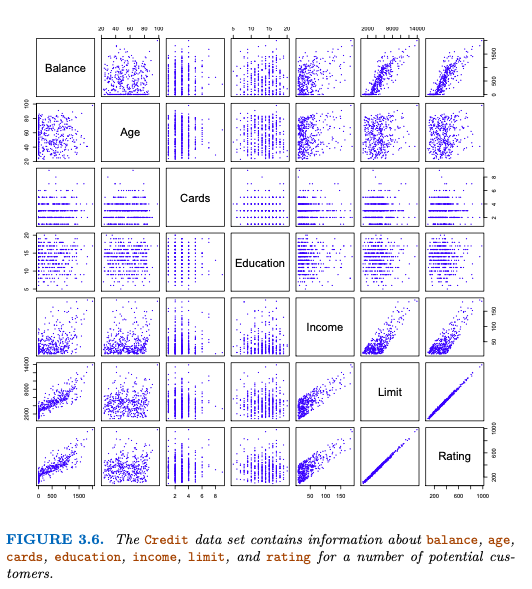
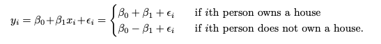
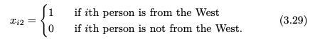
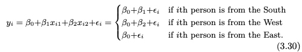

# ISLP (Introduction to Statistical Learing by Python)
## Chapter 3. Linear Regression
예시로 지난 매체 광고 데이터를 회상해보겠다. 각각의 매체마다의 공고 금액이 있다면 내년 광고 계획을 세워보는 것이다. 그럼 고려해야 할 점이 아래와 같이 몇개 있을 것이다.
1. 광고 비용과 판매 사이의 관계가 있는가?
2. 광고 비용과 판매 사이에 얼마나 강한 관계가 있는가?
3. 어떤 매체가 판매에 관계가 있는가?
4. 각각의 매체와 판매 사이에 얼마나 큰 관계가 있는가?
5. 얼마나 정확하게 미래 판매량을 예상할 수 있는가?
6. 선형 관계를 가지는가?
7. 광고 매체 사이에 시너지 효과가 있는가?

각각의 질문에 대해 선형 회귀로 답할 수 있을 것이다. 그럼 선형 회귀(linear regression)에 대해 자세히 알아보자.

### 3.1 Simple Linear Regression
y를 나타내는 매우 직선적인 접근 방식으로 단순회귀분석이 있다. 
Y ≈ β0 + β1X으로 표현할 수 있으며 β0, β1이라는 미제 변수 두개를 알아내기 위해 x,y 쌍의 데이터들로 이 모델을 학습시켜간다. 여기서는 advertising budget과 product sales 사이의 관계를 알아내는 예제를 해보겠다. 학습시키는 과정에서 살펴봐야 할 값으로 RSS가 있다.   

**RSS - 단순 오차 제곱**   
실제 값과 예측 값의 단순 오차 제곱의 합으로 적을수록 모델 성능이 높다.   

위 그림을 보자. TV 광고 예산과 판매량 사이에 β0 = 7.03이고, β1 = 0.0475인 예측 선형 함수가 그려졌다. 하지만 실제값과 예측값 사이의 차이가 있으며 그 값들의 제곱의 합이 RSS다. advertisin data로 학습된 단순 회귀 분석 모델 중 β0, β1 값이 RSS를 최소화하는 값이라고 이해할 수 있다.    

**계수 추정의 정확도 평가**   
chapter2에서 나왔듯 X와 Y 사이의 실제 관계는 **Y = f(X) + ε**, 즉, **Y = β0 + β1X + ε**로 표현되며 여기서 ε는 평균이 제로인 랜덤 오류값이라고 이해할 수 있다. 여기서 β0는 절편 항, 즉 X = 0일 때 Y의 기대값이고, β1은 한 단위와 관련된 Y의 평균 증가의 기울기다. 그리고 오류항은 여기서 놓친 것을 모두 포괄하는 변수가 될 것이다. 실제 관계는 선형이 아닐 가능성이 매우 높으며 Y의 변동을 유발하는 다른 여러 변수가 있을 수 있다. 그렇기 때문에 일반적으로 오류항은 독립적인 값이라고 가정한다.

### 모델의 정확도 평가
선형 회귀 모델의 정확도를 평가하는 값으로 RSE(residual standard error)와 R^2 값이 있다. 

**Residual Standard Error**    
estimate of the standard deviation of error term ε   
실제 값과 예측 값 사이의 오차 제곱 평균이다. 이를 통해 학습된 모델의 적합성 부족의 절대적인 수치를 알 수 있다. 하지만 Y값에 따라 규모가 커지고 작아지므로 적합성을 판단하기에 가장 좋은 방법이라고는 할 수 없다. 

**R2 Statistic**   
R2 값은 분산의 비율로 0과 1사이로 나타낸다. 그렇기 때문에 y의 척도와는 무관하게 적합성을 판단할 수 있는 좋은 대안이 되기도 한다. 계산식은 다음과 같다.   
**R2 = (TSS − RSS)/TSS = 1 − RSS/TSS**   
- TSS = total sum of squares, 개별 y의 편차 제곱의 합
- RSS = Regression sum of squares, 회귀식 추청 y의 편차 제곱의 합

## 3.2 Multiple Linear Regression, 다중선형회귀 (p90)
**Y = β0 +β1X1 +β2X2 +···+βpXp +ε**   
단일선형회귀는 단일 예측 변수에 대해서는 유용한 접근법이다. 그러나 실제로 우리는 한 개보다 더 많은 예측 변수를 가지게 된다. 예를 들어 광고 데이터가 있을 때, 우리는 TV 광고와 판매량 사이의 관계를 알려고 할 것이다. 우리는 또한 라디오와 신문 광고 비용에 대한 데이터도 있을 것이다. 여기서 두가지 옵션이 있다. 하나는 각각을 따로 구분한 단일선형 함수로 각각의 관계를 구하는 것이고, 하나는 이 요소들을 복합적으로 고려해서 판매량과의 관계를 예측하는 선형 회귀 함수를 구하는 것이다.   
그러나, 각 예측 변수에 대해 별도의 간단한 선형 회귀 모델을 맞추는 접근 방식은 완전히 만족스럽지 않다. 우선, 각 예산이 별도의 회귀 방정식과 관련이 있기 때문에, 세 가지 광고 매체 예산을 감안할 때 판매에 대한 단일 예측을 하는 방법은 불분명하다. 둘째, 세 개의 회귀 방정식 각각은 회귀 계수에 대한 추정치를 형성하는 데 있어 다른 두 매체를 무시한다. 그렇기 때문에 각각 따로의 관계를 살피는 것보다 아래와 같은 함수식으로 추정하는 것이 더 좋은 결과를 얻을 수 있다.   
**sales=β0 +β1 ×TV+β2 ×radio+β3 ×newspaper+ε.**

### 3.2.1 Estimating the Regression Coefficients
우리는 위에서 보았던 식에서 추정치 βˆ0, βˆ1, . . , βˆp를 통해 예측을 만들 수 있다. 그리고 우리는 RSS 값이 최소가 되는 방법으로 βˆ0, βˆ1, . . , βˆp의 추정치를 선택하게 된다. 그리고 아래의 그림처럼 실제값과 회귀계수에 따른 예측값의 차이를 그림으로 표현하면 여기서 회귀 계수 추정치는 매트릭스 대수학을 사용하여 가장 쉽게 표현되는 다소 복잡한 형태를 가지게 된다. 그래서 여기서 직접 다루진 않을 것이고, 대부분의 통계학 소프트웨어 패키지에서 이러한 기능을 제공한다.    
[img](./img/fiqure3-4.png)

그렇다면 단일변수와 다중변수가 선형 관계를 어떻게 파악하는지 비교해보자. 먼저 아래 표를 보자.
[img](./img/table3-45.png)
표 3.5는 세가지 각각의 변수와 응답 변수에 대한 상관 관계를 나타낸 행렬이며, 표 3.4는 TV, 라디오 및 신문 광고 예산과 제품 판매 사이의 관계를 나타낼 때 사용된 다중 회귀 계수 추정치를 보여준다. 해석하자면 주어진 양의 TV 및 신문 광고에 대해 라디오 광고에 1,000달러를 추가로 지출하는 것은 약 189 단위의 추가 판매와 관련이 있다는 것이다. 물론 이러한 방향의 예측은 직관적이라고 할 수는 없을 것이다. 신문 광고와 판매량 사이의 관계를 알기 위해 라디오 광고와 TV 광고 데이터를 활용하는 것이기 때문이다. 그러나 이런 약간 반직관적인 관계는 실제로 매우 흔하다. 예를 들어보면 상어 공격 데이터와 아이스크림 판매 데이터의 회귀를 구하는 것은 판매와 신문 사이에서 볼 수 있는 것과 유사한 긍정적인 관계를 보여줄 수 있다. 물론 상어 공격과 아이스크림은 관계가 없어 보이지만, 실제로 더 높은 기온은 더 많은 사람들이 해변을 방문하게 하며, 이는 차례로 더 많은 아이스크림 판매와 더 많은 상어 공격을 초래한다. 

### 3.2.2 Some Important Questions
우리가 다중 선형 회귀를 수행할 때, 고려해야 할 몇가지 중요한 질문이 있다.
1. 예측 변수 x1, x2, x3, .. 중에 적어도 한 개 이상이 예측에 유용한가요?
> 예측 변수와 응답 사이에 관계가 있는가? 이 점을 확인하려면 간단한 선형 회귀 설정에서 β1 = 0인지 확인하면 된다. P개 예측 변수가 있는 다중 회귀 설정에서, 우리는 모든 회귀 계수가 0인지, 즉 **β1 = β2 = ··· = βp = 0**인지 확인하기 위해 H0 귀무 가설 테스트를 사용한다. 
> **H0 : β1 = β2 = ··· = βp = 0** 의 가설에서 하나라도 non-zero가 되어야 한다. (+귀무 가설이란 영 가설이라고도 하며 의미있는 차이가 없는 경우의 가설을 말한다.)
> 위 가설 테스트는 F-통계 테스트를 계산하여 수행한다. F-통계(분포)는 연속확률분포 중 하나로 **F = ((TSS-RSS)/p)/(RSS/(n-p-1))** 로 표현한다. 그러나 단일 선형 회귀에서는 **TSS =  (yi − y)2 들의 합 = RSS** 이므로 **E{RSS/(n-p-1)} = σ2**라는 식이 되고 만약 가설이 true라면 **E{(TSS-RSS)/p} = σ2**가 된다.
> 따라서 예측 변수와 응답 사이에 관계가 없다면 F-statistic 값이 1에 수렴할 것이며, 관계가 있다면 1보다 큰 값이 될 것이다. 
> [img](./img/table3-6.png) 위 표는 radio, tv, newspaper 광고에 따른 판매량 다중 선형 회귀 모델의 f 통계를 나타낸 것이다. f-statistic 값이 570 이므로 귀무가설이 틀렸음을 입증한다. 다시 말해, 큰 F-통계는 광고 매체 중 적어도 하나가 판매와 관련이 있어야 한다는 것을 시사하는 것이다. 여기서 의문이 하나 든다. 우리가 H0을 부정하기 위해서는 F-통계가 얼마나 커야 할까?
> 답은 n과 p의 값에 달려 있다. N이 크다면, 1보다 조금 더 큰 F-통계는 여전히 H0에 대한 반박을 제공할 수 있다. 대조적으로, n이 작으면 H0을 거부하기 위해 더 큰 F-통계가 필요하다. 표 3.6의 F-통계와 관련된 p-값은 본질적으로 0이므로, 우리는 적어도 하나의 미디어가 판매 증가와 관련이 있다는 매우 강력한 증거를 가지고 있다. 여기서 p가 상대적으로 작고 n에 비해 상대적으로 작을 때 이 방식이 잘 작동할 수 있다. 만약 매우 많은 변수를 가지고 있어 p > n이라면 그것들을 추정할 관찰보다 추정할 계수 βj가 더 많아지고 F- 통계를 사용할 수 없다. P가 클 때, 순방향 선택과 같은 다음 섹션에서 논의된 접근 방식, 고차원 설정은 6장에서 더 자세히 살펴보겠다.
(p95)
2. 모든 예측 변수가 Y를 설명하는데 유용한가요? 아니면 그 중 일부만 유용한가요?
모든 예측 변수가 결과값에 관련이 있을 수도 있겠지만 많은 경우, 예측 변수 하위 집합만이 결과에 영향을 끼치기도 한다. 그래서 각각의 예측 변수와 결과 사이의 관계를 알아내는 것이 중요하다. 해당 예측 변수만 포함하는 단일 모델을 맞추기 위해 어떤 예측 변수가 반응과 관련이 있는지 결정하는 작업을 가변 선택이라고 하는데, 여기서 우리는 몇 가지 고전적인 접근 방식에 대해 알아보겠다. 먼저 모든 예측 변수의 하위집합에 대해 생성된 모델을 평가하는 것이다. 모델 평가 방법으로는 Mallow’s Cp, Akaike informa- tion criterion (AIC), Bayesian information criterion (BIC), and adjusted R2 등이 있다. 하지만 작은 모델 세트를 선택하기 위해서는 자동화되고 효율적인 접근 방식이 필요하다. 세 가지 고전적인 접근 방식을 살펴보자.
- Forward selection: 예측 변수가 없는 null model로 시작할 수 있다. 가장 기본적인 선형 함수를 생성한 가장 낮은 RSS 변수를 하나씩 추가하며 회귀 관계를 만들어간다. 이 작업은 정지 규칙에 만족할 때까지 반복하게 된다.
- Backward selection: 모든 변수를 넣은 모델로부터 시작한다. 그 다음, 가장 큰 p-값을 가진 변수부터 하나씩 제거한다. 왜냐면 그것이 통계적으로 가장 유의미한 변수이기 때문이다. 이 방법 또한 정지 규칙에 도달할 때까지 계속된다. 예를 들어, 나머지 모든 변수가 임계값보다 낮은 p-값을 가질 때 멈출 수 있다.
- Mixed selection:이것은 위 두가지 방식의 조합이다. 우리는 모델에 변수가 없는 것으로 시작하고, 순방향 선택과 마찬가지로, 가장 적합한 변수를 하나씩 추가한다. 물론, 광고 예시에서 언급했듯이, 새로운 예측 변수가 모델에 추가됨에 따라 변수의 p-값은 더 커질 수 있다. 따라서, 어느 시점에서든 모델의 변수 중 하나에 대한 p-값이 특정 임계값 이상으로 상승하면, 우리는 모델에서 그 변수를 제거한다. 우리는 모델의 모든 변수가 충분히 낮은 p-값을 가질 때까지 이러한 전진 및 후진 단계를 수행하고, 모델에 추가되면 모델 외부의 모든 변수는 큰 p-값을 가질 것이다. 

3. 모델이 데이터에 얼마나 잘 fit 되었나요? (97p)
모델 학습의 대표적인 수치 측정 값은 RSE와 R2로 분산의 비율을 설명한다. 그리고 이 값들은 단순선형회귀와 같은 방법으로 계산된다. 먼저 RSE는 상관계수라고도 하며 상대표준오차(Relative standard error)로 응답과 변수 사이의 제곱 값을 말한다. 다중선형회귀에서는 그 값들의 평균이 RSE가 될 것이다. 그리고 선형 모델의 가장 큰 특징은 이러한 상관관계를 극대화, RSE를 최소로 하는 방항으로 속성이 fitting된다. 다음으로 R2값은 결정계수라고 하며, 회귀모델에서 독립변수가 종속변수를 얼마나 설명하는지를 나타내는 지표고, 1에 가까울수록 모델이 응답 변수의 분산의 큰 부분을 설명한다는 것을 나타낸다. 광고 데이터에 대해 판매를 예측하기 위해 세 가지 광고 매체를 모두 사용하는 모델의 R2가 0.8972라는 것을 보았다. 반면에, 판매를 예측하기 위해 TV와 라디오만 사용하는 모델은 0.89719의 R2 값을 가지고 있다. 다시 말해, 표 3.4에서 신문 광고의 p-값이 중요하지 않다는 것을 이전에 보았음에도 불구하고, 이미 TV와 라디오 광고가 포함된 모델에 신문 광고를 포함하면 R2가 약간 증가할 것이다. 그 변수들이 반응과 약하게 연관되어 있더라도, 더 많은 변수가 모델에 추가될 때 R2는 항상 증가할 것이라는 것이 밝혀졌다. 따라서, 변수가 추가되면 훈련 데이터로 계산되는 R2 통계는 증가해야하며 만약 R2가 약간 증가했다면 상관관계가 비교적 낮기 때문에 그 변수는 모델에서 삭제될 수 있다는 추가적인 증거를 제공할 수도 있다.

**여기서 잠깐! RSS와 RSE, R2 개념 확실히 정리하기**
실제 선형 관계 y = B0 + B1x가 존재하고, 예측 모델은 hat을 씌워서 표현한다. y^은 예측된 값, y는 실제 값이라고 할 때, ei = yi - yi^이다. 
- RSS(residual sum of squared): e12+ e22+ ... + ei2
여기서 RSS를 최소로 한 값이 hat 베타0, hat 베타1가 되는 것이다.
- 제곱근평균제곱오차(RMSE) : 회귀 시 평균제곱오차의 제곱근. 회귀모형을 평가 하는 데 가장 널리 사용되는 측정 지표
- RSE(Relative standard error): 평균제곱오차와 동일하지만 자유도에 따라 약간 보정된 값
- R2(R-squared): 독립변수가 종속변수를 얼마나 잘 설명하는지 보여주는 지표, 즉, 모델의 회귀식이 얼마나 잘 예측하는지에 대한 지표로 0~1 사이의 값이다. 1이면 오차가 없는 것이며, 0.9이면 90%의 설명력을 가지고 있다고 말한다.

4. 예측 변수 세트가 주어졌을 때, 어떤 응답을 예측할 있으며, 그 예측은 얼마나 정확할까요?
모델의 예측 회귀 식은 f(X)=β0 +β1X1 +···+βpXp에 대한 추정치일 뿐이다. 계수 추정치의 부정확성은 2장의 감소 가능한 오류와 관련이 있으며 Yˆ가 f(X)에 얼마나 가까운지 결정하기 위해 신뢰 구간을 계산할 수 있다.
물론, 실제로 f(X)에 대한 선형 모델을 가정하는 것은 거의 항상 현실의 근사치이므로, 우리가 모델 편향이라고 부르는 잠재적으로 환원 가능한 오류의 추가 원인이 있다. 그래서 우리가 선형 모델을 사용할 때, 우리는 실제로 실제 표면에 대한 최고의 선형 근사치를 추정하고 있다. 그러나, 여기서 우리는 이 불일치를 무시하고, 선형 모델이 올바른 것처럼 작동할 것이다. 만약 우리가 f(X), β0,β1,...,βp의 진정한 값을 알고 있더라도, 무작위 오류 ε 때문에 응답 값을 완벽하게 예측할 수 없다. 앞서 2장에서, 우리는 이것을 환원 불가능한 오류라고 언급한 부분이다. 그래서 우리는 불확실성을 정량화하기 위해 신뢰 구간을 사용합니다. 

## 3.3 Other Considerations in the Regression Model (100p)

### 3.3.1 Qualitative Predictors
우리는 지금까지의 긴 논의에서 회귀모델의 변수들은 모두 양적이라고 가정했다. 하지만 실제로 꼭 그런 것은 아니다. 가끔 몇몇의 예측자는 질적일 수 있다. 예를 들어 아래의 신용 데이터를 살펴보자.

다수의 신용 카드 소지자에 대한 변수를 기록한 데이터로. 각각의 응답은 잔액(각 개인의 평균 신용 카드 부채)과 더불어 몇 가지 양적 예측 변수가 있습니다. 나이, 카드(신용 카드 수), 교육(교육 연도), 소득(수천 달러), 한도(신용 한도) 및 등급(신용 등급)가 있으며, 해당 행과 열 라벨에 의해 한 쌍의 변수에 대한 산점도를 표시한 것이다.   
**Predictors with only two levels**   
먼저 다른 것은 다 무시하고 집을 가지고 있는 사람과 아닌 사람 사이에 신용 카드 잔액을 비교한다고 가정해보자. 만약 두개의 값을 가진 양적 변수이고, 집이 있으면 1, 없으면 -1이라는 수로 가정한다면 간단한 회귀 모델이 될 것이다. 그렇다면 아래와 같이 두 경우의 회귀 식이 만들어진다.    

그럼 여기서 β0은 전체 평균 신용 카드 잔액으로 해석될 수 있으며, β1은 주택 소유자와 비소유자가 각각 평균보다 높은 신용 카드 잔액을 갖는 금액입니다. 이 예시에서 β0 추정치는 $519.665이며, 비소유자와 소유자 평균 $509.80과 $529.53 사이의 중간이다. 그리고 Β1의 추정치는 9.865달러가 되며, 이는 소유자와 비소유자의 평균 차이인 19.73달러의 절반이다.    

**Qualitative predictors with more than two levels**    
여기서 질적 예측 변수가 두가지 레벨보다 더 많다면, 간단한 더미 값으로 모든 가능한 값을 대표하는 것은 어려울 수 있다. 이러한 경우, 또 다른 더미 변수를 만들 수 있다. 지역에 대한 변수를 예로 들어 해보자. 아래 xi1, xi2 두가지 변수를 사용해서 세가지 지역에서 온 사람을 구분할 수 있다.

이제 β0은 동쪽에서 온 개인의 평균 신용 카드 잔액으로 해석될 수 있으며, β1은 남쪽과 동쪽에서 온 사람들 사이의 평균 균형의 차이로 해석될 수 있으며, β2는 서쪽과 동쪽에서 온 사람들 사이의 평균 균형의 차이로 해석될 수 있다. 레벨 수보다 항상 더미 변수가 하나 적을 것이다. 이 예에서 더미 변수가 없는 레벨은 기준선이라고 생각하면 된다. 이러한 더미 변수 방법 외에도 다른 많은 방법이 있으며 각각 해석의 여지가 다르긴 하지만 동일하게 모델 적합성을 추구한다는 점이 같다.

### 3.3.2 Extensions of the Linear Model
선형 모델이 적용되기위해 가정되는 제약이 있다.
1. additive: 예측 변수와 예측 값 사이의 연관이 다른 변수에 의존하지 않아야 한다.
2. linear: 예측 변수와 예측 값 사이의 연관이 값 자체가 아닌 변화값에 따라 존재한다. p.106

