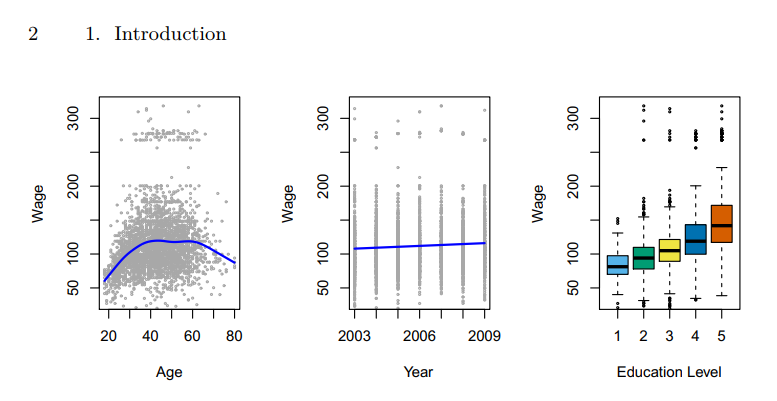
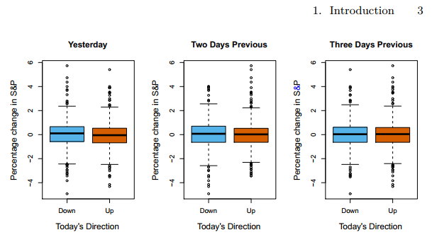

# An Introduction to Statistical Learning with Python
## 1. Introduction (p1~p14)
### Overview of Statistical Learning
Statistical learning = vast set of tools for understanding data.
These tools can be classified as **supervised** or **unsupervised**.
- supervised statistical learning: By one or more inputs, building a statistical model for predicting, estimating.
- unsupervised statistical learning: there are inputs, but no supervising output. Nevertheless we can learn relationships from data.

### Three data sets - 1. Wage Data
미국 대서양 지역의 사람들로 이루어진 그룹의 임금 데이터가 있다. 이 데이터를 통해 임금에 여러 요인들과 임금 사이의 관계에 대해 살펴보겠다. 특히 나이와 교육, 임금 사이의 관계에 대해 이해해보고자 한다.  

첫번째 그림은 개개인의 나이와 임금을 그린 것이다. 대략적으로 60세까지는 나이가 들수록 임금이 늘어다가 60세 이후로는 줄어드는 추세를 보인다. 평균을 그린 파란 선을 보면 더욱 명확하게 알 수 있다. 하지만 평균에서 많이 벗어난 데이터들이 많기 대문에 나이 하나만을 가지고는 임금을 정확하게 예측하기 힘들다.   
중간과 오른쪽 그림을 보면 각각의 교육 수준과 년도에 다른 임금에 대한 정보도 알 수 있다. 년도에 다른 임금 변화는 거의 직선에 가깝기 때문에 데이터 간의 차이에는 미미한 수준의 관계가 있는 것으로 보인다. 하지만 교육 수준에 따른 차이는 좀 더 크게 나타났다. 낮은 교육 수준을 가진 사람들은 대체로 높은 교육 수준의 사람들보다 낮은 임금을 받고 있었다.    
그렇다면 이렇게 정리해보자. 남자의 임금을 가장 정확하게 예측하는 방법은 연도 정보와 남자의 나이와 교육 수준 정보를 활용하여 예측하는 것이다. 이 데이터는 7번째 챕터에서 더 살펴보겠다. 

### Three data sets - 2. Stock Market Data
앞의 임금 데이터는 연속적이고 양적인 결과 값을 가지고 있었다. 이런 유형의 데이터는 주로 회귀 문제에 잘 참조된다.
하지만 특정 경우에는 수치가 아닌 카테고리한 결과 값이 주어질 때가 있다. 예를 들어 4번째 챕터에서는 이 stock market data이라는 Standard & Poor's 500 지수의 일일 움직임을 포함하는 2001년부터 2005년까지 5년 간의 주식시장 데이터 세트를 다룬다. 목적은 과거 5일 간의 인덱스 변화율을 가지고 주어진 날의 상승 혹은 하락의 인덱스를 알아내는 것이다. 여기서 통계적 학습 문제는 수치적 값을 예측하는 것이 아니다.  

오눌 주식 시장의 변화는 상승과 하락 둘 중의 하나로 결정된다. 이러한 방향을 정확히 예측하는 모델은 주식 시장에서 매우 유용할 것이다.  
오늘의 수익률을 예측하는 S&P 패널들을 보면 오늘에서 2일 및 3일 전의 백분율 변화에 대한 상자 그림에는 큰 변화가 없는 것으로 보인다. 이는 과거와 현재 수익률 사이의 연관성이 거의 없음을 나타낸다. 물론, 패턴의 부족이 예상되기 때문에 연속적인 수익률 사이에 강한 상관관계가 있는 경우 간단한 거래 전략을 채택할 수 있다. 4장에서는 이러한 데이터를 가지고 몇 가지 다른 통계적 학습 방법을 재미있게 시도해볼 것이다. 여기서 약 60%는 시장에서의 움직임을 5년 동안의 방향을 정확하게 예측할 수 있다.

### Gene Expression Data 

# 2. Statistical Learning (p15~p68)

# 3. Linear Regression (p69~p134)

# 4. Classification (p135~p200)

# 5. Resampling Methods (p201~p228)

# 6. Linear Model Selection and Regularization (p229~p288)

# 7. Moving Beyond Linearity (p289~p330)

# 8. Tree-Based Methods (p331~p366)

# 9. Support Vector Machines