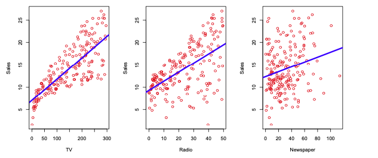
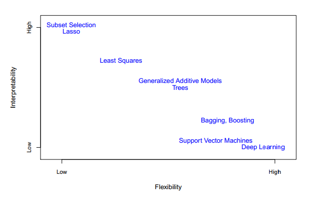

# ISLP (Introduction of Statistical Learning by Python)
# 2. Statistical Learning 

## 2.1 What is statistical learning?
Imagine: We are statistical consultants. From client, we get advertising and sales data. It's impossible to directly increase sales of product, but we can control the advertising expenditure. So we can increase salse indirectly.    
SO, Our goal is to develop an accurate model to predict sales on the basis of the three media budgets.
input variables - the advertising budgets    
output variable - sales   
X1 TV budget, X2 the radio budget, and X3 the newspaper budget.   
Y =f(X)+ε.

### 2.1.1 Why Estimate f(x)?
Prediction   
In many situations, a set of inputs X are readily available, but the output Y cannot be easily obtained. In this setting, since the error term averages to zero, we can predict Y using Y = f(X), where fˆ represents our estimate for f, and Yˆ represents the resulting pre- diction for Y.

Accuracy of Yˆ as a prediction for Y
1) reducible error
    In general, fˆ will not be a perfect estimate for f. This inaccuracy will introduce some error.
2) irreducible error
    Even if it were possible to form a perfect estimate for f, estimated response took the form Yˆ = f(X), we still have some error. Because Y is also a function of ε, which, by definition, cannot be predicted using X.   

**E(Y-Y^)2** = **E[f(X) + ε f^(X)]2** = **[f[X]-f^[X]]2 + Var(ε)** = **Reducible + Irreducible**

### 2.1.2 How Do We Estimate f?
- Parametric Methods: Involve a two-step model-based approach.
    (1) Make an assumption about f. For example, we can make a linear model like    
    f(x) = β0 + β1X1 + β2X2 + ... + βpXp   
    We only needs to estimate the p+1 coefficients β0, β1, . . . , βp.   
       
    (2) After selecting model, we need to procedure that. In case of the linear model, we need to estimate the β0, β1, . . . , βp.    
    The most common approach is **least squares**, and there are many other approaches. We discuss in chapter3, chapter6.   

- Non-Parametric Methods: Do not make explicit assumptions about the functional form of f. Instead, we seek an f that gets as close to the data points. There are no assumption about the form of f and number of parameters.

**<정리>**    
머신러닝 모델은 두가지 유형으로 나뉜다.       
Parametric model: The model has a fixed number of parameters. 모델의 파라미터 수가 정해져 있다.   
Non-parametric model: The number of parameters grow with the amount of training data. 파라미터의 수가 학습 데이터의 크기에 따라 달라진다.    
즉, parametric model은 데이터가 특정 분포를 따른다고 가정하고, 우리가 학습을 하면서 결정해야 하는 (분포의) 파라미터의 종류와 수가 명확하게 정해져 있다. 즉, 데이터가 얼마나 많든 간에 우리가 결정해야 할 파라미터의 수는 변하지 않는 것이다. 그러므로 parametric model은 우선 모델의 형태를 정하고, 이 모델의 파라미터를 학습을 통해 발전시켜나가는 식으로 알고리즘이 진행된다.   

반면에 non-parametric model은 데이터가 특정 분포를 따른다는 가정이 없기 때문에 우리가 학습에 따라 튜닝해야 할 파라미터가 명확하게 정해져 있지 않은 것이다. 그러므로 non-parametric model은 우리에게 data에 대한 사전 지식이 전혀 없을 때 유용하게 사용될 수 있다.    
종류와 장단점
Parametric model: Linear regression, Logistic regression, Bayesian inference, Neural network(CNN, RNN 등) 등. 모델이 학습해야 하는 것이 명확히 정해져 있기 때문에 속도가 빠르고, 모델을 이해하기가 쉽다는 장점이 있다. 하지만 데이터의 분포가 특정한 분포를 따른다는 가정을 해야 하기 때문에 flexibility가 낮고, 간단한 문제를 푸는 데에 더 적합하다는 단점을 가진다.    
Non-parametric model: Decision tree, Random forest, K-nearest neighbor classifier 등. 데이터가 특정한 분포를 따른다는 가정을 하지 않기 때문에 더 flexible하다는 장점이 있다. 하지만 속도가 느린 경우가 많고, 더 큰 데이터를 필요로 하는 경우가 있으며 모델이 왜 그런 형태가 되었는지에 대한 명확한 설명을 하기가 쉽지 않다.    

### 2.1.3 The Trade-Off Between Prediction Accuracy and Model Interpretability
 

위의 그림에서 볼 수 있듯 정확한 해석이 가능한 정도와 유연한 정도는 서로 상충 관계이다. 그렇다면 다들 하나의 의문이 들 것이다.   
**Why would we ever choose to use a more restrictive method instead of a very flexible approch?**    

We mainly interested in inference and restrictive models are much more interpretable. For example, the linear model make easy to understand the relationship between Y and X1, X2, X3,,, Xp. In contrast, very flexible approaches and lead complicated estimates of f, but it is difficult to understand how any individual predictor is associated with the response.    
But sometimes, we are only interested in prediction, and the interpretability of the predictive model is not of interest. So we will discuss all kinds of model.

   

### 2.1.4 Supervised Versus Unsupervised Learning
- Supervised(지도학습): 학습 데이터에 정답이 주어진 경우를 말한다. Many classical statistical learning methods such as linear regression and logistic regression, as well as more modern approaches such as GAM, boosting, and support vector machines, operate in the supervised learning domain.    
- Unsupervised(비지도학습): 학습 데이터에 정답이 없는 경우를 말한다. we observe
a vector of measurements xi but no associated response yi. We can seek to understand the relationships between the variables or between the observations. One statistical learning tool that we may use in this setting is cluster analysis, or clustering.   

Many problems fall naturally into the supervised or unsupervised learning paradigms. However, sometimes the question of whether an analysis should be considered supervised or unsupervised is less clear-cut. 
예를 들어보자. n개의 데이터 셋이 있고, m < n 인 m개의 데이터 셋에 대해서만 정답인 y 데이터가 있다. 이 때 n개 전체에 대해 학습을 해야하지만 모두 라벨링하는 것이 큰 비용일 수 있다. 이러한 상황에서의 학습을 **semi-supervised learning, 준지도학습** 이라고 한다. 앞으로 여러 방식의 학습 방법을 익히고 어떤 경우에 어떤 방식의 학습을 선택하여 적용할지 고민해보도록 하겠다.   

### 2.1.5 Regression Versus Classification Problems
회귀 문제와 분류 문제에 대해 알아보자.
quantitative or qualitative / 양적인 성격의 변수가 있을 수 있고 질적인 성격의 변수가 있을 수 있다. 양적인 변수란 수치값을 말하며 사람의 나이가 키, 수익, 집 값 등이 될 수 있다. 반대로 질적의 변수란 k개의 카테고리로 분류되는 값으로 사람의 결혼 유무, 상품의 브랜드, 암의 진단 등이 될 수 있다. 수적인 값을 추론하는 문제가 regression(회귀)이고 질적인 값을 추론하는 문제가 classification(분류)이며 유형에 따라 학습 방법을 선택할 수 있다. 

## 2.2 Assessing Model Accuracy
One of the key aims of this book is to introduce wide range of statistical learning methods. Why? In statistics, no one method dominates all others.    
Selecting the best approach can be the most challenging parts of statistical learning. In this section, we discuss some of the most important concepts that arise in selecting a statistical learning method for a specific data set.

### 2.2.1 Measuring the Quality of Fit
Evaluation the performance of statistical learning method on a given data set = measure how well it's predictions match the observed data. And the most commonly used measure is the mean squared errer (MSE).    

MSE(Mean Squared Error): 평균제곱오차, 실제값과 예측값 차이를 제곱하여 평균을 낸다. 즉, 예측값과 실제값 차이의 면적 평균과 같으며 특이값이 많이 존재할수록 값이 커진다.    

By using MSE, we can make the model more accurately by using train data. But general, we don't care how well the method works on training dataset. We just interested in the accuracy of the prediction about unseen data.    
For example, we make a model that predict stock's price, than we don't want to predict last stock's price. Just care about how well it will predict tomorrow's of next month's price. Also in clinical data, if we want to know how has diabetes.   
The point to say is that there is no guarantee that the method with the lowest training MSE will also have the lowest test MSE. More fit to train dataset, it's MSE will be lower, but model flexibility will  decreases. Flextibility is important to a large test MSE. We always take care about overfitting problem.   

In practice, one can usually compute the training MSE with relative ease, but estimating the test MSE is considerably more difficult because usually no test data are available.  Throughout this book, we discuss a variety of approaches that can be used in practice to estimate test MSE minimum point. One important method is cross-validation (Chapter 5), which is a crossmethod for estimating the test MSE using the training data.

### 2.2.2 The Bias-Variance Trade-Off
### 2.2.3 The Classification Setting