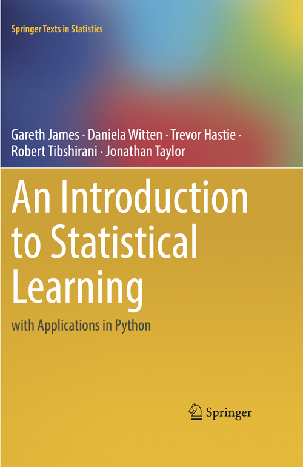

# An Introduction to Statistical Learning with Python
### Wrriten By Gareth James, Daniela Written, Travor Hastie, Robert Tibshirani, Jonathan Taylor
---------------------------

   
이 책으로 머신러닝의 토대를 공부하고 이해한 내용을 정리해갈 예정이다.   
   
      

----------------

# Preface
Statistical Learning = a set of tools for making sense of complex datasets   

통계적 학습은 복잡한 데이터 셋을 이해하기 위한 도구 세트를 가리킨다. 최근 몇년 간, 사실상 모든 분야에 해당하는 과학과 산업에서 데이터의 범위와 크기가 충격적으로 증가하는 것을 보았다. 결과적으로 통계적 학습은 데이터를 이해하고자 하는 모든 사람에게 중요한 툴킷이 되었으며, 더 많은 직업들이 데이터에 관련지어지는 만큼, 통계적 학습도 빠르게 모든 사람에게 필수적인 툴킷이 되고 있다.   
통계적 학습의 초창기 책 중에 The Elements of Statistical Learning 이라는 책이 2001년에 처음 출간했고 통계학 뿐만 아니라 관련된 분야에서 유명한 자료가 되었다. 그리고 ESL에 이어 핵심 주제에 대한 광범위하고 덜 기술적인 내용에 대한 필요성이 있어서 An Introduction to Statistical Learning(ISLP)이라는 본 책이 출간되었다. 이 책에서는 linear regresstion 뿐만 아니라, resampling. sparse methods, classification. re-gression, generalized additive models, tree based methods, support vector machines, deep learning, survival analysis, clustering 등 세계적으로 중요한 통계적 머신 러닝 기법이라고 여겨지는 기법들에 대해서 다룬다. 또한 최근 몇년 간 파이썬이 데이터사이언스 언어로 급부상했고, 이 책은 각각의 통계적 학습 방법들을 파이썬 언어로 풀어냈다.   