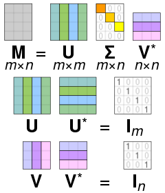
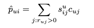
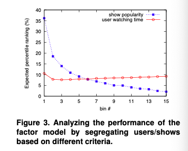
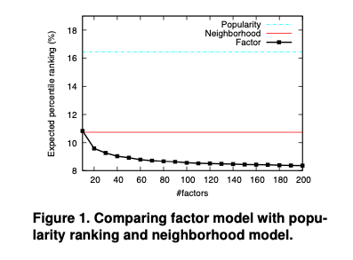
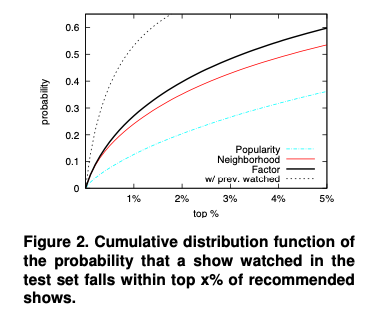

# Collaborative Filtering for Implicit Feedback Datasets
Recommender systems provide users with personalized recommendations for products for services, which hopefully suit their unique tasts and needs.   
The technology is based on systems of profiling users and prodcuts, and finding how to related them.   

### Two different strategies
1. Contents based approach   
- Create a profile for each user or product to characterize its
- User profiles(demographic information or answers to suitable questionnaire) to matching products
- It requires gathering external information 

2. Collaborative Filtering
- It relies only on past user behavior without explicit profiles
- It analyzes relationships between users and interdenpendencies(상호의존성) among products -> identify new user-item associations
- Major appleal of CF is domain-free: 도메인을 가리지 않고 콘텐츠 기반으로 프로파일링 하기 어려운 데이터도 다룰 수 있다. 그러나 콘텐츠 기반 방식이 이미 적합한 곳에는 적용하기 어려운 cold-start 문제가 있다.

명시적인 피드백을 보통 다뤄왔지만, 명시적인 피드백보다 암시적인 피드백에서 유저의 선호를 찾는 것이 관건이다. 예를 들어 유튜브 좋아요, 싫어요 버튼을 클릭한 데이터, 구매 기록보다 브라우징 기록, 시청 기록, 검색 패턴, 심지어 마우스 움직임 데이터까지 사용할 수 있을 것이다. 다음으로는 암시적인 피드백을 활용하는 추천시스템의 주요 특징을 살펴보겠다.

1. **No negative feedback.** 암시적인 데이터에서 좋아하는 선호에 대해 파악하는 것은 가능하지만 불호에 대해 파악하는 것은 쉽지 않다. 예를 들어, 영상 시청 기록에서 특정 영상을 보지 않았다면 그 콘텐츠를 싫어하는 것이라고 판단할 수 없다. 콘텐츠의 존재 여부를 몰랐을 수도 있고, 비교적 다른 콘텐츠가 더 선호였기 때문일 수도 있다. 그러므로 부정적인 피드백을 찾을 수 있는 데이터가 누락되지는 않았는지 파악하는 것이 중요하다.
2. **Implicit feedback is inherently noisy.** 예를 들어, 개인의 구매행동을 볼 수는 있지만 그것이 선물을 위한 것일 수도 있고 사용자가 그 상품에 실망했을 수도 있다. 혹은 TV 시청 기록에서 실제로 시청을 했을지, 그냥 틀어놓고 다른 행동을 했을지 모른다. 그러므로 암시적인 데이터는 본질적으로 노이즈가 많다는 것을 명심해야한다.
3. **The numerical value of implicit feedback indicates confidence.** 명시적인 데이터의 수치값은 선호도를 나타내지만, 암시적 데이터의 수치값은 확신의 정도를 나타낸다. 큰 값을 가지고 있다고 해서 선호도가 높은 것이 아닌 가능성이 높은 것이라고 이해해야하며, 일회성의 이벤트는 사용자의 의지와 관계없이 발생할 수 있기 때문에 여러 번 발생할수록 사용자의 의견이나 의지가 많이 반영되었다고 할 수 있다.
4. **Evaluationofimplicit-feedbackrecommenderrequires appropriate measures.**  암시적 모델을 통해 우리는 품목의 가용성, 다른 품목과의 경쟁, 그리고 반복적인 피드백을 고려해야 한다. 예를 들어, 우리가 텔레비전 시청에 대한 데이터를 수집한다면, 한 번 이상 시청된 쇼를 평가하는 방법, 또는 동시에 켜져 있는 두 개의 쇼를 비교하는 방법은 불분명하며, 따라서 사용자가 둘 다 볼 수 없다.

## Preliminaries
사용자와 항목을 구별하기 위한 특별 인덱싱 문자를 사용하겠다. 사용자 u, v, 그리고 항목 i, j, 입력 데이터는 rui 값을 통해 사용자와 항목을 연관시키며, 그것을 observation이라고 부르겠다. 명시적인 피드백 데이터 세트의 경우, observation은 선호도를 의미하는 항목 i의 사용자 u의 선호도를 나타내는 등급이 될 것이다. 암시적 피드백 데이터 세트의 경우, observation은 사용자 행동에 대한 관찰을 나타낼 것이다. 예를 들어, rui는 아이템 i를 구매한 횟수 또는 웹 페이지 i에 보낸 시간을 나타낼 수 있다. 예를 들어, rui = 0.7은 당신이 쇼의 70%를 시청했음을 나타내는 반면, 쇼를 두 번 본 사용자의 경우 rui=2를 설정할 것이다.

## Previos work
### Neighborhood models 
CF의 가장 일반적인 접근 방식은 Neighborhood models, 이웃 기반 모델을 바탕으로 하는 방식이다. all earier CF systems is user-oriendted. 사용자 지향적인 이웃 기반 모델은 비슷한 생각을 가진 사용자들끼리 같은 등급을 매기는 식으로 진행한다. 그 뒤로 item-oriented methods가 나왔는데, 이 방식은 유사한 항목에 대해 사용자가 매긴 등급을 참고한다. 일반적으로 아이템 지향적인 방식이 more amenable하다. 왜냐하면 사용자가 이전에 선호했던 항목에는 익숙하지만, 일반적으로 같은 생각을 가진 사용자를 알기는 힘들기 때문이다.   
대부분의 아이템 지향적인 접근 방식의 중심에는 아이템 간의 유사도를 계산하는 문제가 있다. 아이템 i와 아이템 j의 유사성을 sij 라고 할 때, 그 값은 피어슨 상관 계수라고 할 수 있다. 우리의 목표는 아이템 i에 대해 사용자 u에게 아직 관찰되지 않은 가치를 rui를 예측하는 것이다. 그러기 위해서는 u가 평가한 항목 중 i와 가장 유사한 항목 k개를 식별해야 한다. 이 K개의 이웃들은 Sk(i;u)로 표시되는데, rui값은 이 아이템들 'Sk(i;u)'의 등급에 대한 가중치를 갖게 된다.   
**rui = j∈Sk(i;u)sijruj 들의 합 / j∈Sk(i;u)sij 들의 합**   
위 구조는 사용자와 아이템에 대한 다양한 수치 평균과 같은 명시적인 피드백에 잘 적용된다. 그러므로 암시적인 피드백에는 단점을 보이는데, 그 이유는 사용자의 선호나 신분을 구별할 수 있는 유연성이 없기 때문이다.

### Latent factor models
잠재 요인 모델은 관찰된 등급을 설명하는 잠재 기능을 다루기 위해 전체적인 목표를 가진 협업 필터링에 대한 대안적인 접근 방식을 제공한다. 이 방식은 사용자와 아이템 데이터 행렬의 특이값 분해 (SVD)로 유도된 모델을 사용한다. SVD 모델은 매력적인 정확성과 확장성 덕분에 인기를 얻었다. 사용자 요인 벡터들과 아이템 요인 벡터들을 사용하여 명시적 데이터로 아래와 같은 공식을 표현할 수 있다.

여기서, λ는 모델을 정규화하는 데 사용되며 매개 변수는 종종 확률적 그리디언트 하강에 의해 학습된다. 이 작업에서 우리는 모델과  최적화 기술 모두 활용해서 암시적 피드백 데이터 세트에 적용해볼 것이다.

+ SVD(특이값 분해)란?
+ 직교하는 벡터 집합에 대해서, 선형 변환 후에 그 크기는 변하지만 여전히 직교할 수 있게 되는 직교 집합과 선형 변환 후의 결과는 무엇을 갖는 지를 구하는 것이다. 즉, 행렬 M을 세 행렬의 곱으로 나타내는 것을 M의 특잇값 분해라고 한다.
+ 임의의 mxn 행렬에 대한 특이값 분해는 A = UΣVT로 분해하는 것이며, 여기서 U는 mxm 직교 행렬, V는 nxn 직교행렬이다. 
+ 

## Our model (collaborative filtering)
암시적 피드백에 대한 모델을 설명해보겠다. 먼저, 우리는 루이 변수가 측정하는 '확신, 자신감'의 개념을 공식화해야 한다. 이를 위해, 항목 i에 대한 사용자 u의 우선 순위를 나타내는 일련의 이진 변수 pui를 소개하겠다. 이 값은 루이 값을 이분화하여 파생된다. 

사용자가 항목 i (rui > 0)를 소비했다면, 우리는 당신이 i (pui = 1)를 좋아한다는 표시가 있습니다. 반면에, 만약 당신이 i를 소비하지 않았다면, (pui = 0). 그러나, 이러한 믿음은 매우 다양한 자신감 수준과 관련이 있다. 첫째, pui의 데이터 제로 값은 낮은 신뢰도를 가진다. 항목에 대해 긍정적인 조치를 취하지 않는 것은 그것을 좋아하지 않는 것 이상의 다른 많은 이유에서 비롯될 수 있기 때문이다. 예를 들어, 사용자는 항목의 존재를 알지 못하거나 가격이나 제한된 가용성으로 인해 소비할 수 없을 수도 있는 것이다. 더불어 아이템을 소비하는 것은 또한 그것을 선호하는 것과는 다른 팩터의 결과일 수 있다. 예를 들어, 사용자는 이전에 시청한 쇼의 채널에 머물고 있기 때문에 해당 TV 쇼를 볼 수 있다. 또는 소비자는 자신을 위한 물건을 좋아하지 않음에도 불구하고 다른 사람을 위한 선물로 물건을 살 수 있다. 따라서, 우리는 사용자가 선호하는 것으로 표시된 항목들 사이에서도 다른 신뢰 수준을 가질 것이다. 일반적으로는 루이 값이 커짐에 따라 사용자가 실제로 그 아이템을 좋아한다는 더 강한 표시를 가지고 있다. 그래서 다음으로 pui의 자신감을 측정하는 일련의 변수인 cui를 소개한다.   

이런 식으로, 우리는 모든 사용자-항목 쌍에 대한 pui에 대한 최소한의 자신감을 가지고 있지만, 긍정적인 선호도에 대한 더 많은 증거를 관찰함에 따라, pui = 1에 대한 자신감은 매우 증가한다. 그리고 이 증가율은 일정한 α에 의해 제어되는데, 실험에서 α = 40을 설정하는 것은 좋은 결과를 만든다는 걸 알 수 있었다.   
우리의 목표는 각각의 유저 u에 따른 xu ∈ Rf, 각각의 아이템 i에 따른 yi ∈ Rf 벡터를 찾는 것이다. 그리고 p 제품에 대한 선호도는 pui = xuyi로 표현된다.   
본질적으로, 벡터는 사용자와 항목을 직접 비교할 수 있는 공통 잠재 요소 공간으로 매핑하기 위해 노력한다. 이것은 명시적인 피드백 데이터에 인기 있는 매트릭스 인수분해 기술과 유사하며, 두 가지 중요한 포인트가 있다.
1) 우리는 다양한 신뢰 수준을 고려해야 한다.   
2) 최적화는 관찰된 데이터에 해당하는 것이 아니라 가능한 모든 u, i 쌍을 설명해야 한다.   
따라서, 요인은 다음과 같은 비용 함수를 최소화함으로써 계산된다.

이 비용 함수에는 m · n 용어가 포함되어 있다. M은 사용자 수이고 n은 항목 수로, 일반적인 데이터 세트의 경우 m · n은 쉽게 수십억이 되기도 한다. 확률적 그라디언트 하강과 같은 최적화 기술을 쓸 수 없게 된다. 따라서, 우리는 대안적인 효율적인 최적화 프로세스를 제안한다.

## Explaining recommendations
모든 과거 사용자 행동이 사용자 요소를 통해 추상화되면 과거의 사용자 행동과 추천 결과 사이의 직접적인 관계를 나타낼 수 없기 때문에 잠재적인 팩터 모델의 설명은 더 까다로워진다. 그래서 우리의 대안인 **최소 제곱 모델**은 이러한 관계를 계산하는 새로운 방법을 가능하게 한다. 그 포인트는 바로 유저 요인을 Eq 변수로 나타내는 것이다. xu = (YT CuY + λI)−1YTCup(u)라고 표현 가능하며, 따라서 항목 i, pˆui = yiTxu에 대한 사용자 u의 사전 지시된 선호도는 다음과 같습니다:    
**yiT(YT CuY + λI)−1YTCup(u)**   
이 표현은 새로운 표기법을 도입해서 단순화할 수 있다. f x f 행렬 (YT CuY + λI)−1을 Wu로 가정하면, suij = yiTWuyj로 표현할 수 있고, 아래와 같은 식으로 해석하여 정리할 수 있다.

## Experimental study
### Data description
우리의 분석은 디지털 텔레비전 서비스의 데이터를 기반으로 하고 있다. 300,000개의 데이터 세트를 얻을 수 있었고, 모든 데이터는 적절하게 수집되었고, 익명화를 통해 사용자 개인정보 보호 계약을 준수했다.   
우리는 사용자들을 위한 모든 채널 튜닝 이벤트를 수집했고, 셋톱 박스가 튜닝된 채널과 타임스탬프를 표시했다. 4주 동안 방영된 약 17,000개의 프로그램이 있었고, 훈련 데이터에는 각 사용자 u와 프로그램 i에 대한 루이 값이 포함되어 있으며 이는 사용자가 프로그램 i를 시청한 횟수를 나타낸다. 같은 프로그램에 대한 다중 시청 기록을 모든 다음 확인해보니 rui이 0이 아닌 값은 32만개에 달했다.    
추가로 우리는 비슷한 테스트 세트를 사용했고, 우리의 시스템은 최근 4주간 선택되었던 기록을 활용해서 예측하는 것이다. 텔레비전 시청의 특징 중 하나는 매주 같은 프로그램을 보는 경향이 있다는 것이다. 그것은 최근 보지 않은 프로그램을 추천하는 것보다 훨씬 가치 있는 추천이 된다. 그럼에도 불구하고 우리의 기본 세팅은, 학습 데이터셋의 최근 시청 프로그램을 추천하는 단순한 것에 그치지 않을 것이다. 테스트 데이터셋을 더 정확하기 만들기 위해서 프로그램을 절반도 보지 않은 것은 rui가 0이 아닌 값에 영향을 주게 했다. 또한 같은 프로그램을 반복해서 보는 경향도 rui을 큰 범위로 조정하게 했다.    
그리고 우리의 가장 중요한 조절장치가 있다. 우리는 많은 케이스에 대해 한 단독 채널이 얼마나 시청되었는지에 대한 데이터를 가지고 있는 것이다. 그런데 그 채널이 시청되는 시작이 사용자가 원해서일 수도 있고, 그렇지 않고 해당 채널의 앞의 프로그램을 본 뒤에 변경하지 않아서 일 수도 있다. 그러므로 우리는 사용자가 선택한 프로그램에 대한 정보 외에 사용자가 원치 않았던 프로그램에 대한 정보도 활용해야 할 것이다.

### Evaluation methodology
우리는 우리가 각각의 유저의 티비 프로그램 선호도를 예측하여 높은 순으로 정렬한 추천 리스트를 생성해주었을 때, 그 시나리오를 평가해야 한다. 그런 다음, 프로그램 목록의 시청 여부 접두사를 제시해야 한다. 여기서 해당 프로그램을 시청하지 않는 것은 여러 이유가 있을 수 있기 때문에, 시청하지 않다고 해서 선호하지 않는다는 피드백이라고 신뢰할 수 없다. 그래서 우리의 추천에 대한 사용자 반응을 추적하지 힘들다. 따라서 정밀도 기반 지표는 어떤 프로그램이 사용자에게 바람직하지 않은지를 알아야 한다.   
우리는 프로그램 i의 백분위 순위를 rankui라고 표시할 것이다. 만약 rankui = 0%라면 프로그램 i는 유저 u에게 가장 바람직하며 가장 앞서는 프로그램이라고 이해할 수 있다. 반면 rankui=100%라면 프로그램 i는 리스트의 맨 끝으로 가장 적은 선호도를 가질 것이라고 예상하는 것이다. 우리의 기본 품질 측정은 테스트 기간 동안 시청 단위의 예상 백분위수 순위다. 순위의 낮은 값은 순위가 실제로 추천 목록의 맨 위에 더 가까운 쇼를 보았음을 나타내기 때문에 더 바람직하다. 무작위 예측의 경우, rankui의 예상 값은 50%이다. 따라서, 순위 50%는 무작위보다 낫지 않은 알고리즘을 나타낸다.

### Evaluation results
우리는 다양한 요인을 반영한 두가지 종류의 모델을 확인해볼 것이다. 첫번째 모델은 인기도에 따라 정렬한 것으로 매우 단순하고 순진한 아이디어지만 꽤 강력한 결과를 확인할 수 있다. 두번째 모델은 이웃 간의 유사도, 아이템 간의 유사도를 기반으로 추천하는 것이다. 그러기 위해서는 먼저  모든 아이템을 "이웃"으로 해야 하고, 항목-항목 유사성을 측정하기 위한 코사인 유사도를 계산해야 한다.

P.7

## Discussion

------------------
# 추가 정리
### 협업 필터링에 대해
### 대표적인 한계점
- Cold start problem: 새로운 사용자나 새로운 아이템이 등장하면, 과거 경험과 행동 방식이 없기 때문에 추천이 곤란하다.
- Long tail: 전체 추천 아이템으로 보이는 비율이 사용자들의 관심을 많이 받은 다수의 아이템으로 구성되어 있는 비대칭적 쏠림 현상이 발생한다.
- 계산 효율 저하: 계산량이 많은 알고리즘이기에, 사용자가 증가하면 계산 시간이 길어져 효율성이 저하될 수 있다.
### 두가지 종류의 협업 필터링
1. Memory-based collaborative filtering(aka. 근접 이웃 방법)
아이템 간의 또는 사용자들 간의 관계 계산에 중점을 두고 사용자가 아직 평가하지 않은 아이템을 예측하고자 한다.
2. Model-based collaborative filtering
사용자-아이템 사이에 숨겨진 특성 값을 계산하여 학습하는 방법으로 추천할 대는 학습한 모델만 있으면 된다. 그래서 예측 속도가 빠르고 확장성이 좋다는 장점이 있지만, 모델 만을 가지고 추천을 하기에는 예측 정확도가 떨어진다는 단점이 있다.
3. 모델 기반 CF 중 하나인 Latent Factor Model(잠재 요인 모델)에 대해
점수 패턴에서 추론된 20-100개의 벡터로 아이템들과 사용자들을 모두 특성화하는 방법이다. 주어진 데이터 행렬로는 사용자-아이템 사이의 특성을 알 수 없으므로, 그 행렬을 사용자-잠재요인, 아이템-잠재요인으로 분해하여 학습한다. 여기서 행렬 분해 방법이 사용되며 데이터가 클수록 성능이 좋아 현업에서 많이 이용한다.

### Singular value decomposition (행렬 분해)
행렬 분해를 하는 이유는 그냥 행렬곱을 계산하여 사용하는 경우 시간 complexcity가 커서 너무 많이 소요된다. 
- 특이값 분해(SVD)
행렬 분해의 대표적인 방법이다. 아래와 같이 하나의 행렬을 세 행렬의 곱으로 나타내는 것을 말한다. 

- 차원 축소 기법

### PCA(Principle Component Analysis) - 주성분 분석

