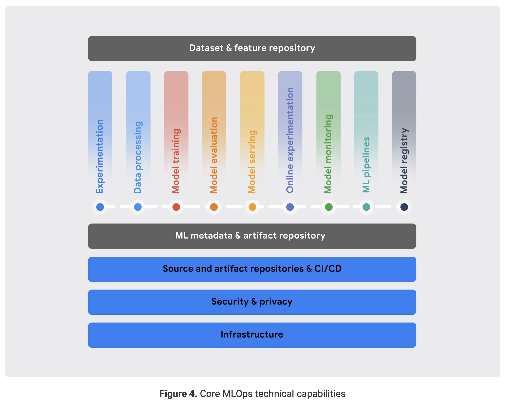

# 1. What is MLOps?
MLOps는 이전에 없던 새로운 개념이 아니라 DevOps라고 불리는 개발 방법론에서 파생된 단어다.   
먼저 Devops에 대해 이해해보자.

### DevOps
Development(개발)와 Operations(운영)의 합성어로 소프트웨어 개발자와 관련 전문가 간의 소통과 협업 및 통합을 위한 개발 환경 및 문화를 말한다. 크게 DevOps의 목적은 소프트웨어 개발 조직과 운영 조직 간의 상호 의존적 대응이며, 빠르게 소프트웨어 서비스를 개발 및 배포하는 것이다. 

### CI/CD
Continuous Integration(CI)와 Continuous Delivery(CD)는 개발팀에서 개발 중인 기능이 정상적으로 배포까지 이어질 수 있는지 확인하도록 하며, 운영팀에서는 검증된 기능이나 개선된 제품을 더 자주 배포해 고객의 제품 경험을 상승시킨다.   

### ML + Ops
ML(Machine Learning)과 Operation의 합성어로 머신러닝과 운영팀의 문제를 해결하고 머신러닝 모델을 더 자주 빠르게 배포하기 위한 관리 툴이다.

--------------------------

# 2. Levels of MLOPs
구글에서 발표한 MLOps의 단계를 확인하고 핵심 기능이 무엇인지 알아보자.

### Hidden Technical Debt in ML System
구글에서는 2015년부터 "머신러닝 제품을 만드는 데 있어서 머신러닝 코드는 아주 일부일 뿐이다, MLOps가 필요하다.'라는 이야기를 해왔다. 또한 그 발전 단계를 총 3단계를 나누어 설명했다.
- 0단계: 수동 프로세스
0단계에서는 개발팀과 운영팀이 모델을 통해 소통한다. 머신러닝 개발팀에서는 쌓여있는 데이터로 모델을 학습시키고, 학습된 모델을 운영팀에 전달한다. 운영팀은 전달받은 모델을 배포한다. 하지만 이러한 모델 중심의 소통은 여러 문제가 있을 수 있다. 필요한 환경이 다를 수 있고, 코드가 잘못 전달되거나 학습된 가중치가 잘못 전달될 수 있다. 간단한 모델의 경우에는 이러한 문제들을 금방 해결할 수 있겠지만, 관리하는 기능이 많아지고 모델의 구조가 복잡해진다면 소통에 어려움을 겪게 될 것이다. 
- 1단계: ML 파이프라인 자동화
MLOps에서는 파이프라인을 통해 이러한 문제를 해결하고자 한다. 파이프라인은 도커와 같은 컨테이너를 이용해 머신러닝 개발팀이 사용한 것과 동일한 환경으로 동작하게 보장한다.   
**Continuous Training**: 과거의 데이터로 학습한 모델은 시간이 지나며 데이터의 분포가 변하기 때문에 성능이 저하되는 문제가 있다. 이를 방지하기 위한 방법으로 변화된 데이터 분포에 맞춰 모델을 자동 재학습(Auto Retrain)할 수 있다. 그러나 완전히 다른 종료의 데이터라면 새로운 모델을 다시 학습시켜야 할 것이다. 하지만 데이터가 쌓이려면 시간이 걸리기 때문에 새로운 종류의 데이터가 들어오고 충분히 쌓일 때까지 모델이 동작할 수 없게 된다. 이 구간을 Blind Spot이라고 하는데, 이 구간을 해결하기 위해서는 새로운 모델을 바로 학습하지 않고 적당량의 데이터가 쌓일 때까지 이전의 모델로 예측을 하다가 적당한 때에 변환해주는 Auto Deploy의 방식이 필요하다. 즉, ML 파이프라인 자동화를 위해서는 CT가 구현되어야 하고, 그를 위한 두 가지 기능이 Auto Retraining과 Auto Deploy이다.

- 2단계: CI/CD 파이프라인 자동화   
DevOps에서의 CI/CD 대상은 소스 코드다. MLOps에서도 마찬가지로 대상이 소스 코드인 것은 맞지만, 엄밀히 정의하면 학습 파이프라인 코드라고 할 수 있다. 영향이 있는 변화에 대해 실제로 모델이 정상적으로 학습을 하는지가 CI이고, 학습된 모델이 정상적으로 동작하는지가 CD인 것이다. 또한 코드 외에도 사용하는 패키지의 버전, 파이썬의 버전 또한 CI/CD의 대상이다.
    
----------------------

# 3. Components of MLOps
### practitioners guide to MLOps

2021년 5월에 발표된 구글의 white paper : Practitioners guide to MLOps: A framework for continuous delivery and automation of machine learning에서는 MLOps의 핵심 기능들로 다음과 같은 것들을 언급하였다.

1. Experimentation : 머신러닝 엔지니어들이 데이터를 분석하고 프로토타입 모델을 만들어 학습 기능을 구현할 수 있도록 지원하는 기능
    - Git과 같은 버전 컨트롤 도구와 통합된 jupyter notebook 환경 
    - 사용한 데이터, 하이퍼 파라미터, 평가 지표를 포함한 실험 추적 기능 
    - 데이터와 모델에 대한 분석 및 시각화 기능
2. Data Processing : 머신러닝 모델 개발 단계, 지속적인 학습, 그리고 API 배포까지 많은 양의 데이터를 사용할 수 있도록 지원하는 기능
    - 다양한 데이터 소스와 서비스에 호환되는 데이터 커넥터 기능
    - 다양한 형태의 데이터와 호환되는 데이터 인코더&디코더
    - 다양한 형태의 데이터에 대한 데이터 변환과 피처 엔지니어랑 기능
    - 학습과 서빙을 위한 확장 가능한 배치, 스트림 데이터 처리 기능
3. Model training : 모델 학습을 위한 알고리즘을 효율적으로 실행시킬 수 있도록 지원하는 기능
    - ML 프레임워크의 실행을 위한 환경 제공
    - 다수의 GPU/분산 학습 사용을 위한 분산 학습 환경을 제공
    - 하이퍼 파라미터 튜닝과 최적화 기능을 제공
4. Model evaluation - 모델 평가는 실험 환경과 상용 환경에서 동작하는 모델의 성능을 관찰할 수 있도록 지원한다.
    - 평가 데이터에 대한 모델 성능 평가 기능
    - 서로 다른 지속 학습 실행 결과에 대한 예측 성능 추적
    - 서로 다른 모델의 성능 비교와 시각화
    - 해석할 수 있는 AI 기술을 이용한 모델 출력 해석 기능 
5. Model serving - 모델 서빙은 상용 환경에 모델을 배포하고 서빙하기 위한 기능을 지원한다.
    - 저 지연 추론과 고가용성 추론 기능 제공
    - 다양한 ML 모델 서빙 프레임워크 지원(tensorflow serging, TorchServe etc)
    - 복잡한 형태의 추론 루틴 기능, 예를 들어 전처리와 후처리 및 최종 결과를 위해 다수의 모델이 사용되는 경우의 기능을 제공
    - 순간적으로 치솟는 추론 요청을 처리하기 위한 오토 스케일링 지원
    - 추론 요청과 추론 결과에 대한 로깅 기능
6. Online experimentation - 새로운 모델이 생성되었을 때, 이 모델을 배포했을 때 얼마나 성능을 보일 것인지 검증하는 기능으로, 새 모델을 배포하는 것까지 연결되어야 한다.
    - 카나리(canary) & 섀도(shadow) 배포 기능
    - A/B 테스트 기능
    - 멀티 암드 밴딧(Multi-armed bandit) 테스트 기능 제공
7. Model Monitoring - 상용 환경에 배포된 모델이 정상적으로 동작하는지 관찰하는 기능을 지원
8. ML Pipeline - 머신러닝 파이프라인은 상용 환경에서 복잡한 ML 학습과 추론 작업을 지원
    - 다양한 이벤트를 소스를 통한 파이프라인 실행 기능
    - 파이프라인 파라미터와 생성되는 산출물 관리를 위한 머신러닝 메타데이터 추적과 연동 기능
    - 일반적인 머신러닝 작업을 위한 내장 컴포넌트 지원과 사용자가 직접 구현한 컴포넌트에 대한 지원 기능
    - 서로 다른 실행 환경 제공 기능
9. Model Registry - 모델 저장소는 머신러닝 모델의 생명 주기를 중앙 저장소에 저장하는 기능, 등록과 추적 및 버저닝 기능과 배포를 위한 정보 저장 기능을 제공한다.
10. Dataset and Feature Repository - 데이터에 대한 공유, 검색, 재사용 및 버전 관리 기능을 제공하며, 이벤트 스트리밍 및 온라인 추론 작업에 대한 실시간 처리를 지원하고 다양한 형태의 데이터를 지원한다. 
11. ML Metadata and Artifact Tracking - MLOps의 각 단계에서 생성된 다양한 형태의 ML 메타 데이터를 관리하는 기능들을 지원한다.
    - ML 산출물에 대한 히스토리 관리 기능
    - 실험과 파이프라인 파라미터 설정에 대한 추적, 공유 기능
    - ML 산출물에 대한 저장, 접근, 시각화, 다운로드 기능 제공
    - 다른 MLOps 기능과의 통합 기능 제공
    
--------------------------------

# 4. Why Kubernetes?
MLOps를 이야기할 때 항상 쿠버네티스를 함께 언급한다. 쿠버네티스(Kubernetes)란 무엇일까?   
성공적인 MLOps 시스템을 위해서는 수많은 머신러닝 모델을 관리하고 학습 요청을 차례대로 실행하고, 다른 작업 공간에서도 동일한 실행환경을 보장해야 하며, 배포된 서비스에 장애가 생기면 빠르게 대응해야 한다. 그러기 위해서는 각각의 구성 요소들이 유기적으로 운영되기 위한 인프라가 필요하다. 그 근저가 되는 인프라가 쿠버네티스와 같은 컨테이너 오케스트레이션 시스템이다. 

### Container
보펀젹인 소프트웨어에서의 컨테이너의 정의는 다음과 같다.
> 컨테이너란 : 애플리케이션의 표준화된 이식 가능한 패키징
머신러닝에서는 왜 컨테이너가 필요할까? 머신러닝 모델들은 운영체제나 파이썬 실행환경, 라이브러리 버전 등에 따라 다르게 동작할 수 있다. 그래서 머신러닝에 사용된 소스 코드와 함께 종속적인 실행 환경 전체를 하나로 묶어서 공유하고 실행하는 기술이 컨테이너라이제이션이다. 패키징된 형태를 컨테이너 이미지라고 부르며, 이 컨테이너 이미지를 공유함으로써 사용자들은 어떤 환경에서든 같은 실행 결과를 보장할 수 있게 된다.   
그렇다면 컨테이너는 도커와 비슷하다고 이해하면 될까? 도커는 컨테이너와 같은 개념이 아니라, 컨테이너를 띄우거나 컨테이너를 쉽고 유연하게 사용할 수 있는 도구다. 즉, 여러 컨테이너 가상화 도구 중 쉬운 사용성과 높은 효율성을 바탕으로 많이 사용하는 컨테이너 활용 도구가 도커인 것이다.

### Container Orchestration System
오케스트레이션은 여러 컨테이너들이 서로 조화롭게 구동할 수 있도록 지휘하는 시스템을 의미한다. 컨테이너 기반의 시스템에서는 서비스가 컨테이너 형태로 사용자들에게 제공된다. 하지만 수백 개 이상의 컨테이너가 수십대 이상의 클러스터에서 구동되고 있다면 장애가 발생했을 때, 모든 컨테이너의 정상 동작 여부를 확인하기 어려울 것이다. 그래서 필요한 것이 컨테이너 오케스트레이션 시스템이다.   
컨테이너 오케스트레이션 시스템은 모든 서비스가 정상적으로 동작하고 있는지 계속해서 모니터링하고, 특정 클러스터나 특정 컨테이너에 작업이 몰리지 않도록 스케줄링 로드 밸런싱하고 스케일링하는 작업을 자동으로 쉽게 할 수 있도록 지원한다.    

쿠버네티스는 컨테이너 오케스트레이션 시스템 중 하나로, 컨테이너를 쉽고 빠르게 배포하고 확장하고 관리할 수 있도록 자동화해주는 오픈소스 플랫폼이다. 구글에서 만들어서 현재 많은 기업의 인프라/서버를 지탱하고 있는 기술이다. 

더 자세한 내용은 쿠버네티스 공식 문서 및 아래 잘 정리된 블로그 등의 자료를 참고

