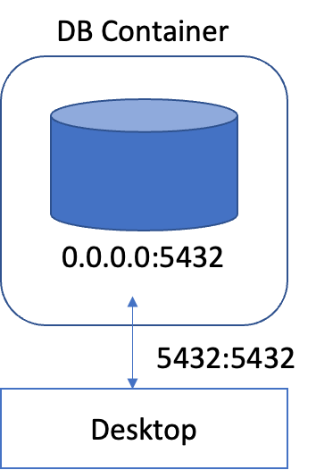
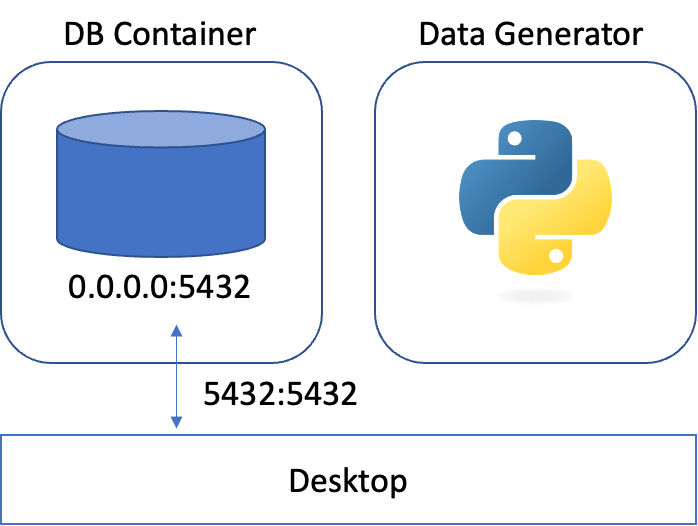

# MLOps for MLE
## 01. Database
Docker를 이용해서 DB server를 생성하고 psycopg2 패키지를 사용해 테이블을 생성하고 데이터 삽입을 해볼 것이다.
또한 Docker 파일과 Compose 파일을 만들어 Docker 컨테이너 안에서 계속 데이터를 생성하는 서비스를 구축해볼 것이다.

### Docker의 기능
- Build and run an image as a container.
- Share images using Docker Hub.
- Deploy Docker applications using multiple containers with a database.
- Run applications using Docker Compose.

### what is a container?
A container is a sandboxed process running on a host machine that is isolated from all other processes running on that host machine.
- Is a runnable instance of an image. We can create, start, stop, move, or delete a container using the DockerAPI or CLI.
- Can be run on local machines, virtual machines, or deployed to the cloud.
- Is portable (and can be run on any OS).
- Is isolated from other containers and runs its own software, binaries, configurations, etc.

### what is a container image?
A running container uses an isolated filesystem. This isolated filesystem is provided by a container image, and the container image must contain everything needed to run an application - all dependencies, configurations, scripts, binaries, etc. The image also contains other configurations for the container, such as environment variables, a default command to run, and other metadata.


------------------------------------------------


# 실습 - 1
## DB Server Creation

[설치링크](https://www.docker.com/)   
위 링크에서 Mac - Intel Chip 버전을 설치하였음.   

docker run 명령어를 통해 옵션을 설정하여 DB 서버를 생성할 수 있다.   
-d : 컨테이너가 detached 모드로 실행하게 되며, -d 옵션 없이 실행했다면 해당 터미널에서 Ctrl + C 를 눌러서 빠져나오는 순간 해당 컨테이너는 종료된다.   
--name : 컨테이너의 이름을 지정   
-p : 컨테이너에서 외부로 노출할 포트 포워딩 (port forwarding) 을 설정한다. 형식은 host:container 으로 사용되며, 여기서는 5432:5432 로 설정하겠다.   
-e : 필요한 환경 변수를 설정한다.   
POSTGRES_USER : 유저의 이름을 설정한다.   
POSTGRES_PASSWORD : 유저의 비밀번호를 설정한다.   
POSTGRES_DB : DB 의 이름을 설정한다.   
postgres:14.0 : 사용할 이미지를 지정한다.   

```python
docker run -d \
> --name postgres-server \
> -p 5432:5432 \
> -e POSTGRES_USER=heejin \
> -e POSTGRES_PASSWORD=password \
> -e POSTGRES_DB=mydatabase \
> postgres:14.0
```

이렇게 서버가 생성되고 나면 docker ps 명령어를 통해 확인할 수 있다.   
```
CONTAINER ID   IMAGE           COMMAND                   CREATED          STATUS          PORTS                    NAMES
363e70063ae3   postgres:14.0   "docker-entrypoint.s…"   20 seconds ago   Up 16 seconds   0.0.0.0:5432->5432/tcp   postgres-server
```

### DB 서버 확인
PostgreSQL DB 서버를 확인할 때 사용하는 CLI 툴인 psql을 설치한다.   

[설치 링크](https://www.enterprisedb.com/downloads/postgres-postgresql-downloads)   


PostgreSQL Version - 15.3 / Mac OS X 로 설치하였다. 그 다음 아래 커맨드로 psql을 통해 postgreSQL DB 서버로 접속한다.   
```python
PGPASSWORD=password psql -h localhost -p 5432 -U heejin -d mydatabase
```
아래와 같은 출력을 확인할 수 있다.   
```
psql (14.8 (Homebrew), server 14.0 (Debian 14.0-1.pgdg110+1))
Type "help" for help.

mydatabase=# \du
                                   List of roles
 Role name |                         Attributes                         | Member of 
-----------+------------------------------------------------------------+-----------
 heejin    | Superuser, Create role, Create DB, Replication, Bypass RLS | {}

mydatabase=# 
```


----------------------------------------------


# 실습 - 2
## Table Creation
생성된 DB에 query를 작성하여 테이블을 생성해보겠다.

1. pandas, psycopg2-binary, scikit-learn 패키지를 설치한다.
2. Python 스크립트를 이용하여 DB 에 접근한다.
    - user : myuser
    - password : mypassword
    - host : localhost
    - port : 5432
    - database : mydatabase
3. psycopg2 패키지를 사용하여 iris_data 테이블을 생성한다.
    - 테이블은 다음과 같은 column 들을 갖고 있어야 한다.   
    - id, sepal length (cm), sepal width (cm), petal length (cm), petal width (cm), target   
4. psql 을 이용하여 생성한 테이블을 확인한다.

### 패키지 설치
```
pip install pandas psycopg2-binary scikit-learn
```
<버전정보>   
psycopg2-binary-2.9.6   
pandas 1.1.3   
scikit-learn 0.23.2

### 테이블 생성
python으로 PostgreSQL DB 서버에 접근하는 코드를 구현하는 가장 간단한 방법은 psycopg2 패키지를 이용하는 것이다. 자세한 내용은 [공식문서](https://www.psycopg.org/docs/)를 확인하자.   

**DB Connection**
psycopg2로 DB 접근하려면 connect 함수를 이용한다. db_connect이라는 connector 인스턴스를 생성한다. 일반적으로 DB 연결에는 user, password,host,port,database 5가지 정보가 필요하다.

```python
import psycopg2

db_connect = psycopg2.connect(
    user="heejin",
    password="lhj6843*",
    host="localhost",
    port=5432,
    database="mydatabase",
)
```

테이블을 생성하기 위한 SQL 문은 아래와 같은 형식이다.   
```sql
CREATE TABLE table_name (
    column1 datatype,
    column2 datatype,
    column3 datatype,
)
```

그럼 한번 scikit-learn 패키지의 iris 데이터를 이용해서 입력해보겠다.   

```python
import pandas as pd
from sklearn.datasets import load_iris

X, y = load_iris(return_X_y = True, as_frame=True)
df = pd.concat([x, y], axis='columns')

print(df)
print(df.dtypes)
```

데이터 타입과 컬럼 이름에 수정해야 할 부분이 있다. 그래서 수정 사항을 반영하기 위해 query를 작성한다.   

```python
create_table_query = """
CREATE TABLE IF NOT EXISTS iris_data (
    id SERIAL PRIMARY KEY,
    timestamp timestamp,
    sepal_length float8,
    sepal_width float8,
    petal_length float8,
    petal_width float8,
    target int
);"""
```

**DB에 query 전달하기**
작성한 쿼리를 DB에 전달하기 위해 아래 과정이 필요하다.   
1. Connector에서 cursor를 열고 query를 전달한다.  
```python
cur = db_connect.cursor()
cur.execute(create_table_query)
```
2. 전달된 쿼리를 실행하기 위해 connector에 commit를 한다.   
```python
db_connect.commit()
```
3. cursor 사용이 끝나면 cursor를 close한다.   
```python
cur.close()
```

위 세가지 과정을 하나의 프로세스로 처리하자.   
```python
with db_connect.cursor() as cur:
    cur.excute(create_table_query)
    db_connect.commit()
```


### Query 실행
위 프로세스의 코드를 모아서 table_creator.py로 작성한다.    
```python
# table_creator.py
import psycopg2


def create_table(db_connect):
    create_table_query = """
    CREATE TABLE IF NOT EXISTS iris_data (
        id SERIAL PRIMARY KEY,
        timestamp timestamp,
        sepal_length float8,
        sepal_width float8,
        petal_length float8,
        petal_width float8,
        target int
    );"""
    print(create_table_query)
    with db_connect.cursor() as cur:
        cur.execute(create_table_query)
        db_connect.commit()


if __name__ == "__main__":
    db_connect = psycopg2.connect(
        user="myuser",
        password="mypassword",
        host="localhost",
        port=5432,
        database="mydatabase",
    )
    create_table(db_connect)
```

위 코드를 실행한다. 만약 실행 시 psycopg2 패키지 설치가 필요하다면 pip으로 설치하고 다시 실행하면 된다.

### 테이블 확인

1) psql로 DB 접속하기   
```
PGPASSWORD=password psql -h localhost -p 5432 -U heejin -d mydatabase
```
2) \d 를 입력해 생성된 테이블 목록을 확인하면 아래와 같이 생성되있을 것이다.   
```
psql (14.8 (Homebrew), server 14.0 (Debian 14.0-1.pgdg110+1))
Type "help" for help.

mydatabase=# \d
               List of relations
 Schema |       Name       |   Type   | Owner  
--------+------------------+----------+--------
 public | iris_data        | table    | heejin
 public | iris_data_id_seq | sequence | heejin
(2 rows)
```


---------------------------
   

# 실습 - 3
## Data Insertion
이번에는 앞서 생성한 테이블에 데이터를 삽입하고 확인해볼 것이다.

### 데이터 삽입
1) Iris 데이터 불러오기    
    삽입할 데이터는 Iris 데이터로 scikit-learn 패키지의 load_iris를 이용한다. 데이터를 불러와서 앞에 생성해놓은 테이블과 컬럼명이 일치하도록 수정해준다.  

2) 데이터를 한줄 추출하여 입력하는 query를 포함하여 입력 함수를 작성한다.   
```python
def insert_data(db_connect, data):
    insert_row_query = f"""
    INSERT INTO iris_data
        (timestamp, sepal_length, sepal_width, petal_length, petal_width, target)
        VALUES (
            NOW(),
            {data.sepal_length},
            {data.sepal_width},
            {data.petal_length},
            {data.petal_width},
            {data.target}
        );"""
    print(insert_row_query)
    with db_connect.cursor() as cur:
        cur.execute(insert_row_query)
        db_connect.commit()
```


3) 확인하기      
위의 과정을 하나의 파이썬 파일 data_insertion.py로 작성하고 실행한 다음, psql로 DB 서버 접속하여 확인해보면 데이터가 한줄 입력된 것을 확인할 수 있다.
```
    PGPASSWORD=password psql -h localhost -p 5432 -U heejin -d mydatabase
```
```mysql
select * from iris_data;
```

mydatabase=# select * from iris_data;
 id |         timestamp          | sepal_length | sepal_width | petal_length | petal_width | target 
----+----------------------------+--------------+-------------+--------------+-------------+--------
  1 | 2023-08-05 09:00:25.150453 |          6.3 |         3.3 |            6 |         2.5 |      2
(1 row)
  

---------------------------


# 실습 - 4
## Data Insertion Loop
이번에는 데이터를 계속해서 생성해보고 계속 DB에 삽입되고 있는지 확인해보겠다.    
data_insertion.py 코드에 insert_data 파트에 반복 루프를 추가한다. 여기서 너무 빠른 시간에 추가되면 DB에 부하가 생길 수 있으므로 1초 간격을 넣어준다. 그리고 코드를 실행하면 계속 실행되며 DB에도 데이터가 계속 추가되는 것을 확인할 수 있다.


---------------------------


# 실습 - 5
## Data Generator on Docker
이번에는 앞에서 작성했던 코드를 Docker 컨테이너 안에서 실행할 수 있도록 Docker file를 작성해볼 것이다. Docker 컨테이너 간의 네트워크를 연결해 DB에 데이터를 계속 삽입하도록 하고 확인해보자.

### 1) data_generator.py 작성
data_insertion.py 코드와 달라진 부분은 DB 에 연결하는 connector를 생성한 것 뿐이다. Connector를 생성할 때 4) Data Insertion Loop 챕터에서 작성한 내용과는 다르게 호스트를 받는 부분을 다음과 같이 ArgumentParser 로 변경했다.
```python
parser = ArgumentParser()
parser.add_argument("--db-host", dest="db_host", type=str, default="localhost")
args = parser.parse_args()
```

기존에 연결된 DB 에 iris_data 테이블을 생성하는 코드, Iris 데이터 불러오고 불러온 데이터 중 랜덤으로 row 1개를 DB 에 삽압허는 과정을 계속해서 반복하게 된다.

### 2) docker file 이용해 컨테이너 생성
docker 컨테이너를 생성하려면 docker create [이미지이름] 명령이 필요하며 먼저 docker 이미지를 만들어야 한다. 즉 dockerfile을 말하는 것인데, 도커 파일은 컨테이너 이미지를 만드는데 사용되는 단순 텍스트 기반 스크립트이다. Dockerfile이라는 파일을 만들고 내용을 적어주면 되는데, 기본 요소는 아래와 같다.   
* FROM: 이미지를 만들 때 base가 되는 이미지를 지정한다. 이 실습에서는 amd64/python:3.9-slim을 사용하겠다.   
* RUN: 이미지를 만들 때 실행할 코드를 지정한다. 첫번째 RUN은 해당 도커 파일로 Data Generator를 띄울 때 컨테이너 안에 접근하여 psql을 사용하기 위해 postgresql-client를 설치한다. 두번째 RUN은 컨테이너에서 python 스크립트를 실행할 때 필요한 라이브러리나 패키지를 설치한다.    
* WORKDIR: 작업 directory를 지정한다. 해당 폴더가 없는 경우는 새로 생성하며 작업 디렉토리가 지정된 이후 모든 명령어는 해당 위치를 기준으로 동작한다.    
* COPY: 파일이나 폴더를 이미지에 복사한다. 상대 경로를 사용할 경우, WORKDIR로 지정한 디렉토리를 기준으로 복사한다.    
* ENTRYPOINT: 컨테이너가 실행될 때 시작할 프로세스를 입력한다.   
* CMD: 컨테이너가 실행될 때 ENTRYPOINT에 전달할 argument를 입력한다.   

그럼 한번 도커 파일을 작성해보자

```
FROM amd64/python:3.9-slim

RUN apt-get update && apt-get install -y \
    postgresql-client \
    && rm -rf /var/lib/apt/lists/*

WORKDIR /usr/app

RUN pip install -U pip && pip install scikit-learn pandas psycopg2-binary

COPY code/1_data_generator.py data_generator.py

ENTRYPOINT [ "python", "data_generator.py", "--db-host" ]

CMD [ "localhost" ]
```

다음으로 위 docker file을 이용해서 이미지를 build 한다. 빌드 규칙과 명령어는 아래와 같고 이미지 이름은 data-generator로 하겠다.  

```
docker build [OPTIONS] PATH | URL | -
```
```
docker build -t data-generator .
```
```
> docker image ls
REPOSITORY       TAG       IMAGE ID       CREATED          SIZE
data-generator   latest    77451f3cb081   15 seconds ago   609MB
postgres         14.0      317a302c7480   21 months ago    374MB
```

그리고 이미지가 생성되었는지 docker image ls 명령어로 확인해보면 잘 생성된 것을 확인할 수 있을 것이다. 그럼 빌드한 이미지를 docker run data-generator 명령어로 실행해보자.   

```
Traceback (most recent call last):
  File "/usr/app/code/1_data_generator.py", line 61, in <module>
    db_connect = psycopg2.connect(
  File "/usr/local/lib/python3.9/site-packages/psycopg2/__init__.py", line 122, in connect
    conn = _connect(dsn, connection_factory=connection_factory, **kwasync)
psycopg2.OperationalError: connection to server at "localhost" (127.0.0.1), port 5432 failed: Connection refused
	Is the server running on that host and accepting TCP/IP connections?
connection to server at "localhost" (::1), port 5432 failed: Cannot assign requested address
	Is the server running on that host and accepting TCP/IP connections?
```
위와 같은 메세지와 함께 컨테이너가 실행되지 않고 종료될 것이다. 이유는 로컬호스트가 응답하지 않는다는 에러인데 먼저 DB 컨테이너가 제대로 실행되고 있는지를 확인해야 할 것이다. 그럼 앞의 다른 실습에서 띄워놓은 DB Server만 실행 중임을 알 수 있다.  왜 로컬에서는 실행이 되지만 도커 컨테이너에서는 이 DB 서버에 접근할 수 없는 것일까? Docker의 네트워크에 대해 알아보자.   

### 3) doker network 연결
먼저 로컬에서 DB 컨테이너에 접근한 방법을 살펴보자.   


DB Server Creation 챕터에서 DB 컨테이너를 띄울 때 사용한 명령어는 docker run -d ... -p 5432:5432 postgres:14.0 이다. 즉, DB 컨테이너의 5432 포트를 localhost 의 5432 포트로 연결한 것인데 localhost:5432 에 대한 접근은 컨테이너 내부의 5432 포트에 대한 접근과 같다. 그래서 연결이 가능한 것이다.   

반면 Data Generator 컨테이너를 실행시켜서 DB 컨테이너를 띄우고자 하는 방법은 아래 그림과 같다.   

이 때 Data Generator 컨테이너 입장에서 localhost:5432 는 아무것도 열려있지 않은 비어있는 포트이다. 그렇기 때문에 DB 를 찾지 못한다는 에러와 함께 종료된다. 이를 해결하려면 두 컨테이너 간 통신을 할 수 있게 네트워크를 연결해주어야 한다.   

두 컨테이너를 연결시키는 방법 중 하나로 **docker network**를 사용할 수 있다.   
1. 우선 컨테이너 간 통신할 네트워크를 생성한다.   
```
docker network create my-network
```
2. 실행 중인 DB 컨테이너를 생성된 네트워크에 연결한다.   
```
docker network connect my-network postgres-server
```
3. 이제 다시 data-generator 이미지를 이용해 data-generator 이라는 컨테이너를 실행하는데 네트워크를 지정해준다.   
```
docker run -d \
  --name data-generator \
  --network "my-network" \
  data-generator "postgres-server"
```

### 4) 데이터 확인
다시 psql 을 이용하여 DB 에 접속해서 데이터를 확인해보면 실시간으로 입력되고 있는 것을 확인할 수 있다.

```
    PGPASSWORD=password psql -h localhost -p 5432 -U heejin -d mydatabase
```
```
mydatabase=# select * from iris_data;
 id  |         timestamp          | sepal_length | sepal_width | petal_length | petal_width | target 
-----+----------------------------+--------------+-------------+--------------+-------------+--------
 124 | 2023-08-07 06:40:28.653459 |          5.7 |         2.6 |          3.5 |           1 |      1
 125 | 2023-08-07 06:40:29.683945 |          6.5 |           3 |          5.2 |           2 |      2
 126 | 2023-08-07 06:40:30.689314 |          6.7 |         3.3 |          5.7 |         2.1 |      2
```


---------------------


# 실습 - 6
## Data Generator on Docker
이번에는 Docker Compose를 이용해 컨테이너를 띄우는 실습을 해보겠다. 아래 명령어로 먼저 실행 중안 DB 서버와 Data Generator를 종료시킨다.  
```
docker rm --force postgres-server data-generator
```

### Docker Compose 파일 작성
먼저 Compose 파일은 .yaml 파일로 작성하며 아키텍처는 다음과 같다.

* version - Compose 파일의 버전을 의미한다. 최신 버전은 에서 확인 가능하며 최신 버전인 3을 사용하겠다.   
* services - Compose에 묶일 서비스들을 의미하며 하나의 서비스는 하나의 컨테이너라고 이해하면 된다.

1) services - postgres-server
    - (name): 먼저 이름을 입력해준다. 서비스의 이름 == 컨테이너 호스트 이름
    - image: 사용할 컨테이너의 이미지
    - ports: 컨테이너에서 외부로 노출할 포트 포워딩 설정, 여러개 지정 가능하다.   
    - environment: 컨테이너 실행할 때 사용한 -e 옵션과 같은 역할이다.
2) services - data generator
    - build
        - context: 이미지를 빌드하기 위해 dockerfile의 절대경로 또는 상대경로를 설정한다.   
        - dockerfile: 위의 경로에 있는 dockerfile 파일명을 입력한다.    
    - depends_on: 띄어지는 서비스 간 종속성 순서로 postgres server가 먼저 실행되고 난 뒤에 data generator를 실행해야 하므로 postgres server를 입력해준다.   
    - command: Dockerfile에 작성되어 있는 CMD를 덮어쓴다. 

```yaml
# docker-compose.yaml
version: "3"

services:
    postgres-server:
        image: postgres:14.0
        container_name: postgres-server
        ports:
        - 5432:5432
        environment:
        POSTGRES_USER: myuser
        POSTGRES_PASSWORD: mypassword
        POSTGRES_DB: mydatabase

    data-generator:
        build:
        context: .
        dockerfile: Dockerfile
        container_name: data-generator
        depends_on:
        - postgres-server
        command: ["postgres-server"]
```

위와 같이 Compose 파일을 작성했다면 up과 down 명령어롤 통해 실행과 종료를 할 수 있다. 여기서 -d는
Detached 모드로 실행한다는 의미로 백그라운드에서 컨테이너를 실행 후 유지시키는 모드다.
```
docker compose up -d
``` 

하지만 실행이 되지 않을 것이다. 그 이유는 앞서 depends_on 으로 서비스 간의 종속성은 정했지만, 실제로 postgres server 가 띄워진 뒤에 곧바로 Data Generator 가 띄워지려고 하다보니 Postgres server 는 아직 준비가 되어있지 않은데 Data Generator 가 띄워져서 DB 에 연결을 하려다보니 Data Generator 가 Exited 되는 문제가 발생하는 것이다.   

따라서 postgres server 가 사용 가능한 상태가 되어있는지 체크를 한 뒤에 Data Generator 를 띄워야 한다. 이를 해결하기 위한 방법으로 Docker Compose Healthcheck 가 있다.   
간단하게 아래와 같이 yaml 파일에 healthcheck 부분과 condition 을 추가해볼텐데 postgres-server에 10초마다 테스트를 실행하여 5초 이내에 준비가 되었는지 체크하는 내용의 healthcheck 구문을 추가한다. 그리고 data-generator depend_on에 condition 속성을 추가한다.    
```
services:
    postgres-server:
        healthcheck:
            test: ["CMD", "pg_isready", "-q", "-U", "myuser", "-d", "mydatabase"]
            interval: 10s
            timeout: 5s
            retries: 5
    data-generator:
        depends_on:
            postgres-server:
                condition: service_healthy
```

### 확인
```
docker network ls
```
88631c0ecb57   mlops-basic_default   bridge    local   
디렉토리명_default 라는 이름으로 생성된 것 확인할 수 있다.

```
docker network mlops-basic_default
```
네트워크에 자동으로 postgres-server 와 data-generator 컨테이너가 추가된 것을 볼 수 있다.


```
"Containers": {
            "665c73b7d45da9f4c841a29380eda38cb9024453697e01216bfe31ab5ed6149b": {
                "Name": "postgres-server",
                "EndpointID": "136e8aabce59eec43212aaf6db875df18f664f842c67b0b5586172fe096b0e94",
                "MacAddress": "02:42:ac:13:00:02",
                "IPv4Address": "172.19.0.2/16",
                "IPv6Address": ""
            },
            "ccac41fab42ef629481a081b1778911de91346cab0cdf8a3b434cc9ff560267b": {
                "Name": "data-generator",
                "EndpointID": "5f7a5b3a574441362984db5b147405efcbac1d955a1b68dbcae1b2eb1590ea36",
                "MacAddress": "02:42:ac:13:00:03",
                "IPv4Address": "172.19.0.3/16",
                "IPv6Address": ""
```
네트워크에 자동으로 postgres-server 와 data-generator 컨테이너가 추가된 것을 볼 수 있다.


그럼 일단 모든 서비스를 종료한 후 이름을 생성해서 다시 만들어주겠다. -v는 생성된 볼륨도 삭제하는 옵션이다.
```
docker compose down -v
```

이름을 지정하기 위해 compose 파일 하단에 아래 구문을 추가한다.
```
networks:
  default:
    name: mlops-network
```

### 다시 실행하기
```
docker compose up -d
```

### 네트워크 확인
```
(base) ihuijin-ui-MacBook-Air:MLOps-basic leeheejin$ docker network ls
NETWORK ID     NAME            DRIVER    SCOPE
801c384a5fd1   bridge          bridge    local
b3aabcb80e16   host            host      local
699f996e9400   mlops-network   bridge    local
f37593eed931   my-network      bridge    local
91f2fbb1fcbc   none            null      local
```

### 데이터 확인
```
(base) ihuijin-ui-MacBook-Air:MLOps-basic leeheejin$ PGPASSWORD=password psql -h localhost -p 5432 -U heejin -d mydatabase
psql (14.8 (Homebrew), server 14.0 (Debian 14.0-1.pgdg110+1))
Type "help" for help.

mydatabase=# \d
               List of relations
 Schema |       Name       |   Type   | Owner  
--------+------------------+----------+--------
 public | iris_data        | table    | heejin
 public | iris_data_id_seq | sequence | heejin
(2 rows)

mydatabase=# select * from iris_data;
 id  |         timestamp          | sepal_length | sepal_width | petal_length | petal_width | target 
-----+----------------------------+--------------+-------------+--------------+-------------+--------
   1 | 2023-08-08 06:33:51.316981 |          5.5 |         4.2 |          1.4 |         0.2 |      0
   2 | 2023-08-08 06:33:52.323448 |          5.6 |         2.8 |          4.9 |           2 |      2
   3 | 2023-08-08 06:33:53.330731 |            6 |         2.2 |            5 |         1.5 |      2
   4 | 2023-08-08 06:33:54.338171 |          6.3 |         3.4 |          5.6 |         2.4 |      2
   5 | 2023-08-08 06:33:55.344954 |          6.3 |         2.3 |          4.4 |         1.3 |      1
   6 | 2023-08-08 06:33:56.351195 |          6.2 |         3.4 |          5.4 |         2.3 |      2
   7 | 2023-08-08 06:33:57.357598 |            6 |         3.4 |          4.5 |         1.6 |      1
   8 | 2023-08-08 06:33:58.366004 |          4.6 |         3.2 |          1.4 |         0.2 |      0
   9 | 2023-08-08 06:33:59.383616 |          5.4 |         3.7 |          1.5 |         0.2 |      0
  10 | 2023-08-08 06:34:00.389241 |          6.3 |         2.3 |          4.4 |         1.3 |    :
```

그럼 docker exec로도 Data Generator 컨테이너 안으로 접속해보자.
docker 컨테이너 상에서 psql 을 이용하여 DB 로 접속하는데 이 때는 호스트가 local 이 아닌 Data Generator 컨테이너에서 접속해야 하기 때문에 호스트를 localhost 에서 postgres-server 로 변경해야한다.

```
(base) ihuijin-ui-MacBook-Air:MLOps-basic leeheejin$ docker exec -it data-generator /bin/bash
root@9e5227b175c6:/usr/app# 
root@9e5227b175c6:/usr/app# 
root@9e5227b175c6:/usr/app# 
root@9e5227b175c6:/usr/app# PGPASSWORD=password data_generator.py psql -h postgres-server -p 5432 -U heejin -d mydatabase
bash: data_generator.py: command not found
root@9e5227b175c6:/usr/app# PGPASSWORD=password psql -h postgres-server -p 5432 -U heejin -d mydatabase
psql (15.3 (Debian 15.3-0+deb12u1), server 14.0 (Debian 14.0-1.pgdg110+1))
Type "help" for help.

mydatabase=# \d
               List of relations
 Schema |       Name       |   Type   | Owner  
--------+------------------+----------+--------
 public | iris_data        | table    | heejin
 public | iris_data_id_seq | sequence | heejin
(2 rows)
```