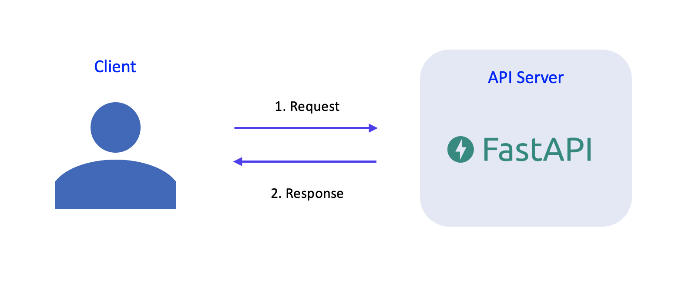
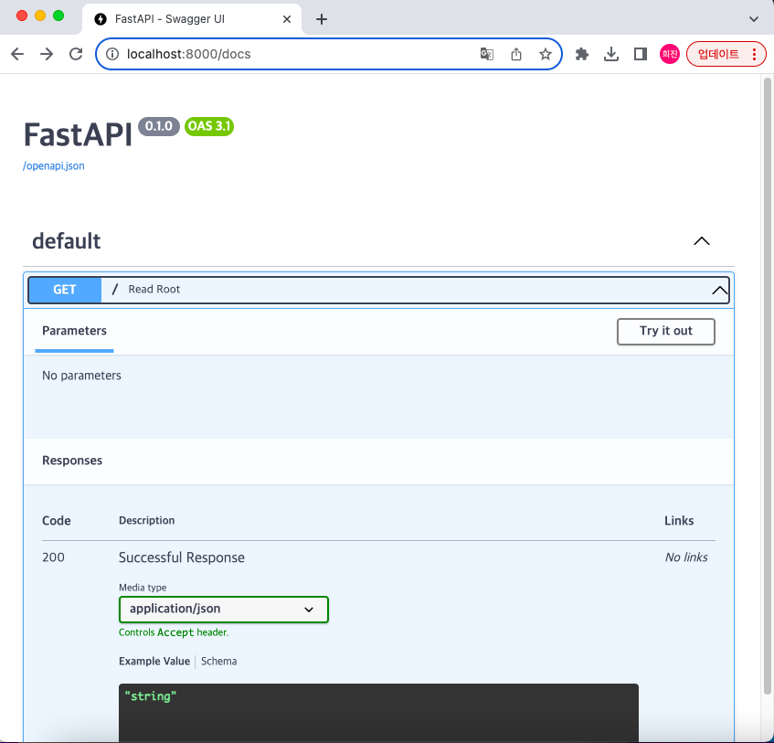
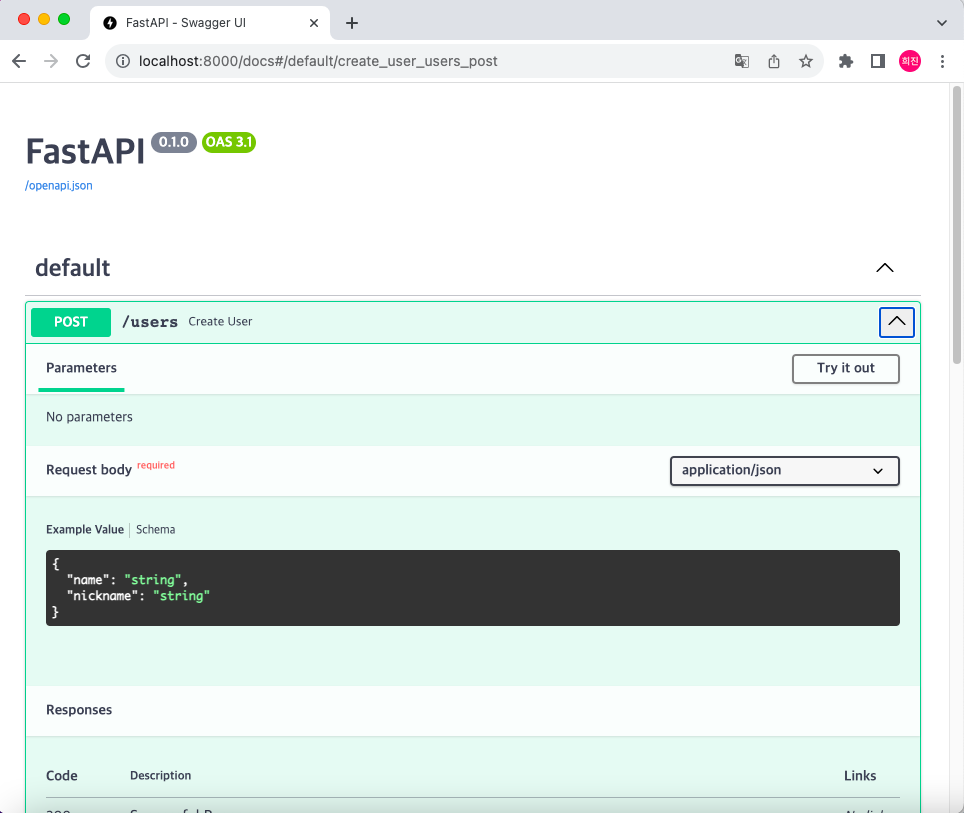

# MLOps for MLE
## Chapter 5 - FastAPI
이번 파트에서는 모델을 서빙하는 방법 중 하나로 API의 개념에 대해 알아보겠다. 파이썬 기반 웹 프레임워크인 FastAPI를 사용할 것이고 Docker를 이용해 FastAPI로 만든 API 서버를 실행하여 client와 서버 사이에 request와 response를 주고 받는다.   


------------------------


# 실습 - 1
## FastAPI Tutorial 
먼저 FastAPI의 공식 문서를 참고하여 구조를 이해하고 간단한 API를 만들어볼 것이다. 여기서는 Path Parameter와 Query Parameter를 이해할 필요가 있다.

### 0) 패키지 설치
```
pip install "fastapi[all]"
```

### 1) main.py 작성하기
```python
from fastapi import FastAPI
app = FastAPI()

@app.get("/")
def read_root():
    return {"Hello":"World"}
```

실행하는 명령어는 다음과 같다. 
```
uvicorn main:app --reload
```
- uvicorn: FastAPI를 실행하는 웹 서버 실행 Command Line Tool
- main: 위에서 작성한 python 모듈 main.py를 의미한다.
- app: main.py에서 FastAPI()를 통해 생성된 객체를 의미한다.
- --reload: 코드가 바뀌면 서버가 재시작하도록 해주는 옵션이다.

이제 http://localhost:8000 에 접속해보면 다음 화면과 같이 {"Hello": "World"} 가 표시되는 것을 확인할 수 있다.    
그리고 http://localhost:8000/docs 에 접속해보면. 다음과 같은 형태로 된 화면을 볼 수 있다.

이 페이지는 Swagger UI에 의해 제공되는 interactive API documentation이다. 이를 통해 작성한 API를 다양하게 테스트하고 확인해볼 수 있다. (Swagger UI - API Documentation과 관련된 기능을 제공하는 제품)

### 2) First Steps
FastAPI에서 제공하는 First steps tutorial을 한번 따라해보자.
참고 링크 - 

**Step 1: Import FastAPI**
먼저 API를 만들 수 있도록 도와주는 Python 클래스 FastAPI를 import한다.
```python
from fastapi import FastAPI
```

**Step 2: Create a FastAPI Instance**
FastAPI 클래스의 인스턴스를 생성한다. 여기서 생성하는 인스턴스의 이름에 따라 uvicorn main:app --reload 같은 형태의 명령어가 정해진다.
```python
app = FastAPI()
```


**Step 3: Create a Path Operation**
여기서 말하는 path는 url에서 첫번째 /부터 시작되는 마지막 부분을 의미한다. 예를 들어 url이 https://example.com/items/foo라면 path는 /items/foo라고 할 수 있다.   
Operation은 POST, GET, PUT, DELETE 등과 같은 HTTP Method를 의미한다. 이러한 operation을 수행하기 위해 @app.get("/")은 fastapi로 하여금 path /로 가서 GET operation을 수행하라는 의미로 사용된다.


**Step 4: Define the Path Operation Function**
Path Operation Function은 Path Operation이 수행되었을 때 호출될 python 함수를 말한다.
```python
@app.get("/")
def read_root():
    return {"Hello":"World"}
```


**Step 5: Return the Content**
Path Operation Function을 통해 리턴하는 값으로는 dict, list. str, int 등이 가능하다. 또한 뒤에서 나올 Pydantic Model 의 형태로도 return 할 수 있다.

### 3) Path Parameter 이해하기
Path Parameter는 Path Operation에 포함된 변수로 사용자에게 입력받아 function의 argument로 사용되는 parameter를 의미한다. 다음과 같이 path_param.py를 작성하고 uvicorn path_param:app --reload를 입력하여 실행한다.

```python
# path_param.py
from fastapi import FastAPI
app = FastAPI()

@app.get("/items/{item_id}")
def read_item(item_id: int):
    return {"item_id": item_id}
```
위와 같이 path에 parameter를 입력할 수 있다. 여기서 item_id와 같은 파라미터를 path parameter라고 하며 function에 argument로 전달된다.   
read_item(item_id: int)와 같이 파라미터의 타입을 지정할 수 있는데, 만약 다른 타입의 데이터가 입력되면 다음과 같은 HTTP Error를 리턴한다.
```
{
    "detail": [
        {
            "loc": [
                "path",
                "item_id"
            ],
            "msg": "value is not a valid integer",
            "type": "type_error.integer"
        }
    ]
}
```


### 4) Query Parameter 이해하기
Query Parameter는 function parameter로는 사용되지만 Path Operation에 포함되지 않아 Path Parameter라고 할 수 없는 parameter를 의미한다. 다음과 같이 query_param.py를 작성하고 uvicorn query_param:app --reload를 입력하여 실행한다.
```python
# query_param.py
from fastapi import FastAPI
app = FastAPI()
fake_items_db = [{"item_name": "Foo"}, {"item_name": "Bar"}, {"item_name": "Baz"}]


@app.get("/items/")
def read_item(skip: int = 0, limit: int = 10):
    return fake_items_db[skip : skip + limit]
```
Path Parameter와는 다르게, function에 parameter로 들어있는 skip과 limit이 Path Operation인 @app.get("/items/")에는 들어있지 않다. Query는 URL 에서 ? 뒤에 key-value 쌍의 형태로 나타나고, &로 구분되어 사용된다. 예를 들면, 위와 같은 경우 http://localhost:8000/items/?skip=0&limit=10과 같은 형태로 사용할 수 있다. Query Parameter는 path의 고정된 부분이 아니기 때문에 optional로 사용될 수 있고, 따라서 기본값을 가질 수 있다. 위의 예시에서는 skip=0 과 limit=10 의 기본값을 가지고 있다. 하지만 항상 기본값을 가지는 것은 아니고, 값을 입력받아야만 하는 Query Parameter도 존재한다. 이를 Required Query Parameter라고 하고 다음과 같은 형태로 사용할 수 있다.

```python
@app.get("/items/{item_id}")
def read_user_item(item_id: str, needy: str):
    item = {"item_id": item_id, "needy": needy}
    return item
```
위의 예시에서 needy 는 Path Operation @app.get("/items/{item_id}")에 포함되어 있지 않으므로 Query Parameter이고, function read_user_item()에서 기본값이 존재하지 않기 때문에 Required Query Parameter 임을 알 수 있다. 이러한 경우 http://localhost:8000/items/foo-item와 같이 needy를 입력해주지 않으면 에러가 발생한다. 따라서 http://localhost:8000/items/foo-item?needy=someneedy와 같은 형태로 ? 뒤에 입력을 해 주어야 에러가 발생하지 않고 함수가 제대로 동작한다.


### 5) Multiple Path and Query Parameters 사용해보기
이번에는 Path Parameter와 Query Parameter를 모두 사용하여 Path Operation Function을 작성해보자.

```python
from typing import Union
from fastapi import FastAPI

app = FastAPI()

@app.get("/users/{user_id}/items/{item_id}")
def read_user_item(user_id: int, item_id: str, q: Union[str, None] = None, short: bool = False):
    item = {"item_id": item_id, "owner_id": user_id}
    if q:
        item.update({"q": q})
    if not short:
        item.update(
            {"description": "This is an amazing item that has a long description"},
        )
    return item
```

여기서 Path parameter로는 user_id, item_id가 있다. path operation function의 파라미터를 살펴보면 user_id, item_id, q, short가 있는데, 여기서 q와 short는 query parameter라는 것을 알 수 있고 기본 값이 각각 None과 False이다.

요청 가능한 URL의 형태는 다음과 같다.
* http://localhost:8000/users/3/items/foo-item?q=hello&short=True
* http://localhost:8000/users/3/items/foo-item?short=True
* http://localhost:8000/users/3/items/foo-item?q=hello
* http://localhost:8000/users/3/items/foo-item


----------------------


# 실습 - 2
## FastAPI CRUD
이번에는 fastapi를 활용해 CRUD(Create, Read, Update, Delete)를 수행하도록 api를 작성해보겠다. Path Parameter와 Query Parameter의 차이점을 확인할 수 있다.

### 1) 명세서 작성
**(a) Path Parameter**
- Create: 이름과 별명을 입력하여 사용자를 생성한다.   
   
POST /users/name/{name}/nickname/{nickname}
```
Response Body
{
 “status”: “success” 
}
```
- Read: 이름을 입력하여 해당 이름을 가진 사용자의 별명을 반환한다.
   
GET /users/name/{name}
```
Response Body
{
 “nickname”: “world” 
}
```

- Update: 이름과 새로운 별명을 입력하여 해당 이름을 가진 사용자의 별명을 업데이트한다.
   
PUT /users/name/{name}/nickname/{nickname}
```
Response Body
{
 “status”: “success” 
}
```

- Delete: 이름을 입력하여 해당 이름을 가진 사용자의 정보를 삭제한다.
   
DELETE /users/name/{name}
```
Response Body
{
 “status”: “success” 
}
```

**(b) Query Parameter**
- Create: 이름과 별명을 입력하여 사용자를 생성한다.   
   
POST /users?name=hello&nickname=world
```
Response Body
{
 “status”: “success” 
}
```
- Read: 이름을 입력하여 해당 이름을 가진 사용자의 별명을 반환한다.
   
GET /users?name=hello
```
Response Body
{
 “nickname”: “world” 
}
```

- Update: 이름과 새로운 별명을 입력하여 해당 이름을 가진 사용자의 별명을 업데이트한다.
   
PUT /users?name=hello&nickname=world2
```
Response Body
{
 “status”: “success” 
}
```

- Delete: 이름을 입력하여 해당 이름을 가진 사용자의 정보를 삭제한다.
   
DELETE /users?name=hello
```
Response Body
{
 “status”: “success” 
}
```
### 2) API 구현
작성한 명세서를 FastAPI 를 이용해 구현한다.
먼저 FastAPI 클래스의 인스턴스를 생성한 후 입력받은 데이터를 저장할 수 있도록 USER_DB 를 생성한다. 만약 메모리에 존재하지 않는 이름에 대한 요청이 들어온 경우에 에러를 발생할 수 있도록 HTTPException 을 이용하여 NAME_NOT_FOUND 를 선언한다. 그리고 명세한 CRUD 기능을 추가로 작성한다.   

```python
from fastapi import FastAPI, HTTPException

app = FastAPI()
USER_DB = {}
NAME_NOT_FOUND = HTTPException(status_code=400, detail="Name not found.")
```
**(a) Path Parameter**
```python
@app.post("/users/name/{name}/nickname/{nickname}")
def create_user(name: str, nickname: str):
    USER_DB[name] = nickname
    return {"status": "success"}


@app.get("/users/name/{name}")
def read_user(name: str):
    if name not in USER_DB:
        raise NAME_NOT_FOUND
    return {"nickname": USER_DB[name]}


@app.put("/users/name/{name}/nickname/{nickname}")
def update_user(name: str, nickname: str):
    if name not in USER_DB:
        raise NAME_NOT_FOUND
    USER_DB[name] = nickname
    return {"status": "success"}


@app.delete("/users/name/{name}")
def delete_user(name: str):
    if name not in USER_DB:
        raise NAME_NOT_FOUND
    del USER_DB[name]
    return {"status": "success"}
```

**(b) Query Parameter**
```python
@app.post("/users")
def create_user(name: str, nickname: str):
    USER_DB[name] = nickname
    return {"status": "success"}


@app.get("/users")
def read_user(name: str):
    if name not in USER_DB:
        raise NAME_NOT_FOUND
    return {"nickname": USER_DB[name]}


@app.put("/users")
def update_user(name: str, nickname: str):
    if name not in USER_DB:
        raise NAME_NOT_FOUND
    USER_DB[name] = nickname
    return {"status": "success"}


@app.delete("/users")
def delete_user(name: str):
    if name not in USER_DB:
        raise NAME_NOT_FOUND
    del USER_DB[name]
    return {"status": "success"}
```

### 3) 작동 확인
```
uvicorn crud_path:app --reload
uvicorn crud_query:app --reload
```
다음으로 http://localhost:8000/docs 에 접속하면 다음과 같은 Swagger UI 화면을 볼 수 있고, 각 http method에 파라미터가 포함되어 있는 걸 확인할 수 있다.

**Path Parameter vs Query Parameter**
Path Parameter를 이용한 API에서는 path에 변수의 값을 저장하여 함수에 전달한다.
반면, Query Parameter를 이용한 API에서는 path 에 변수의 값을 저장하지 않고 데이터를 전달한다.


-----------------------


# 실습 - 3
## FastAPI CRUD (Pydantic)
이번에는 앞서 입력으로 받는 부분을 pydantic의 basemodel을 이용하는 것으로 수정해볼 것이다. Pydantic을 사용하기 전과 후에 어떠한 차이가 있는지 알아보자.   

### Pydantic 이란?
pydantic은 타입 애너테이션을 사용해서 데이터를 검증하고 설정들을 관리하는 라이브러리이다. pydantic은 런타임 환경에서 타입을 강제하고 타입이 유효하지 않을 때 에러를 발생시켜준다. FastAPI, Project Jupyter, Microsoft, AWS 등 많은 곳에서 사용된다.   

Request Body는 client에서 API로 전송하는 데이터를 의미한다. 반대로 Response Body는 API가 client로 전송하는 데이터를 의미한다.

이렇게 client와 API 사이에 데이터를 주고 받을 때 데이터의 형식을 지정해 줄 수 있는데, 이를 위해 Pydantic Model을 사용할 수 있다.

### 코드 작성
```python
from fastapi import FastAPI, HTTPException
from pydantic import BaseModel

app = FastAPI()
USER_DB = {}
NAME_NOT_FOUND = HTTPException(status_code=400, detail="Name not found.")

class CreatIn(BaseModel):
    name: str
    nickname: str

class CreateOut(BaseModel):
    status: str
    id: int

@app.post("/users", response_model=CreateOut)
def create_user(user: CreateIn) -> CreateOut:
    USER_DB[user.name] = user.nickname
    return CreateOut(status="success", id=len(USER_DB))

@app.get("/users")
def read_user(name: str):
    if name not in USER_DB:
        raise NAME_NOT_FOUND
    return {"nickname": USER_DB[name]}


@app.put("/users")
def update_user(name: str, nickname: str):
    if name not in USER_DB:
        raise NAME_NOT_FOUND
    USER_DB[name] = nickname
    return {"status": "success"}


@app.delete("/users")
def delete_user(name: str):
    if name not in USER_DB:
        raise NAME_NOT_FOUND
    del USER_DB[name]
    return {"status": "success"}
```

create_user 함수는 입력으로 CreateIn 모델을 받고, CreateOut 모델을 반환함으로써 request 할 때와 response 할 때 주고받는 데이터에 다른 변수를 사용할 수 있다.

### 실행
```
uvicorn crud_pydantic:app --reload
```


-----------------------


# 실습 - 4
## FastAPI on Docker
이번에는 앞서 작성한 API를 docker를 이용하여 실행해보겠다. 

### 1) Dockerfile 작성
- RUN: pip을 먼저 업데이트한 후에 fastapi[all]을 설치한다.
- COPY: Pydantic을 이용한 api 코드를 컨테이너 내부로 복사한다.
- CMD: 컨테이너가 실행될 때 수행할 명령어의 기본값을 적어준다. 여기서는 uvicorn을 이용해 API 코드 안의 객체 app을 실행시킨다.

```
FROM amd64/python:3.9-slim

WORKDIR /usr/app

RUN pip install -U pip \
    && pip install "fastapi[all]"

COPY 5_crud_pydantic.py 5_crud_pydantic.py

CMD ["uvicorn", "crud_pydantic:app", "--host", "0.0.0.0", "--reload"]
```

### 2) Build & Run
```
docker build -t part5-api-server .
```
먼저 위의 명령어로 part5-api-server 라는 이름의 이미지를 빌드하고 그 이미지를 실행해보겠다.
- --name: 컨테이너의 이름 설정
- -p: 포트 포워딩을 8000:8000으로 설정해준다.
```
docker run -d \
  --name api-server \
  -p 8000:8000 \
  part5-api-server
```

### 3) 확인
먼저 docker ps 명령어로 컨테이너가 잘 실행되고 있는지 확인한다. 
```
(base) ihuijin-ui-MacBook-Air:MLOps-basic leeheejin$ docker psCONTAINER ID   IMAGE              COMMAND                  CREATED          STATUS          PORTS                    NAMES
c420ccea0be2   part5-api-server   "uvicorn crud_pydant…"   52 seconds ago   Up 51 seconds   0.0.0.0:8000->8000/tcp   api-server
```

그럼 API 서버도 잘 작성하고 있는지 확인해보자. API 서버 컨테이너를 실행할 때 포트 포워딩을 8000:8000 으로 했으므로 8000번 포트로 접속하면 API 서버로 접속할 수 있다. http://localhost:8000/docs 에 접속하면 다음과 같이 접속이 되는 것을 확인할 수 있다.




**도커 컨테이너 종료**
```
docker rm --force api-server
```

**도커 이미지 삭제**
```
docker images -a
docker rmi name
```