# MLOps for MLE
## Chapter 7 - Kafka

이번 챕터에서는 실시간으로 데이터를 모델에 전달하기 위한 데이터 파이프라인 구축을 해볼 것이다. 실시간으로 생성되는 데이터를 kafka registry로 얻고 kafka connect를 이용해 postgres server (DB 서버)와 연결하여 주고 받을 수 있다.    
여기서 source DB는 데이터가 계속해서 쌓이고 있는 외부 DB, 즉 PostgreSQL DB 서버를 말하며, target DB는 외부에서 가져온 데이터를 처리한 뒤 쌓이는 내부 DB를 말한다.
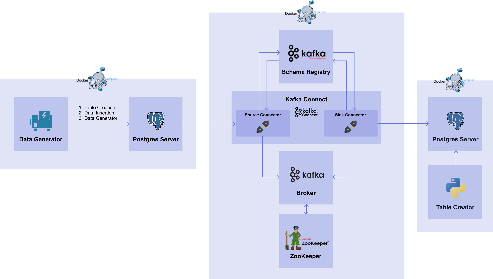


------------------


# Kafka Introduction
먼저 메시징 시스템에 대해 알아보고 Kafka의 전체 아키텍처를 이해해보자.   

## 메시징 시스템(Message System)
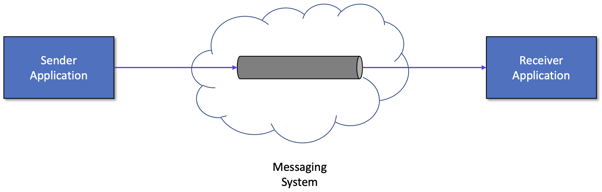
메시징 시스템이란 서로 다른 어플리케이션기리 정보를 교환하기 위해 메세지의 생성, 전송 및 저장을 하는 시스템을 말한다. 주로 하나의 어플리케이션이 여러 외부 어플리케이션에 데이터를 전달하거나 하나 이상의 데이터 소스로부터 데이터를 받아 처리하는 어플리케이션에 사용한다. 여기서 메시지는 하나의 entity에서 다른 하나의 entity로 정보를 전송하는 데 사용되는 통신 아티팩트를 말한다. 메시징 시스템의 대표적인 예로는 Kafka, RabbitMQ, Active MQ, AWS SQS 등이 있다.      

고전적인 분산 컴퓨팅 모델과의 차이점은 무엇일까? 메시징 시스템은 메시지 생산자와 소비자 사이에 약한 결합성을 가지기 때문에 한 쪽이 끊기거나 변경이 있어도 다른 쪽에는 큰 영향을 주지 않는다. 그리고 메시지 생산자와 소비자가 서로를 알지 못한다는 장점도 있다. 덕분에 동적이고 신뢰성있는 유연한 시스템을 구현할 수 있도록 해주며, 하위 어플리케이션의 전체적인 구성 변경도 가능하다는 장점이 있다. 추가로 높은 확장성과 통합성, 안정성의 특징을 가지고 있다. 이 특징 덕분에 서로 다른 네트워크 사이에서 비즈니스와 컴퓨팅 사이언스 문제를 해결하기 위해 많이 사용되며 다양한 어플리케이션의 기반이 되고 있다.   

### 용어 정리
메시징 시스템에서 쓰이는 기본적인 용어들을 정리해보자.

- Message Oriented Middleware / MOM   
  독립된 애플리케이션 간에 데이터를 주고받을 수 있도록 하는 중간 계층에 대한 인프라 아키텍처.   
  비동기(asynchronous)로 메시지를 전달하며 메시지를 발행하는 Publisher, 메시지를 소비하는 Subscriber 로 구성되어 있다.
- Message Broker: 메시지 처리를 하거나 메시지 수신자에게 메시지를 전달하는 시스템
- Message Queue(MQ):Message Broker 와 MOM 을 구현한 소프트웨어 (RabbitMQ, ActiveMQ, Kafka 등)
- Advanced Message Queueing Protocol / AMQP      
  메시지를 안정적으로 주고받기 위한 인터넷 프로토콜로 MOM은 메시지 전송 보장을 해야하므로 AMQP를 구현한다.

뒤이어 살펴볼 Kafka 는 **AMQP 를 구현한 MOM 시스템** 이다.
---------------------------

## Kafka
Kafka는 Open-source Distributed Event Streaming Platform이다. 여기서 Event Streaming이란 데이터베이스, 센서, 모바일 기기, 어플리케이션과 같은 곳에서 발생하는 데이터를 event stream 형태로 저장해서 나중에 검색할 수 있도록 하는 것을 말한다. 다시 말해, 발생하는 데이터를 실시간으로 처리하고, 필요에 따라서 데이터가 또 다른 target 시스템으로 event stream을 라우팅 해주는 것을 말한다.
### 1) Kafka의 주요 특징
- Event Streaming Platform: Event Stream을 실시간으로 처리하고 쌓이는 데이터를 지속적으로 보관하다가 그 데이터를 쓰려고 하는 다른 target 시스템에게 제공한다.
- Publish/Subcribe (Pub/Sub) 구조: 다른 시스템에서 데이터를 가져와서 Kafka에 publish(발행, 저장)하거나 kafka로부터 데이터를 subcribe(구독, 읽기)할 수 있는 기능을 제공한다.  
- Decoupling: Kafka에서는 Pub/Sub 구조를 구현하기 위해 Producer와 Consumer가 존재한다. 두 객체는 서로 의존적이지 않고 완벽하게 분리되어 있다.
  - Producer: Kafka에 event를 publish하는 클라이언트 어플리케이션
  - Consumer: Kafka로부터 event를 subcribe하는 클라이언트 어플리케이션

### 2) Architecture
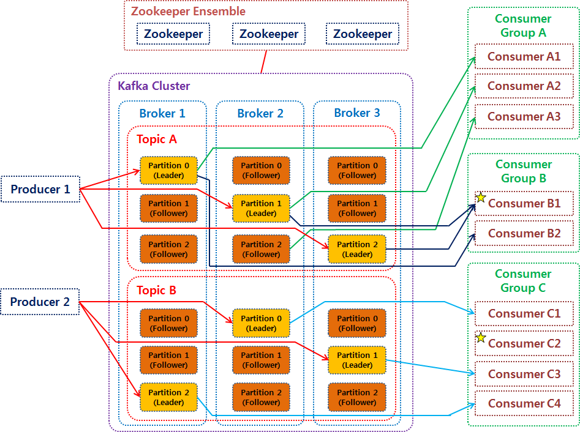

### 3) Components
* Broker   
  브로커는 메시징 서비스를 담당해주는 kafka 서버나 시스템을 말한다. 하나의 브로커는 하나의 kafka broker process를 의미하며 kafka를 구성한다고 말하거나 kafka를 통해 메시지를 전달한다고 할 때의 Kafka는 브로커를 의미한다고 할 수 있다.   
  프로세스를 구동하는 방법에 따라 다양한 방법으로 클러스터를 구성할 수 있는데, 주로 단일 브로커보다는 다중 브로커를 사용한다. 브로커가 여러 개일 경우에 각각의 브로커들은 ID로 식별된다.   
  브로커의 주요 역할은 Topic 내의 partition들을 분산, 유지 및 관리하는 것이다. 브로커 내부에는 여러 토픽들이 생성될 수 있고, 토픽들에 의해 파티션이 생성된다. 브로커는 파티션의 데이터를 분산하여 저장하기 때문에 시스템이 장애가 생기더라도 분산된 데이터로 안전하게 사용할 수 있게 해준다. 브로커의 중요한 특징 중 하나는 토픽의 일부 파티션들을 포함하고 있지만 데이터의 일부분인 파티션을 가질 뿐 전체 데이터를 갖고 있는 것은 아니라는 점이다.

* Kafka Cluster   
  여러 개의 브로커로 이루어진 집합체를 말한다. 일반적으로 최소 3대 이상의 브로커를 하나의 클러스터로 구성한다.

* Topic   
  토픽이란 브로커에서 event를 관리하는 기준 혹은 어떤 event를 저장할 지에 대한 주제를 말한다. 토픽은 파일 시스템으로 치면 폴더라고, event는 폴더 속의 파일과 같다. 전통적인 메시징 시스템과는 다르게 메시지(event)들을 subcribe해서 받아보더라도 그 메시지는 삭제되지 않는다. 대신 토픽마다 지정된 기간 또는 용량에 따라 event를 유지한다. 

* Partition   
  토픽에는 파티션이 존재하는데 이 파티션들은 Producer로부터 전달된 데이터를 보관하는 역할을 한다. 파티션은 리더 파티션(필수)와 팔로워 파티션으로 구분된다.   
  - 리더 파티션: Producer 혹은 Consumer와 직접 통신하는 파티션이다. read와 write 연산을 담당한다.
  - 팔로워 파티션: 리더 파티션으로 전달된 데이터를 복제하여 저장한다. 리더 파이션에 속해있는 브로커에 장애가 발생하면 팔로워 파티션이 리더 파이션의 지위를 가지고 복사하고 보관하고 있던 데이터를 제공한다.
  - Replication Fator: 리더 파티션과 팔로워 파티션의 개수를 정하는 기준   
    - Replication fator가 1인 경우: 복제가 없으므로 팔로워 파티션이 없다.
    - Replication fator가 3인 경우: 복제를 두개 한다. 브로커 A의 리더 파티션의 데이터를 복제해서 가지고 있을 브로커 B, C의 팔로워 파티션이 존재한다. 브로커 A 의 파티션이 3개였다면, A, B, C 는 각각 하나의 리더 파티션과 두개의 팔로워 파티션을 가지게 된다.

* Zookeeper   
  주키퍼(Zookeeper)란 분산 시스템에서 시스템 간의 정보 유지, 상태 체크, 서버들 간의 동기화 등을 처리해주는 분산 코디네이션 서비스(Distributed Coordination Service)이다. API를 이용하여 동기화를 하거나 마스터 선출 등의 작업을 쉽게 구현할 수 있게 한다. 주키퍼의 데이터는 분산 작업을 제어하기 위해 트리 형태의 데이터 저장소에 스냅샷을 저장한다.
* Zookeeper Ensemble   
  주키퍼 서버의 클러스터로 하나의 주키퍼 서버에 문제가 생겼을 경우, 주키퍼 서버에 쌓이는 데이터로 일관성을 맞추기 때문에 홀수(최소 3개 이상, 5개 권장)로 구축한다. 파티션처럼 하나의 리더 서버가 있고 write를 담당하며 나머지 팔로워 서버는 read를 담당한다. 

* Producer & Consumer    
  * Producer: "메시지를 생산"해서 브로커의 토픽으로 메시지를 보내는 역할을 하는 어플리케이션 또는 서버를 말한다. 데이터를 전송할 때 리더 파티션을 가지고 있는 브로커와 직접 통신하며 이후 어떤 Consumer에게 전송되는 지는 신경쓰지 않는다. 
  * Consumer: 토픽의 파티션에 저장되어 있는 "메시지를 소비"하는 역할을 하는 어플리케이션 또는 서버를 말한다. 데이터를 요청할 때 리더 파티션을 가지고 있는 브로커와 통신하여 토픽의 파티션으로부터 데이터를 가져간다. 운영 방법은 두가지가 있는데 첫번째는 토픽의 특정 파티션만 구도하는 방식, 두번째는 1개 이상의 consumer로 이루어진 consumer 그룹을 운영하는 방식이다. 어떤 Producer 에게서 메시지가 왔는지는 관심이 없고, 원하는 토픽의 파티션을 읽어서 필요한 메시지만 얻어간다. 


--------------------


# 실습 - Producer & Consumer
Docker Compose를 이용하여 주키퍼와 브로커를 생성한다. Producer와 Consumer를 실행하여 메시지를 생성하고 확인하는 작업을 해본다.

## 1. Docker Compose 파일 작성
### Zookeeper
주키퍼는 분산 코디네이션 서비스를 제공하는 오픈소스 프로젝트로 어플리케이션 작업 조율을 쉽게 할 수 있도록 도와준다. 기본적으로 주키퍼 서버들의 집합인 Ensemble로 구성되며 메인 역할은 분산 코디네이션 서비스다. 분산 코디네이션 서비스는 분산 시스템에서 시스템 간의 정보 공유, 상태 체크, 서버들 간 동기화를 위한 락 등을 처리해주는 서비스를 말한다. 이러한 역할을 하기 때문에 동작이 멈추지 않도록 클러스터로 구축하여 안정성을 확보하는 것이다. MLOps에서 분산 시스템을 운영하는 서버는 주키퍼이고 클라이언트는 카프카라고 이해할 수 있다. 

```
version: "3"

services:
  zookeeper:
    image: confluentinc/cp-zookeeper:7.3.0
    container_name: zookeeper
    port:
      - 2181:2181
    environment:
      ZOOKEEPER_SERVER_ID: 1
      ZOOKEEPER_CLIENT_PORT: 2181
```

- image: 주키퍼의 이미지로 confluentinc/cp-zookeeper:7.3.0를 사용한다.
- ZOOKEEPER_SERVER_ID: 주키퍼 클러스터에서 해당 주키퍼를 식별할 id를 지정한다. 여기서는 1을 사용하겠다.
- ZOOKEEPER_CLIENT_PORT: 주키퍼 클라이언트의 포트를 지정한다. 여기서는 기본 주키퍼 포트인 2181을 지정하겠다.

### Broker
브로커 서비스를 띄울 때 쓰이는 요소들을 확인해서 작성해준다.
```
version: "3"
services:
  broker:
    image: confluentinc/cp-kafka:7.3.0
    container_name: broker
    depends_on:
      - zookeeper
    ports:
      - 9092:9092
    environment:
      KAFKA_BROKER_ID: 1
      KAFKA_ZOOKEEPER_CONNECT: zookeeper:2181
      KAFKA_ADVERTISED_LISTENERS: PLAINTEXT://broker:29092,PLAINTEXT_HOST://localhost:9092
      KAFKA_LISTENER_SECURITY_PROTOCOL_MAP: PLAINTEXT:PLAINTEXT,PLAINTEXT_HOST:PLAINTEXT
      KAFKA_INTER_BROKER_LISTENER_NAME: PLAINTEXT
      KAFKA_OFFSETS_TOPIC_REPLICATION_FACTOR: 1
      KAFKA_GROUP_INITIAL_REBALANCE_DELAY_MS: 0
```
- depends_on: 주키퍼가 먼저 실행된 후 다음에 브로커가 실행되어야 한다.
- KAFKA_SERVER_ID: 브로커의 id를 지정한다. 단일 브로커에서는 없어도 무방하나 일단 1로 지정하겠다.
- KAFKA_ZOOKEEPER_CONNECT: 브로커가 주키퍼에 연결하기 위한 주소를 지정한다. 일반적은 형식은 "주키퍼 서비스 이름 : 주키버 서비스 포트"로 작성하며 앞서 띄운 주키퍼의 이름과 포트인 "zookeeper:2181"를 입력한다. 
- KAFKA_ADVERTISED_LISTENERS: 내부와 외부에서 접속하기 위한 리스너를 설정한다. 
- KAFKA_LISTENER_SECURITY_PROTOCOL_MAP: 보안을 위한 protocol mapping을 설정하며 이 설정값은 KAFKA_ADVERTISED_LISTENERS 과 함께 key/value 로 매핑된다.
- KAFKA_INTER_BROKER_LISTENER_NAME: 컨테이너 내부에서 사용할 리스너 이름을 지정한다. 앞서 internal 로 설정했던 PLAINTEXT를 입력해주겠다.
- KAFKA_OFFSETS_TOPIC_REPLICATION_FACTOR: 토픽을 분산하여 저장할 Replication Factor를 설정한다. 여기서는 단일 브로커를 사용하기 때문에 1로 지정하겠다.
- KAFKA_GROUP_INITIAL_REBALANCE_DELAY_MS: 카프카 클러스터가 초기에 rebalancing할 때 consumer들이 조인할 때 대기하는 시간으로 여기서는 0으로 설정해주겠다.

docker compose 파일 작성을 다 했으니 아래 명령어를 활용해 정의된 서비스를 백그라운드 프로세스로 띄우겠다. 
```
docker compose -p part7-naive -f naive-docker-compose.yaml up -d
```

docker ps로 잘 띄워졌는지 확인해본다.
```
CONTAINER ID   IMAGE                             COMMAND                  CREATED          STATUS          PORTS                                        NAMES
035f4541ac0f   confluentinc/cp-kafka:7.3.0       "/etc/confluent/dock…"   25 seconds ago   Up 22 seconds   0.0.0.0:9092->9092/tcp                       broker
e89625eb2f69   confluentinc/cp-zookeeper:7.3.0   "/etc/confluent/dock…"   26 seconds ago   Up 23 seconds   2888/tcp, 0.0.0.0:2181->2181/tcp, 3888/tcp   zookeeper
```


## 2. Producer & Consumer Setup
이번에는 토픽을 생성해보고 producer와 consumer를 생성해보겠다.

### 2.1 topic 생성
```
docker compose -p part7-naive exec broker kafka-topics --create --topic topic-test --bootstrap-server broker:29092 --partitions 1 --replication-factor 1
```
* docker compose exec는 컨테이너 내에 명령어를 수행하도록 한다.
* --create로 토픽을 생성하고, --topic으로 생성할 토픽의 이름을 지정할 수 한다.
* --bootstrap-server는 브로커 서비스에 대한 호스트 이름과 포트를 지정한다. 앞서 docker compose로 띄웠던 브로커의 환경변수를 참고하여 설정한다.
* --partition은 파티션의 개수를 설정하며 --replication-fator은 replication factor을 지정한다.

아래 커멘드를 통해 토픽이 잘 생성되었는지와 상세 설명을 확인할 수 있다.
```
docker compose -p part7-naive exec broker kafka-topics --describe --topic topic-test --bootstrap-server broker:29092
```

### 2.2 Consumer 생성
이제 토픽을 생성했으니 생성한 토픽을 사용한 consumer를 만들어보겠다. consumer를 먼저 실행하는 이유는 일반적으로 consumer가 메시지를 subcribe 하려고 대기하는 상태에서 producer가 메시지를 생성해서 보내기 때문이다.    

먼저 docker compose exec 명령어를 통해 컨테이너 내부로 접속한다. 터미널이 열릴 것이다.
```
docker compose -p part7-naive exec broker /bin/bash
```

이후에 kafka-console-consumer 를 이용하여 topic-test 토픽을 subscribe 한다. 
```
kafka-console-consumer --topic topic-test --bootstrap-server broker:29092
```
그럼 수신을 대기하고 있는 상태가 될 것이다.


### 2.3 Producer 생성
마지막으로 producer를 만들어 메시지를 보낼 준비를 해보겠다. 앞에서 한 것과 같이 새로운 터미널에서 docker compose exec 명령어를 통해 컨테이너 내부로 접속한다. 그 뒤, 아래 커맨드로 topic-test 토픽에 접근해 Publish할 준비를 한다. 그럼 publish 할 수 있는 상태가 될 것이다.

```
kafka-console-producer --topic topic-test --broker-list broker:29092
```


### 2.4 Communicate
producer에서 텍스트를 입력하면 consumer에서 받은 걸 확인할 수 있다.
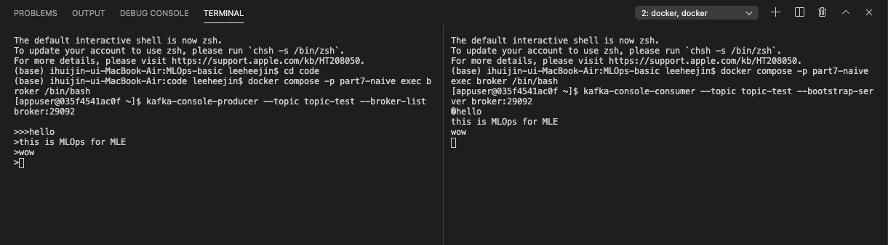

producer와 consumer로 아주 간단한 메시지 파이프라인을 만들어보았다.


--------------


# 실습 - Connect & Connector
## 1. Connect & Connector 소개
실제 시스템에서 producer와 consumer가 어떻게 쓰일까?
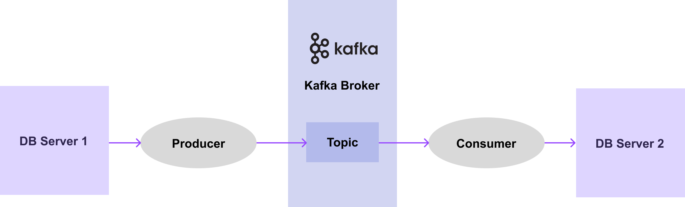
어떠한 DB server1에서 DB server2로 데이터를 전달하는 시스템은 위 그림과 같을 것이다. 그렇다면 전달할 DB들이 100개 1000개, 10000개 있다면 어떨까? 그럼 아래 그림과 같이 producer와 consumer 많아져야 할 것이다.
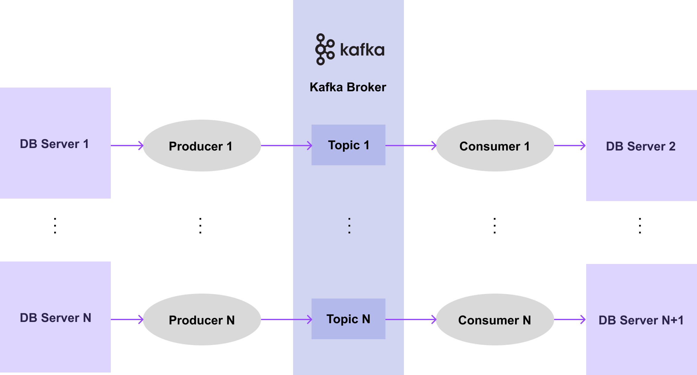
위와 같이 매번 메시지 파이프라인 구성을 위해 producer와 consumer를 개발하는 것은 비용도 많이 들고 쉽지 않다. 따라서 더 간편하고 효율적으로 메시지 파이프라인을 구축하는 방법으로 Kafka에서는 Connect와 Connector를 제공한다.   

**Connect**란?   
-> 데이터 시스템과 kafka 간의 데이터를 확장 가능하고 안전한 방법으로 스트리밍하기 위한 도구, 프레임워크다. Connector를 정의해서 사용한다.   
**Connector**란?   
-> 데이터를 어디로부터 가져오고 어디에다가 전달해야하는지 정의하는 플러그인이다. 메시지 파이프라인에 대한 추상 객체이며 task들을 관리하다. 두가지 종류의 connector가 존재한다.   
-> Source Connector: source system의 데이터를 브로커의 토픽으로 publish하는 connector로 producer의 역할이라고 이해하면 된다.   
-> Sink Connector: 브로커의 토픽에 있는 데이터를 subcribe에서 target system에 전달하는 connector로 consumer 역할을 한다고 이해할 수 있다.   

각각의 connector에 대한 설정 명세를 connect에 전달하면 connector가 구성되며, 주기적으로 메시지를 확인하여 새로운 메시지가 들어오면 파이프라인을 통해 흘려보내게 된다. 아래의 그림으로 이해할 수 있다.

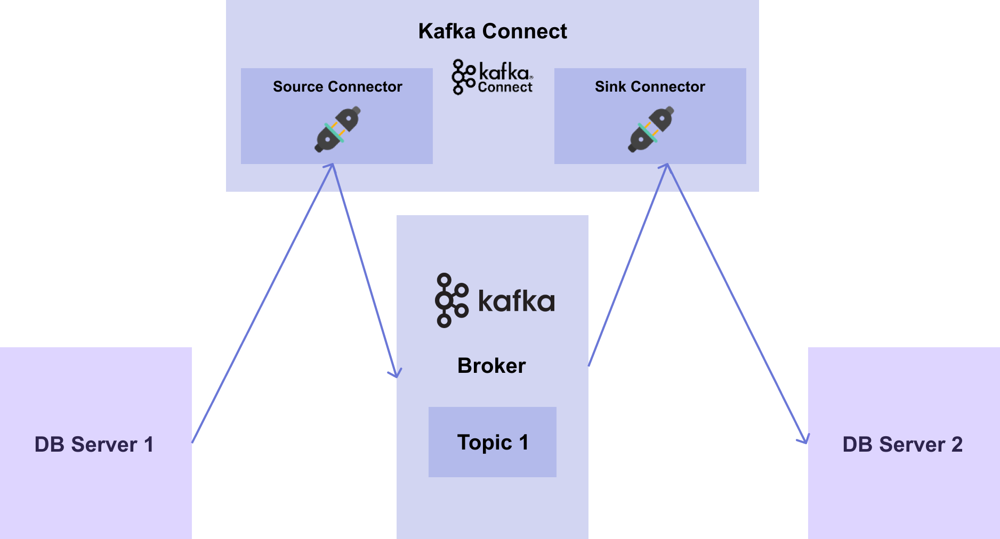
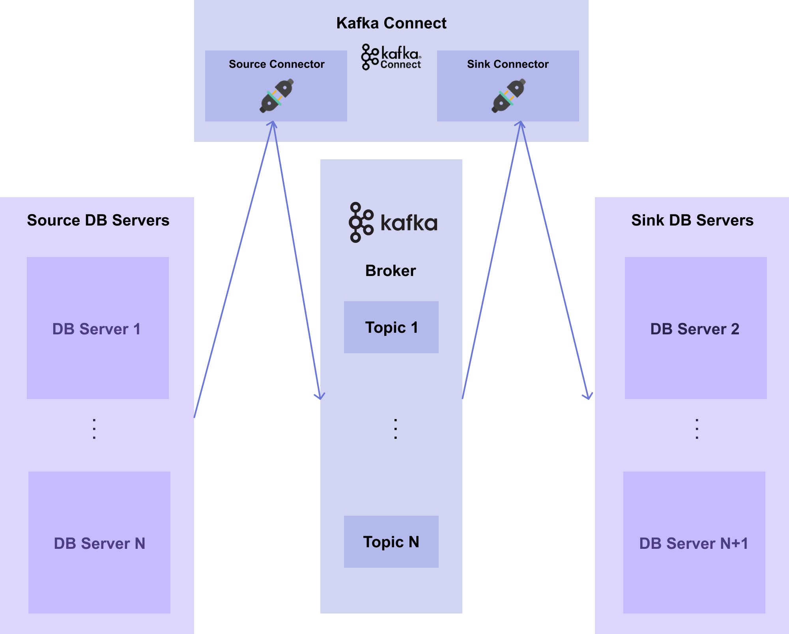

보면 producer와 consumer를 일일히 만드는 것보다 Source Connector와 Sink Connector를 사용하게 되면 설정 파일만 수정하여 더 큰 개발 비용 없이 띄울 수 있게 된다. Source Connector의 경우에 Connector의 유형, 연결할 URL, user와 password, 테이블 이름, 토픽의 파티션 수, Replication Factor 수 등을 설정해주면 connect의 인스턴스로 생성된다. 훨씬 간단하게 적은 비용으로 개발할 수 있게 되는 것이다.   

### Schema Registry 소개
Connect와 함께 쓰이는 Schema Registry에 대해 알아보겠다. 앞서 말했듯이 kafka는 decoupling이라는 특징을 가지고 있어 producer와 consumer가 서로 완벽히 분리되어 있다. 또한 브로커는 메시지를 한번 저장하면 이후에는 수정할 수 없다. 이러한 특징 때문에 몇가지 문제가 발생할 수 있다. 여러 개의 producer가 브로커에 메시지를 보내고 schema를 변경하는 등을 작업을 해도 consumer는 이 상황을 알지 못하기 때문에 메시지를 구독하는 과정에서 장애가 발생할 수 있다. 또는 동일한 schema의 메시지가 계속 들어오는 경우, 같은 schema를 계속해서 저장해야하므로 불필요한 데이터 용량을 차지하게 된다.    
이러한 구조적인 결합도를 낮추고 불필요한 데이터 용량을 줄이기 위해 kafka에서는 메시지 schema를 저장해주는 저장소인 schema registry를 사용한다. 

### 작동 과정
Kafka Connector가 만들어 내는 메시지 구조는 다음과 같다. 
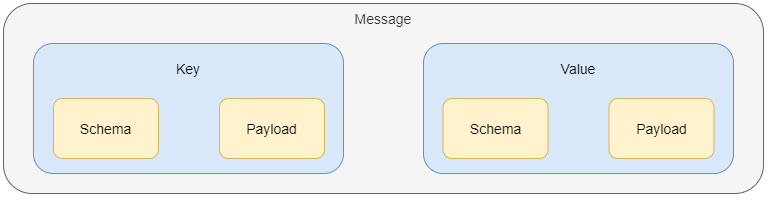
메시지는 key와 value로 구성되어 있으며, 각 key와 value는 schema와 payload로 구성되어 있다. 

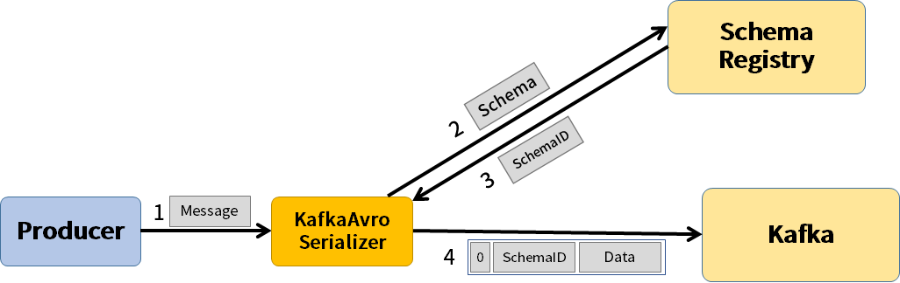
1. Producer 에서 Kafka 의 Serializer (또는 Converter) 에게 메시지를 보낸다.
2. Serializer는 메시지를 받아 메시지의 schema를 Schema Registry에 보낸다.
3. 이어서 schema ID를 받고, schema ID와 데이터를 Kafka에게 보낸다.

하지만 여기서 connect와 connector를 이용하면 Serializer를 직접 구현하지 않고 connect를 띄울 때 환경변수로 적어주면 돈다. 

앞에서 말했던 schema 중복으로 인한 용량 문제는 schema registry에 key와 value에 명시된 스키마를 따로 저장하기 때문에 connector가 schema id만 명시하여 해결할 수 있게 된다.


**Schema 호환성 규칙 강제**   
schema를 등록하여 사용할 수 있지만 스키마 버전 간의 호환성을 강제하여 일종의 규칙을 세우는 것이다. 이를 통해 특정 Schema가 다른 데이터도 읽을 수 있도록 지원한다.   


----------------

# Kafka System
## 코드 실습 
docker compose로 Zookeeper, Broker, Schema Registry, Connect를 생성해보자. 

### 0. 환경설정
먼저 앞서 실행해놓은 producer와 consumer docker를 종료시킨다.

```
docker ps
docker compose -p part7-naive down -v
```

### 1. 아키텍처
이번 실습에서 다룰 서비스들의 다이어그램이다.
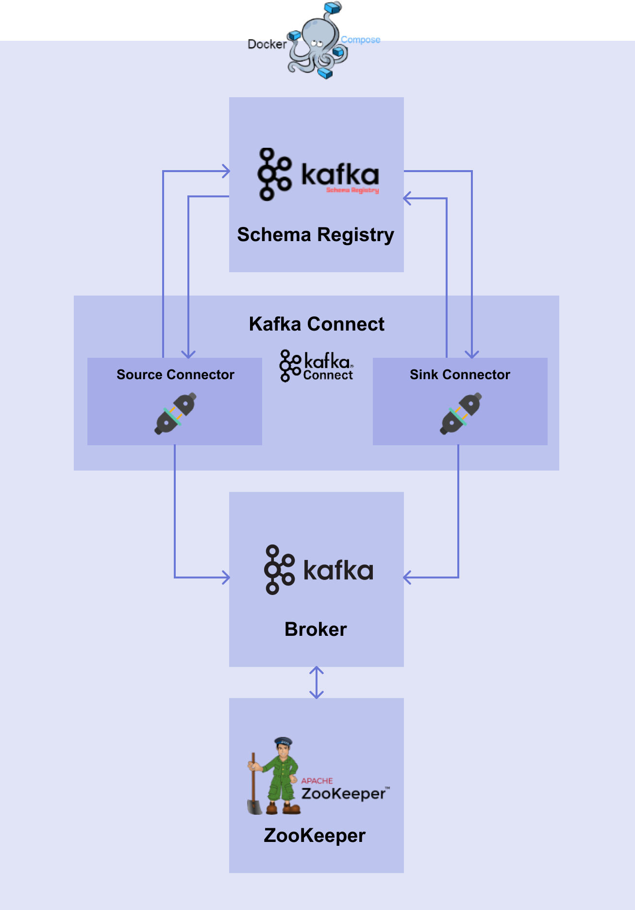

- Zookeeper: 브로커 서버의 상태 감지를 위해 사용되는 주키퍼 서버
- Broker: Source Connector에서 데이터를 받아 토픽에 저장하고 Sink Connector로 데이터를 넘겨주는 브로커 서버로 단일 브로커를 사용하겠다.
- Schema Registry: 메시지의 schema를 저장하기 위한 서버
- Connect: Connector를 띄우기 위한 connect 서버

### 2.1 Zookeeper & Broker
주키퍼와 브로커를 띄우는 코드는 앞에서 작성한 내용을 활용한다. 
```
version: "3"

services:
  zookeeper:
    image: confluentinc/cp-zookeeper:7.3.0
    container_name: zookeeper
    ports:
      - 2181:2181
    environment:
      ZOOKEEPER_SERVER_ID: 1
      ZOOKEEPER_CLIENT_PORT: 2181

  broker:
    image: confluentinc/cp-kafka:7.3.0
    container_name: broker
    depends_on:
      - zookeeper
    ports:
      -9092:9092
    environment:
      KAFKA_BROKER_ID: 1
      KAFKA_ZOOKEEPER_CONNECT: zookeeper:2181
      KAFKA_ADVERTISED_LISTENERS: PLAINTEXT:://broker:29092,PLAINTEXT_HOST://localhost:9092
      KAFKA_LISTENER_SECURITY_PROTOCOL_MAP: PLAINTEXT:PLAINTEXT,PLAINTEXT_HOST:PLAINTEXT
      KAFKA_INTER_BROKER_LISTENER_NAME: PLAINTEXT
      KAFKA_OFFSETS_TOPIC_REPLICATION_FACTOR: 1
      KAFKA_GROUP_INITIAL_REBALANCE_DELAY_MS: 0
```

### 2.2 Schema Registry
```
version: "3"

services:
  schema-registry:
    image: confluentinc/cp-schema-registry:7.3.0
    container_name: schema-registry
    depends_on:
      - broker
    ports:
      - 8081:8081
    environment:
      SCHEMA_REGISTRY_HOST_NAME: schema-registry
      SCHEMA_REGISTRY_KAFKASTORE_BOOTSTRAP_SERVERS: broker:29092
      SCHEMA_REGISTRY_LISTENERS: http://schema-registry:8081
```
환경 변수는 다음과 같다.
- SCHEMA_REGISTRY_HOST_NAME: Schema Registry 의 호스트 이름을 지정한다.
- SCHEMA_REGISTRY_KAFKASTORE_BOOTSTRAP_SERVERS: Bootstrap 으로 띄워진 브로커 서버를 지정한다. 일반적으로 브로커 서비스 이름 : 브로커 서비스 내부 포트 형식으로 작성하며 이번 챕터에서는 broker:29092을 사용하겠다.
- SCHEMA_REGISTRY_LISTENERS: 외부에서 접속할 리스너를 설정한다. 이번 챕터에서는 http://schema-registry:8081 으로 설정하겠다.


### 2.3 Connect
Connect의 경우, 이미지를 빌드하기 위한 도커파일이 필요하다. 먼저 도커파일은 아래와 같이 작성할 수 있다.

```
# connect.Dockerfile
FROM confluentinc/cp-kafka-connect:7.3.0

ENV CONNECT_PLUGIN_PATH="/usr/share/java,/usr/share/confluent-hub-components"

RUN confluent-hub install --no-prompt snowflakeinc/snowflake-kafka-connector:1.5.5 &&\
  confluent-hub install --no-prompt confluentinc/kafka-connect-jdbc:10.2.2 &&\
  confluent-hub install --no-prompt confluentinc/kafka-connect-json-schema-converter:7.3.0
```

그럼 해당 도커파일을 가지고 compose 파일을 작성해보자.
```
version: "3"

services:  
  connect:
    build:
      context: .
      dockerfile: connect.Dockerfile
    container_name: connect
    depends_on:
      - broker
      - schema-registry
    ports:
      - 8083:8083
    environment:
      CONNECT_BOOTSTRAP_SERVERS: broker:29092
      CONNECT_REST_ADVERTISED_HOST_NAME: connect
      CONNECT_GROUP_ID: docker-connect-group
      CONNECT_CONFIG_STORAGE_TOPIC: docker-connect-configs
      CONNECT_CONFIG_STORAGE_REPLICATION_FACTOR: 1
      CONNECT_OFFSET_STORAGE_TOPIC: docker-connect-offsets
      CONNECT_OFFSET_STORAGE_REPLICATION_FACTOR: 1
      CONNECT_STATUS_STORAGE_TOPIC: docker-connect-status
      CONNECT_STATUS_STORAGE_REPLICATION_FACTOR: 1
      CONNECT_KEY_CONVERTER: org.apache.kafka.connect.storage.StringConverter
      CONNECT_VALUE_CONVERTER: org.apache.kafka.connect.json.JsonConverter
      CONNECT_VALUE_CONVERTER_SCHEMA_REGISTRY_URL: http://schema-registry:8081
```
환경변수는 다음과 같다.
- CONNECT_BOOTSTRAP_SERVERS: Bootstrap으로 띄워진 브로커 서버를 지정한다. 일반적으로 브로커 서비스 이름 : 브로커 서비스 내부 포트 형식을 사용한다.
- CONNECT_REST_ADVERTISED_HOST_NAME: Connect에서는 REST API 요청에 대한 처리와 Connector의 등록, 설정, 시작, 종료 등의 처리를 담당하는 Worker가 존재한다. Worker 간의 연결이 가능하도록 호스트 이름을 지정한다.
- CONNECT_GROUP_ID: Connect 의 Worker 프로세스 그룹 (또는 클러스터)를 구성하는 데 사용하는 고유한 ID를 지정한다. 단, Consumer 그룹 ID 와 충돌하면 안된다.
- CONNECT_CONFIG_STORAGE_TOPIC: Connector의 환경 설정을 저장할 브로커의 토픽 이름을 설정한다.
- CONNECT_CONFIG_STORAGE_REPLICATION_FACTOR: 환경 설정을 저장하는 토픽을 생성할 때 사용할 Replication Factor의 수를 설정한다.
- CONNECT_OFFSET_STORAGE_TOPIC: Connector의 offset을 저장할 브로커의 토픽 이름을 설정한다.
- CONNECT_OFFSET_STORAGE_REPLICATION_FACTOR
Offset 을 저장하는 토픽을 생성할 때 사용할 Replication Factor의 수를 설정한다.
- CONNECT_STATUS_STORAGE_TOPIC: Connector와 task의 상태를 저장할 브로커의 토픽 이름을 설정한다.
- CONNECT_STATUS_STORAGE_REPLICATION_FACTOR: 상태를 저장하는 토픽을 생성할 때 사용할 Replication Factor의 수를 설정한다.
- CONNECT_KEY_CONVERTER: Key에 대한 Converter를 설정힌다.
- CONNECT_VALUE_CONVERTER: Value에 대한 Converter를 설정한다. 이번 챕터에서는 Json Converter를 사용하겠다.
- CONNECT_VALUE_CONVERTER_SCHEMA_REGISTRY_URL: Value Converter에 대한 Schema Registry URL을 설정한다. 이번 챕터에서는 Schema Registry 의 서비스 이름과 포트인 http://schema-registry:8081 을 기입해준다.

### 실행 및 확인
```
docker compose -p part7-kafka -f kafka-docker-compose.yaml up -d
docker ps
```

```
CONTAINER ID   IMAGE                                   COMMAND                  CREATED          STATUS                            PORTS                                        NAMES
7725dc0e5cda   part7-kafka-connect                     "/etc/confluent/dock…"   12 seconds ago   Up 4 seconds (health: starting)   0.0.0.0:8083->8083/tcp, 9092/tcp             connect
c0acbe428897   confluentinc/cp-schema-registry:7.3.0   "/etc/confluent/dock…"   15 seconds ago   Up 5 seconds                      0.0.0.0:8081->8081/tcp                       schema-registry
7656a09bb391   confluentinc/cp-kafka:7.3.0             "/etc/confluent/dock…"   16 seconds ago   Up 6 seconds                      0.0.0.0:9092->9092/tcp                       broker
72aed624eed0   confluentinc/cp-zookeeper:7.3.0         "/etc/confluent/dock…"   17 seconds ago   Up 8 seconds                      2888/tcp, 0.0.0.0:2181->2181/tcp, 3888/tcp   zookeeper
```


--------------------------


# 실습 - 5
## Source Connector
Connect에 Source Connector를 생성해보고 토픽에 쌓인 데이터를 확인해볼 것이다. 먼저 아래의 다이어그램처럼 서비스를 구현할 것이며, DB 서버를 먼저 실행시켜야 한다.
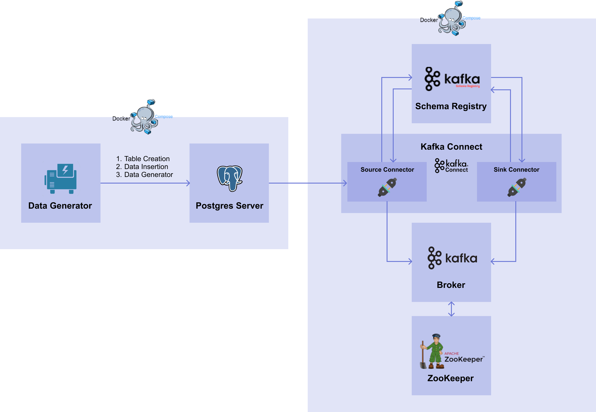

### 생성
Source Connector는 connect에 api를 호출해서 생성한다. 아래 명령어를 통해 source connector를 띄울 수 있는 sourse_connector.json을 생성하겠다. 

```
cat <<EOF > source_connector.json
{
    "name": "postgres-source-connector",
    "config": {
        "connector.class": "io.confluent.connect.jdbc.JdbcSourceConnector",
        "connection.url": "jdbc:postgresql://postgres-server:5432/mydatabase",
        "connection.user": "heejin",
        "connection.password": "lhj6843*",
        "table.whitelist": "iris_data",
        "topic.prefix": "postgres-source-",
        "topic.creation.default.partitions": 1,
        "topic.creation.default.replication.factor": 1,
        "mode": "incrementing",
        "incrementing.column.name": "id",
        "tasks.max": 2,
        "transforms": "TimestampConverter",
        "transforms.TimestampConverter.type": "org.apache.kafka.connect.transforms.TimestampConverter$Value",
        "transforms.TimestampConverter.field": "timestamp",
        "transforms.TimestampConverter.format": "yyyy-MM-dd HH:mm:ss.S",
        "transforms.TimestampConverter.target.type": "string"
    }
}
EOF
```

그럼 source_connector.json 파일이 생성되며 내용은 다음과 같다.   
```
{
    "name": "postgres-source-connector",
    "config": {
        "connector.class": "io.confluent.connect.jdbc.JdbcSourceConnector",
        "connection.url": "jdbc:postgresql://postgres-server:5432/mydatabase",
        "connection.user": "heejin",
        "connection.password": "lhj6843*",
        "table.whitelist": "iris_data",
        "topic.prefix": "postgres-source-",
        "topic.creation.default.partitions": 1,
        "topic.creation.default.replication.factor": 1,
        "mode": "incrementing",
        "incrementing.column.name": "id",
        "tasks.max": 2,
        "transforms": "TimestampConverter",
        "transforms.TimestampConverter.type": "org.apache.kafka.connect.transforms.TimestampConverter",
        "transforms.TimestampConverter.field": "timestamp",
        "transforms.TimestampConverter.format": "yyyy-MM-dd HH:mm:ss.S",
        "transforms.TimestampConverter.target.type": "string"
    }
}
```
- name: connector의 이름
- config
  - connector.class: Connector를 생성하기 위한 class를 설정하는데 여기서는 JDBC Source Connector를 사용하므로 io.confluent.connect.jdbc.JdbcSourceConnector를 기입한다.
  - connection.url: source DB에 접근하기 위한 주소를 설정한다. postgres server의 url를 입력해주겠다.
  - connection.user: source DB에 접속하기 위한 유저 이름을 설정한다.
  - connection.password: source DB에 접속하기 위한 유저 비밀번호를 설정한다.
  - table.whitelist: 데이터를 가져올 테이블 목록을 설정하며 여러개를 설정할 경우 콤마를 쓸 수 있다. 
  - topic.prefix: 토픽 생성 시 이름 앞에 붙일 prefix를 설정한다.
  - topic.creation.default.partitions: 토픽 자동 생성을 위해 설정하는 값으로 source connector를 실행했는데 토픽이 존재하지 않는다면 자동으로 생성하게 된다. 이때 필요한 기본 설정으로 토픽 자동 생성 시에 파티션의 개수를 설정한다.
  - topic.creation.default.replication.factor: 토픽 자동 생성 시에 replication factor 수를 설정한다. 
  - mode: 테이블에 변경이 발생했을 때 어떤 방식으로 가져올지 설정하는 것으로 총 4가지 모드가 존재한다.
    - bulk
    - timestamp
    - incrementing
    - timestamp+incrementing  
  - increamenting.column.name: Incrementing column의 이름을 설정한다. 
  - tasks.max: Connector에서 task의 수를 얼마나 가져갈 지 설정한다. 
  - transforms: 
  - transforms.TimestampConverter.type:
  - transforms.TimestampConverter.field: 
  - transforms.TimestampConverter.format
  - transforms.TimestampConverter.target.type


그럼 이 json 파일을 curl을 이용해 Connect의 REST API에 POST로 보내겠다. 
```
curl -X POST http://localhost:8083/connectors -H "Content-Type: application/json" -d @source_connector.json
```
명령어를 실행하면 다음과 같이 출력된다.
```
{"name":"postgres-source-connector","config":{"connector.class":"io.confluent.connect.jdbc.JdbcSourceConnector","connection.url":"jdbc:postgresql://postgres-server:5432/mydatabase","connection.user":"myuser","connection.password":"mypassword","table.whitelist":"iris_data","topic.prefix":"postgres-source-","topic.creation.default.partitions":"1","topic.creation.default.replication.factor":"1","mode":"incrementing","incrementing.column.name":"id","tasks.max":"2","name":"postgres-source-connector"},"tasks":[],"type":"source"}%
```

### 생성 확인
아래의 GET method로 현재 connector 목록을 확인할 수 있다.
```
curl -X GET http://localhost:8083/connectors
```
그럼 아래와 같이 출력될 것이다.
```
["postgres-source-connector"]%
```
이어서 postgres-source-connector의 정보를 확인하자.
```
curl -X GET http://localhost:8083/connectors/postgres-source-connector
```
```
{"name":"postgres-source-connector","config":{"connector.class":"io.confluent.connect.jdbc.JdbcSourceConnector","mode":"incrementing","incrementing.column.name":"id","topic.prefix":"postgres-source-","topic.creation.default.partitions":"1","connection.password":"mypassword","connection.user":"myuser","tasks.max":"2","topic.creation.default.replication.factor":"1","name":"postgres-source-connector","connection.url":"jdbc:postgresql://postgres-server:5432/mydatabase","table.whitelist":"iris_data"},"tasks":[],"type":"source"}%
```

### topic에 쌓인 데이터 확인
토픽에 데이터가 잘 쌓이고 있는지 확인해보겠다. kafkacat을 이용하기 위해 설치를 해준다.   
Linux - apt-get install kafkacat   
MacOS - brew install kcat   

아래 명령어를 통해 토픽 리스트를 확인하자
```
kcat -L -b localhost:9092
```
그럼 중간에 postgres-source-iris_data 토픽이 생성된 것을 볼 수 있다.
```
Metadata for all topics (from broker 1: localhost:9092/1):
 1 brokers:
  broker 1 at localhost:9092 (controller)
 6 topics:
  topic "docker-connect-status" with 5 partitions:
    partition 0, leader 1, replicas: 1, isrs: 1
    partition 1, leader 1, replicas: 1, isrs: 1
    partition 2, leader 1, replicas: 1, isrs: 1
    partition 3, leader 1, replicas: 1, isrs: 1
    partition 4, leader 1, replicas: 1, isrs: 1
  topic "_schemas" with 1 partitions:
    partition 0, leader 1, replicas: 1, isrs: 1
  topic "__consumer_offsets" with 50 partitions:
    partition 0, leader 1, replicas: 1, isrs: 1
    partition 1, leader 1, replicas: 1, isrs: 1
    .
    .
    .
    partition 48, leader 1, replicas: 1, isrs: 1
    partition 49, leader 1, replicas: 1, isrs: 1
  topic "postgres-source-iris_data" with 1 partitions:
    partition 0, leader 1, replicas: 1, isrs: 1
  topic "docker-connect-offsets" with 25 partitions:
    partition 0, leader 1, replicas: 1, isrs: 1
    partition 1, leader 1, replicas: 1, isrs: 1
    .
    .
    .
    partition 23, leader 1, replicas: 1, isrs: 1
    partition 24, leader 1, replicas: 1, isrs: 1
  topic "docker-connect-configs" with 1 partitions:
    partition 0, leader 1, replicas: 1, isrs: 1
```
  
kcat 명령어를 이용하여 postgres-source-iris_data 토픽에 쌓인 데이터를 확인해보자.
```
kcat -b localhost:9092 -t postgres-source-iris_data
```
```
{"schema":{"type":"struct","fields":[{"type":"int32","optional":false,"field":"id"},{"type":"double","optional":true,"field":"sepal_length"},{"type":"double","optional":true,"field":"sepal_width"},{"type":"double","optional":true,"field":"petal_length"},{"type":"double","optional":true,"field":"petal_width"},{"type":"int32","optional":true,"field":"target"}],"optional":false,"name":"iris_data"},"payload":{"id":187,"sepal_length":6.5,"sepal_width":3.0,"petal_length":5.8,"petal_width":2.2,"target":2}}
{"schema":{"type":"struct","fields":[{"type":"int32","optional":false,"field":"id"},{"type":"double","optional":true,"field":"sepal_length"},{"type":"double","optional":true,"field":"sepal_width"},{"type":"double","optional":true,"field":"petal_length"},{"type":"double","optional":true,"field":"petal_width"},{"type":"int32","optional":true,"field":"target"}],"optional":false,"name":"iris_data"},"payload":{"id":189,"sepal_length":7.0,"sepal_width":3.2,"petal_length":4.7,"petal_width":1.4,"target":1}}
{"schema":{"type":"struct","fields":[{"type":"int32","optional":false,"field":"id"},{"type":"double","optional":true,"field":"sepal_length"},{"type":"double","optional":true,"field":"sepal_width"},{"type":"double","optional":true,"field":"petal_length"},{"type":"double","optional":true,"field":"petal_width"},{"type":"int32","optional":true,"field":"target"}],"optional":false,"name":"iris_data"},"payload":{"id":191,"sepal_length":5.6,"sepal_width":2.7,"petal_length":4.2,"petal_width":1.3,"target":1}}
% Reached end of topic postgres-source-iris_data [0] at offset 191
```

----------------------------

# 실습 - 6
## Sink Connector
먼저 이번 실습에서는 docker compose를 이용해 데이터를 전달받을 target DB 서버와 table creator를 구축할 것이며, 구축한 target DB 서버에 데이터를 전달할 sink connector를 connect에 생성할 것이다.
```
[Target DB Server INFO]
Image : postgres:14.0
Container name : target-postgres-server
POSTGRES_USER : targetuser
POSTGRES_PASSWORD : targetpw
POSTGRES_DB : targetdatabase
Port forwarding : 5433:5432

[Table Creator INFO]
Dockerfile : psycopg2 패키지를 이용하여 Target DB 서버에 테이블을 생성하는 코드를 만든 후 Dockerfile 에서 해당 코드가 실행되도록 이미지를 만든다.
Docker Compose의 Container name : table-creator
```
Sink Connector 를 띄우기 위한 설정 파일 (sink_connector.json)
```
{
    "name": "postgres-sink-connector",
    "config": {
        "connector.class": "io.confluent.connect.jdbc.JdbcSinkConnector",
        "connection.url": "jdbc:postgresql://target-postgres-server:5432/targetdatabase",
        "connection.user": "targetuser",
        "connection.password": "targetpassword",
        "table.name.format": "iris_data",
        "topics": "postgres-source-iris_data",
        "auto.create": false,
        "auto.evolve": false,
        "tasks.max": 2,
        "transforms": "TimestampConverter",
        "transforms.TimestampConverter.type": "org.apache.kafka.connect.transforms.TimestampConverter$Value",
        "transforms.TimestampConverter.field": "timestamp",
        "transforms.TimestampConverter.format": "yyyy-MM-dd HH:mm:ss.S",
        "transforms.TimestampConverter.target.type": "Timestamp"
    }
}
```

