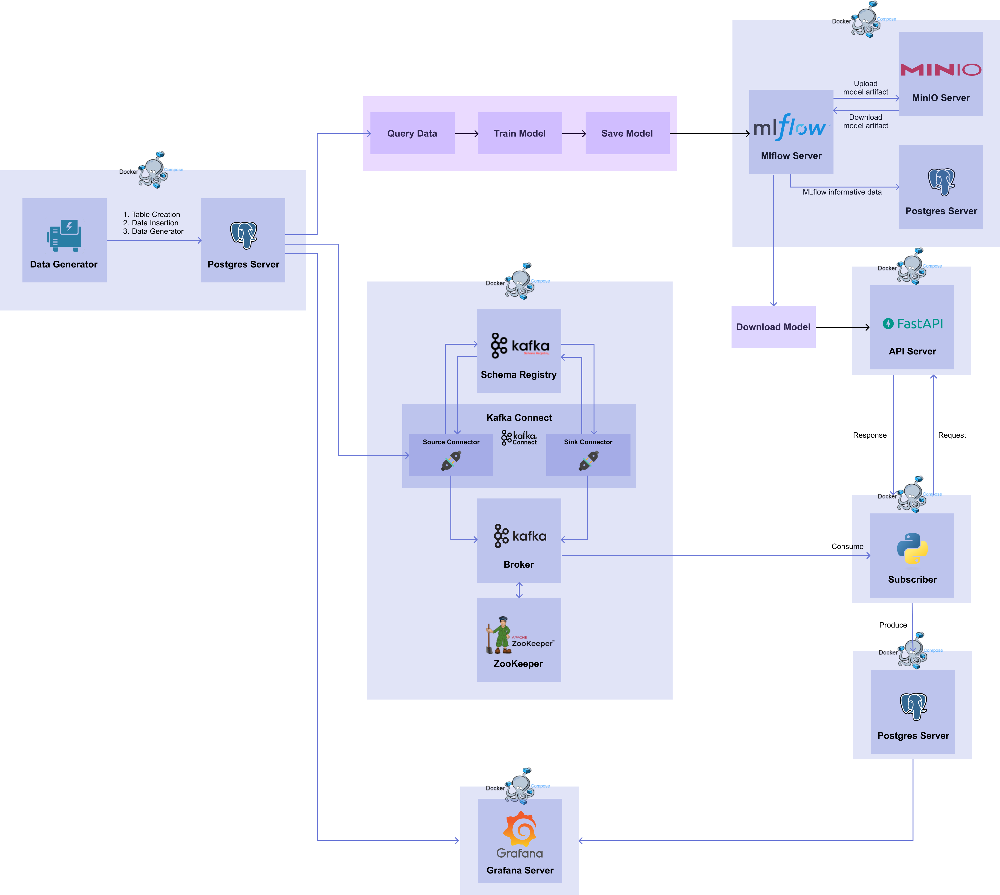

# MLOps for MLE
## Chapter 8. Stream
이번 파트에서는 event-driven 방식을 구현해보겠다.    
Kafka 파트에서 생성된 kafka system과 target DB를 이용할 것이고, consumer를 통해 토픽으로부터 데이터를 읽어온 후, API 서버에 입력으로 전달하고 inference 결과를 받아 Target DB로 전달하는 Data Subscriber를 구현하겠다. 이는 Stream Serving이라고 하며 이 뿐만 아니라 Grafana를 이용해 원본 데이터와 예측 결과 값을 실시간으로 시각화해주는 대시보드를 만들어보자. 대시보드를 통해 Stream Serving이 잘 되고 있는지 확인할 수 있다. 전체 workflow는 아래 그림과 같다.   



### 준비
1) data_generator.py, dockerfile_1, docker-compose_1.yaml 실행   
2) app.py, dockerfile_6, docker-compose_6.yaml   
3) kafka system+source connector 생성
4) kafka sink connector에 target db 생성 - create_table.py, target.Dockerfile, target-docker-compose.yaml


포트가 겹친다는 에러 발생 시, 먼저 docker ps로 실행 중엔 도커 확인을 한다. 그리고 포트를 확인해준다. 만약 도커를 종료한 후에도 해당 포트가 사용되고 있다면 kill 해준다.  
```
sudo lsof -i :5433

COMMAND  PID     USER   FD   TYPE            DEVICE SIZE/OFF NODE NAME
postgres 126 postgres    7u  IPv6 0x4d744f32d929b27      0t0  TCP *:pyrrho (LISTEN)
post

sudo kill -9 126
```

준비된 상태는 다음과 같다.
```
(base) ihuijin-ui-MacBook-Air:code leeheejin$ docker ps
CONTAINER ID   IMAGE                 COMMAND                  CREATED          STATUS                      PORTS                    NAMES
4aee3471c02c   postgres:14.0         "docker-entrypoint.s…"   23 seconds ago   Up 21 seconds (healthy)     0.0.0.0:5433->5432/tcp   target-postgres-server
a6fec85e9ba6   code-api-with-model   "uvicorn app:app --h…"   10 minutes ago   Up 10 minutes (unhealthy)   0.0.0.0:8000->8000/tcp   api-with-model
725c036e28aa   code-data-generator   "python data_generat…"   13 minutes ago   Up 13 minutes                                        data-generator
329d38b0c083   postgres:14.0         "docker-entrypoint.s…"   13 minutes ago   Up 13 minutes (healthy)     0.0.0.0:5432->5432/tcp   postgres-server
```


-------------------------


# 실습 - Stream Serving
## Data Subscriber 생성
stream serving을 위한 data subscriber를 생성해보겠다. 역할은 consumer를 통해 토픽으로부터 데이터를 읽어온 후 ML 모델에 연결되어 있는 API 서버에 입력으로 전달하고 받은 결과 값을 target DB에 전달하는 것이다.

### 0) 패키지 설치 및 아키텍처 이해
추가로 설치가 필요한 패키지는 다음과 같다.
- kafka-python: python에서는 kafka를 SDK 형태로 사용할 수 있도록 도와주는 kafka python client 패키지다. consumer를 구현하는 데 사용한다.
- requests: python으로 HTTP 통신이 필요한 프로그램을 작성할 때 사용되는 패키지로 API 호출에 사용한다.
```
pip install kafka-python requests psycopg2-binary
```

구현해볼 아키텍처는 다음과 같다.


앞서 kafka에서 source connector와 sink connector를 생성해서 source DB에서 target DB로 데이터를 전달하는 것을 구현했었다. 여기서는 다시 model deployment 관점으로 돌아와 kafka를 어떻게 쓸지 생각해볼 것이다. 여기서는 토픽에서 데이터를 읽어서 바로 sink connector가 target DB에 전달하는 것이 아닌 api server에 보내고 response를 받을 것이기 때문에 sink connector를 대신해서 kafka python SDK를 이용해 직접 구현할 것이다. 즉 Source DB에서 데이터를 받아 API 서버로 요청을 보내고, 모델의 예측 값을 받고, 받은 결과를 Target DB에 삽입하는 과정을 담당하는 코드가 직접 구현할 Data Subscriber이다.

### 1) Data Subscriber 코드 작성
구현할 Data Subscriber의 절차는 다음과 같다.
1. psycopg2 패키지를 이용해 target DB에 접근하고 테이블을 생성한다.
2. kafka-python 패키지를 이용해 브로커의 토픽에 있는 데이터를 읽어올 consumer를 생성한다.
3. requests 패키지를 이용해 consumer를 토해 받은 데이터를 API 서버에 보내고 예측값을 받는다.
4. psycopg2 패키지를 이용해 받은 response를 target DB에 삽입한다.

**Prediction 테이블 생성**   
먼저 예측값을 저장할 테이블을 생성한다.

```python
# data_subcriber.py
import psycopg2

def create_table(db_connect):
    create_table_query="""
    CREATE TABLE IF NOT EXISTS iris_prediction (
        id SERIAL PRIMARY KEY,
        timestamp timestamp,
        iris_class int
    );"""
    print(create_table_query)
    with db_connect.cursor() as cur:
        cur.execute(create_table_query)
        db_connect.commit()

if __name__ == "__main__":
    db_connect = psycopg2.connect(
        user="targetuser", 
        password="targetpassword",
        host="target-postgres-server",
        port=5432,
        database="targetdatabase",
    )
    
    create_table(db_connect)
```

**Consumer 생성**   
consumer를 생성하겠다. kafka-python 패키지를 이용해 kafkaConsumer 인스턴스를 만든다.

```python
from json import loads
from kafka import KafkaConsumer

consumer = KafkaConsumer(
    "postgres-source-iris_data",
    bootstrap_servers="broker:29092",
    auto_offset_reset="earliest",
    group_id="iris-data-consumer-group",
    value_deserializer=lambda x: loads(x),
)

for msg in consumer:
    print(
        f"Topic : {msg.topic}\n"
        f"Partition : {msg.partition}\n"
        f"Offset : {msg.offset}\n"
        f"Key : {msg.key}\n"
        f"Value : {msg.value}\n",
    )
```

- bootstrap_servers: Bootstrap 서버로 띄워져있는 브로커의 "브로커 서비스 이름 : 브로커 서비스 내부 포트"를 넣는다.
- auto_offset_reset: 토픽에 있는 데이터를 어떤 offset 값부터 가져올 지 설정하는 것으로 2가지 설정이 있으며, earliest는 가장 초기 offset 값, latest 는 가장 마지막 offset 값이다.
- group_id: consumer 그룹을 식별하기 위해 그룹 ID를 설정한다.
- value_deserializer: Source Connector (또는 Produceer)에서 serialization 된 value 값을 deserialization 할 때 사용할 deserializer를 설정한다.   
   
이렇게 만들어진 consumer 인스턴스는 for문을 이용해 토픽에 있는 데이터를 실시간으로 계속해서 가져올 수 있다.


**API 호츌**   
- 먼저 API Serving 파트에서 띄워둔 API 서버의 schema를 살펴보면 다음과 같다. 
```python
# schemas.py
from pydantic import BaseModel

class PredictIn(BaseModel):
    sepal_length: float
    sepal_width: float
    petal_length: float
    petal_width: float

class PredictOut(BaseModel):
    iris_class: int
```

요청 보내는 값들에는 sepal_length, sepal_width, petal_length, petal_width이 있고, 응답 받는 값들에는 iris_class가 있다. 그럼 보낼 값들 중 필요없는 컬럼은 삭제해야 할 것이다. 여기서 timestamp는 요청에 보내지는 않지만 추후에 target db에 넣어줄 것이므로 ts 변수에 할당해준다. 
```python
# data_subscriber.py
def subscribe_data(db_connect, consumer):
    for msg in consumer:
        print(f"Topic : {msg.topic}\n"
            f"Partition : {msg.partition}\n"
            f"Offset : {msg.offset}\n"
            f"Key : {msg.key}\n"
            f"Value : {msg.value}\n",
        )
    msg.value["payload"].pop("id")
    msg.value["payload"].pop("target")
    ts = msg.value["payload"].pop("timestamp")
    
    response = requests.post(
        url="http://api-with-model:8000/predict",
        json=msg.value["payload"],
        headers={"Content-Type":"application/json"},
    ).json()
    response["timestamp"] = ts
    insert_data(db_connect, response) 
```

- api 요청 및 응답: requests 패키지의 POST method를 이용해 payload 값들을 보내고 response를 받을 것이다. url은 API 서버에 호스트 이름과 포트, 메소드 명인 predict를 합친 url을 넣어줄 것이고, headers에는 부가적인 정보를 전송할 수 있도록 설정한다. 보내는 데이터 형식이 json이라는 정보를 적어준다. 

```python
# data_subscriber.py
def subscribe_data(db_connect, consumer):
    
    response = requests.post(
        url="http://api-with-model:8000/predict",
        json=msg.value["payload"],
        headers={"Content-Type":"application/json"},
    ).json()
    response["timestamp"] = ts
    insert_data(db_connect, response) 
```

**Prediction 테이블에 예측값 삽입**
```python
def insert_data():
    insert_row_query = f"""
    INSERT INTO iris_prediction (timestamp, iris_class) VALUES ('{data["timestamp"]}', {data["iris_class"]});
    """
    print(insert_row_query)
    with db_connect.cursor as cur:
        cur.execute(insert_row_query)
        db_connect.commit()
```

**완성된 data_subscriber.py 코드는 code/example/8_data_subscriber.py에서 확인할 수 있다.**

### 2) Docker Compose로 생성
Dockerfile
```
FROM amd64/python:3.9-slim

WORKDIR /usr/app

RUN pip install -U pip &&\
    pip install psycopg2-binary kafka-python requests

COPY data_subscriber.py data_subscriber.py

ENTRYPOINT ["python", "data_subscriber.py"]
```

stream-docker-compose.yaml
```
# stream-docker-compose.yaml
version: "3"

services:
  data-subscriber:
    build:
      context: .
      dockerfile: Dockerfile
    container_name: data-subscriber

networks:
  default:
    name: mlops-network
    external: true
```

```
docker compose -p part8-stream -f stream-docker-compose.yaml up -d
```

### 3) Target DB 데이터 확인
psql로 Target DB에 접속해서 데이터를 확인한다. 
```
$ PGPASSWORD=targetpassword psql -h localhost -p 5433 -U targetuser -d targetdatabase
psql (14.6, server 14.0 (Debian 14.0-1.pgdg110+1))
Type "help" for help.

targetdatabase=#


