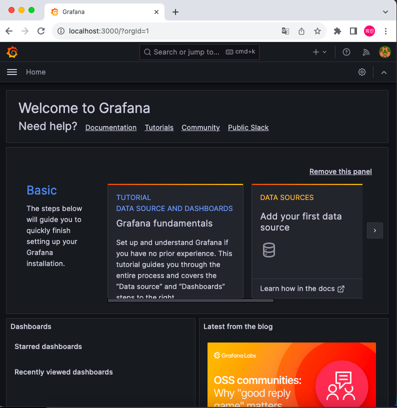
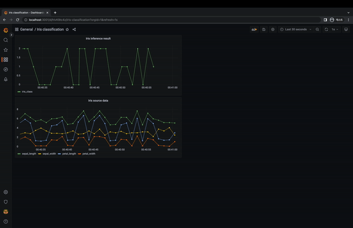

# MLOps for MLE
## Dashboard by Grafana
Grafana 대시보드를 통해 실시간으로 데이터를 모니터링하는 대시보드를 작성해보며 원본 데이터와 예측값을 시각화하는 방법을 이해해보겠다.   

### What is Grafana?
Grafana는 멀티플랫폼 오픈 소스 애널리틱스 및 인터랙티브 시각화 웹 어플리케이션이다. 데이터 소스에 연결하여 웹 차트, 그래프, 알람 등을 이용할 수 있다.   
Grafana에는 다양한 종류의 차트가 있어 상황에 따라 적절한 대시보드를 구현할 수 있다. 그리고 오픈소스이기 때문에 자체적인 Grafana 커뮤니티의 정보들을 활용할 수 있고 여러 데이터 소스를 지원한다.   
Dashboard는 전체 페이지로 전체 제목, 새로고침 주기, 패널 시각과 기간 등을 설정할 수 있으며, Panel은 Dashboard 안에 포함되어 있는 차트로 차트 제목과 종류, 데이터 소스와 쿼리 등을 설정할 수 있다.


--------------------------------

# 실습 - 1 
## Grafana Setup
Grafana를 생성할 docker compose 파일을 작성한다. 여기서 GF_DASHBOARDS_MIN_REFRESH_INTERVAL는 대시보드를 만들기 위해 실시간으로 패널을 그리기 위한 새로고침이 필요한데 그 주기의 최솟값을 정하는 설정이다.
```
version: "3"
services:
  grafana-dashboard:
    image: grafana/grafana
    ports:
      - 3000:3000
    environment:
      GF_SECURITY_ADMIN_USER: dashboarduser
      GF_SECURITY_ADMIN_PASSWORD: dashboardpassword
      GF_DASHBOARDS_MIN_REFRESH_INTERVAL: 500ms

networks:
    default:
        name: mlops-network
        external: true
```  
```
docker compose -p part8-dashboard -f grafana-docker-compose.yaml up -d
```
서비스가 띄워졌다면, localhost:3000을 통해 Grafana에 접속하여 설정했던 아이디와 비밀번호로 접속한다.


-----------------------

# 실습 - 2
## Dashboard 생성
로그인이 잘 되었다면 왼쪽 사이드바의 네모 모양 > New dashboard 버튼을 클릭하여 새로운 대시보드를 만든다. 몇가지 설정을 해보겠다.

**메뉴바 -> Dashboards 클릭 -> New -> new dashboard -> dashboard settings**   
- General
    - 대시보드의 이름은 Iris classification으로 설정
    - Time options: Auto refresh 영역에 1s,를 앞쪽에 추가한다.
    - Refresh live dashboards 토글을 클릭해 실시간으로 패널의 시간 축이 업데이트 되도록 해놓는다.
오른쪽 위의 Save dashboard 버튼을 클릭하고, General 폴더에 저장한다.   

**메뉴바 -> Connections -> Data sourses**
Add data source 버튼을 클릭하고, PostgreSQL 을 검색하여 클릭한다. 그리고 다음과 같이 설정 후 save&test하면 connection ok가 뜰 것이다.
- Name : Source-database
- Host : postgres-server:5432
- Database : mydatabase
- User : myuser
- Password : mypassword
- TLS/SSL Mode : disable
- Version : 14.0
![img][/img/grafana-source-db-2.png]

---------------------

# 실습 - 3
## Panel 생성
Grafana 대시보드로 이동한 뒤 우측 상단의 차트 📊 버튼을 클릭하여 패널을 생성한다. 생성된 패널에서 Add a new panel 옵션을 선택한다.

- 우측 탭 : 패널의 이름, 차트의 종류 등을 설정
    - 기본 값으로 Time series 차트가 설정되어 있다.
    - 오른쪽 탭의 Title 에 패널의 이름을 붙여준다. Iris source data로 설정하겠다.
- 하단 탭 : DB 에서 시각화할 테이블 및 column 정보를 설정
    - Data source : Source-database
    - Table : iris_data
    - Column : ➕ 버튼을 눌러 시각화 대상의 column 을 추가 (timestamp, sepal_length. sepal_width, petal_length, petal_width)
- Run query 버튼 오른쪽의 Code 버튼을 클릭하고 Limit 부분을 지워준 후, Run query 버튼을 클릭한다.

- 작업이 마무리 되었으면 오른쪽 위의 Save 버튼을 통해 패널을 저장한다. 
- 대시보드의 패널 새로고침 주기 및 패널 시각화 기간을 설정
    - 오른쪽 위의 🕙 Last 6 hours 를 클릭하여 패널에 시각화할 기간을 명세
    - 1초 단위로 데이터가 생성 되기 때문에, 30초를 모니터링 하기 위해서 From 부분을 now-30s 로 바꿔주고 Apply time range 버튼을 눌러 1s을 선택해준다.
- 실시간 모니터링을 확인하고 수정된 대시보드를 오른쪽 위의 💾 버튼을 클릭하여 저장한다. 저장시에 save current time range as dashboard default 를 체크할 것!


------------------

# 실습 - 3
## Inference Database 그리기
다시 반복해볼 것이다. 먼저 target database 연결해주고 대시보드에 새로운 패널을 추가하고 설정 변경하여 생성해준다. 다음과 같이 뜬다면 성공이다.   
